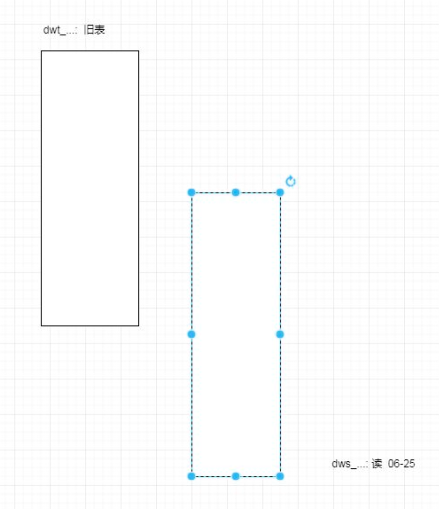

# 电商数仓系统(二)

### 一、数仓搭建DWS层

##### 1. 宽表

```bash
#什么事宽表
包含一些纬度

#宽表的意义
将多张子查询得出的中间结果存在宽表中
降低sql难度, 和提升性能
减少重复计算

#宽表的创建原理
首先把通用的指标先放进宽表中
有多少纬度表, 就应该创建多少纬度表
每个宽表就是以这个纬度作为基础, 分析的多个指标

#分区
每日的统计
```


##### 2. 业务术语

```bash
#用户
以设备为判断标准, 认为一个独立设备就是一个独立用户.
以已注册的用户作为一个独立用户

#新增用户
首次联网使用应用的用户
新增包括, 日新增, 周新增, 月新增

#活跃用户
DAU(Day Activitive User)
打开应用多次会被算作活跃用户

#周活跃用户
一周内多次启动只记一个活跃用户

#月活跃率
活跃用户 / 总用户数

#沉默用户
用户仅在安装当天启动一次, 后续不再启动.
反应用户质量

#版本分布
版本受欢迎程度

#本周回流用
上周未启动应用, 本周启动了应用的用户

#连续n周
连续n周, 每周至少启动一次

#忠诚用户
连续活跃5周以上的用户

#连续活跃用户
连续两周以上的活跃用户

#近期流失用户
连续n(2-4周)周没有启动应用的用户

#留存用户
某段时间内的新增用户，经过一段时间后，仍然使用应用的被认作是留存用户；这部分用户占当时新增用户的比例即是留存率。
例如，5月份新增用户200，这200人在6月份启动过应用的有100人，7月份启动过应用的有80人，8月份启动过应用的有50人；则5月份新增用户一个月后的留存率是50%，二个月后的留存率是40%，三个月后的留存率是25%。

#用户新鲜度
每天启动应用的新老用户比例，即新增用户数占活跃用户数的比例。

#单次使用时长
每次启动使用的时间长度。

#日使用时长
累计一天内的使用时间长度。

#启动次数计算标准
IOS平台应用退到后台就算一次独立的启动；Android平台我们规定，两次启动之间的间隔小于30秒，被计算一次启动。用户在使用过程中，若因收发短信或接电话等退出应用30秒又再次返回应用中，那这两次行为应该是延续而非独立的，所以可以被算作一次使用行为，即一次启动。业内大多使用30秒这个标准，但用户还是可以自定义此时间间隔。
```


##### 3. 系统函数

celloect_set函数

```sql
-- 把同一分组的不同行的数据聚合成一个集合
```


nvl函数

```sql
-- NVL（表达式1，表达式2）
如果表达式1为空值，NVL返回值为表达式2的值，否则返回表达式1的值。 该函数的目的是把一个空值（null）转换成一个实际的值。其表达式的值可以是数字型、字符型和日期型。但是表达式1和表达式2的数据类型必须为同一个类型。
```


coalesce函数

```sql
coalesce(a1, a2, ...) - Returns the first non-null argument
```


日期函数

```sql
-- 1）date_format函数（根据格式整理日期）
hive (gmall)> select date_format('2020-06-14','yyyy-MM');
2020-03


-- 2）date_add函数（加减日期）
hive (gmall)> select date_add('2020-06-14',-1);
2020-03-09
hive (gmall)> select date_add('2020-06-14',1);
2020-06-15


-- 3）next_day函数
	（1）取当前天的下一个周一
hive (gmall)> select next_day('2020-03-12','MO');
2020-03-16
说明：星期一到星期日的英文（Monday，Tuesday、Wednesday、Thursday、Friday、Saturday、Sunday）
（2）取当前周的周一
hive (gmall)> select date_add(next_day('2020-03-12','MO'),-7);
2020-06-15


-- 4）last_day函数（求当月最后一天日期）
hive (gmall)> select last_day('2020-06-14');
2020-03-31
```


##### 4. DWS层(用户行为)

###### 1). 每日设备行为

```sql
drop table if exists dws_uv_detail_daycount;
create external table dws_uv_detail_daycount
(
    `mid_id` string, 
    `brand` string, 
    `model` string, 
    `login_count` bigint COMMENT '活跃次数',
    `page_stats` array<struct<page_id:string,page_count:bigint>> COMMENT '页面访问统计'
)
partitioned by(dt string)
stored as parquet
location '/warehouse/gmall/dws/dws_uv_detail_daycount';
```


分析:

```bash
#数据来源dwd
login_count 遥远与启动日志 dwd_start_log
来源于页面的表 dwd_page_log

分组之后, 能取的字段只有三种
1. 分组字段
2. 聚合值
3. 常量值
```


数据装载:

```sql
with
tmp_start as
(
    select  
        mid_id,
        brand,
        model,
        count(*) login_count
    from dwd_start_log
    where dt='2020-06-25'
    group by mid_id,brand,model
),
tmp_page as
(
    select
        mid_id,
        brand,
        model,         collect_set(named_struct('page_id' ,page_id , 'page_count',page_count)) page_stats
    from
    (
        select
            mid_id,
            brand,
            model,
            page_id,
            count(*) page_count
        from dwd_page_log
        where dt='2020-06-25'
        group by mid_id,brand,model,page_id
    )tmp
    group by mid_id,brand,model
)
insert overwrite table dws_uv_detail_daycount partition(dt='2020-06-25')
select
    nvl(tmp_start.mid_id,tmp_page.mid_id),
    nvl(tmp_start.brand,tmp_page.brand),
    nvl(tmp_start.model,tmp_page.model),
    tmp_start.login_count,
    tmp_page.page_stats
from tmp_start 
full outer join tmp_page
on tmp_start.mid_id=tmp_page.mid_id
and tmp_start.brand=tmp_page.brand
and tmp_start.model=tmp_page.model;


3）查询加载结果
select * from dws_uv_detail_daycount where dt='2020-06-25' limit 2;
```


##### 5. DWS 层(业务)

###### 1). 每日会员行为

建表

```sql
drop table if exists dws_user_action_daycount;
create external table dws_user_action_daycount
(   
    user_id string comment '用户 id',
    login_count bigint comment '登录次数',
    cart_count bigint comment '加入购物车次数',
    order_count bigint comment '下单次数',
    order_amount    decimal(16,2)  comment '下单金额',
    payment_count   bigint      comment '支付次数',
    payment_amount  decimal(16,2) comment '支付金额',
    order_detail_stats array<struct<sku_id:string,sku_num:bigint,order_count:bigint,order_amount:decimal(20,2)>> comment '下单明细统计'
) COMMENT '每日用户行为'
PARTITIONED BY (`dt` string)
stored as parquet
location '/warehouse/gmall/dws/dws_user_action_daycount/'
tblproperties ("parquet.compression"="lzo");


-- 分析
包含与事实表相关的所有度量值的统计值
每日当天的统计
列式存储
```


数据装载

```sql
with
tmp_login as
(
    select
        user_id,
        count(*) login_count
    from dwd_start_log
    where dt='2020-06-25'
    and user_id is not null
    group by user_id
),
tmp_cart as
(
    select
        user_id,
        count(*) cart_count
    from dwd_action_log
    where dt='2020-06-25'
    and user_id is not null
    and action_id='cart_add'
    group by user_id
),tmp_order as
(
    select
        user_id,
        count(*) order_count,
        sum(final_total_amount) order_amount
    from dwd_fact_order_info
    where dt='2020-06-25'
    group by user_id
) ,
tmp_payment as
(
    select
        user_id,
        count(*) payment_count,
        sum(payment_amount) payment_amount
    from dwd_fact_payment_info
    where dt='2020-06-25'
    group by user_id
),
tmp_order_detail as
(
    select
        user_id,
        collect_set(named_struct('sku_id',sku_id,'sku_num',sku_num,'order_count',order_count,'order_amount',order_amount)) order_stats
    from
    (
        select
            user_id,
            sku_id,
            sum(sku_num) sku_num,
            count(*) order_count,
            cast(sum(final_amount_d) as decimal(20,2)) order_amount
        from dwd_fact_order_detail
        where dt='2020-06-25'
        group by user_id,sku_id
    )tmp
    group by user_id
)

insert overwrite table dws_user_action_daycount partition(dt='2020-06-25')
select
    tmp_login.user_id,
    login_count,
    nvl(cart_count,0),
    nvl(order_count,0),
    nvl(order_amount,0.0),
    nvl(payment_count,0),
    nvl(payment_amount,0.0),
    order_stats
from tmp_login
left join tmp_cart on tmp_login.user_id=tmp_cart.user_id
left join tmp_order on tmp_login.user_id=tmp_order.user_id
left join tmp_payment on tmp_login.user_id=tmp_payment.user_id
left join tmp_order_detail on tmp_login.user_id=tmp_order_detail.user_id;
```


###### 2). 每日商品行为

建表

```sql
drop table if exists dws_sku_action_daycount;
create external table dws_sku_action_daycount 
(   
    sku_id string comment 'sku_id',
    order_count bigint comment '被下单次数',
    order_num bigint comment '被下单件数',
    order_amount decimal(16,2) comment '被下单金额',
    payment_count bigint  comment '被支付次数',
    payment_num bigint comment '被支付件数',
    payment_amount decimal(16,2) comment '被支付金额',
    refund_count bigint  comment '被退款次数',
    refund_num bigint comment '被退款件数',
    refund_amount  decimal(16,2) comment '被退款金额',
    cart_count bigint comment '被加入购物车次数',
    favor_count bigint comment '被收藏次数',
    appraise_good_count bigint comment '好评数',
    appraise_mid_count bigint comment '中评数',
    appraise_bad_count bigint comment '差评数',
    appraise_default_count bigint comment '默认评价数'
) COMMENT '每日商品行为'
PARTITIONED BY (`dt` string)
stored as parquet
location '/warehouse/gmall/dws/dws_sku_action_daycount/'
tblproperties ("parquet.compression"="lzo");
```


注意:

```bash
#注意：如果是23点59下单，支付日期跨天。需要从订单详情里面取出支付时间是今天，订单时间是昨天或者今天的订单。
```


插入数据

```sql
with 
tmp_order as
(
    select
        sku_id,
        count(*) order_count,
        sum(sku_num) order_num,
        sum(final_amount_d) order_amount
    from dwd_fact_order_detail
    where dt='2020-06-25'
    group by sku_id
),
tmp_payment as
(
    select
        sku_id,
        count(*) payment_count,
        sum(sku_num) payment_num,
        sum(final_amount_d) payment_amount
    from dwd_fact_order_detail
    where dt='2020-06-25'
    and order_id in
    (
        select
            id
        from dwd_fact_order_info
        where (dt='2020-06-25'
        or dt=date_add('2020-06-25',-1))
        and date_format(payment_time,'yyyy-MM-dd')='2020-06-25'
    )
    group by sku_id
),
tmp_refund as
(
    select
        sku_id,
        count(*) refund_count,
        sum(refund_num) refund_num,
        sum(refund_amount) refund_amount
    from dwd_fact_order_refund_info
    where dt='2020-06-25'
    group by sku_id
),
tmp_cart as
(
    select
        item sku_id,
        count(*) cart_count
    from dwd_action_log
    where dt='2020-06-25'
    and user_id is not null
    and action_id='cart_add'
    group by item 
),tmp_favor as
(
    select
        item sku_id,
        count(*) favor_count
    from dwd_action_log
    where dt='2020-06-25'
    and user_id is not null
    and action_id='favor_add'
    group by item 
),
tmp_appraise as
(
select
    sku_id,
    sum(if(appraise='1201',1,0)) appraise_good_count,
    sum(if(appraise='1202',1,0)) appraise_mid_count,
    sum(if(appraise='1203',1,0)) appraise_bad_count,
    sum(if(appraise='1204',1,0)) appraise_default_count
from dwd_fact_comment_info
where dt='2020-06-25'
group by sku_id
)

insert overwrite table dws_sku_action_daycount partition(dt='2020-06-25')
select
    sku_id,
    sum(order_count),
    sum(order_num),
    sum(order_amount),
    sum(payment_count),
    sum(payment_num),
    sum(payment_amount),
    sum(refund_count),
    sum(refund_num),
    sum(refund_amount),
    sum(cart_count),
    sum(favor_count),
    sum(appraise_good_count),
    sum(appraise_mid_count),
    sum(appraise_bad_count),
    sum(appraise_default_count)
from
(
    select
        sku_id,
        order_count,
        order_num,
        order_amount,
        0 payment_count,
        0 payment_num,
        0 payment_amount,
        0 refund_count,
        0 refund_num,
        0 refund_amount,
        0 cart_count,
        0 favor_count,
        0 appraise_good_count,
        0 appraise_mid_count,
        0 appraise_bad_count,
        0 appraise_default_count
    from tmp_order
    union all
    select
        sku_id,
        0 order_count,
        0 order_num,
        0 order_amount,
        payment_count,
        payment_num,
        payment_amount,
        0 refund_count,
        0 refund_num,
        0 refund_amount,
        0 cart_count,
        0 favor_count,
        0 appraise_good_count,
        0 appraise_mid_count,
        0 appraise_bad_count,
        0 appraise_default_count
    from tmp_payment
    union all
    select
        sku_id,
        0 order_count,
        0 order_num,
        0 order_amount,
        0 payment_count,
        0 payment_num,
        0 payment_amount,
        refund_count,
        refund_num,
        refund_amount,
        0 cart_count,
        0 favor_count,
        0 appraise_good_count,
        0 appraise_mid_count,
        0 appraise_bad_count,
        0 appraise_default_count        
    from tmp_refund
    union all
    select
        sku_id,
        0 order_count,
        0 order_num,
        0 order_amount,
        0 payment_count,
        0 payment_num,
        0 payment_amount,
        0 refund_count,
        0 refund_num,
        0 refund_amount,
        cart_count,
        0 favor_count,
        0 appraise_good_count,
        0 appraise_mid_count,
        0 appraise_bad_count,
        0 appraise_default_count
    from tmp_cart
    union all
    select
        sku_id,
        0 order_count,
        0 order_num,
        0 order_amount,
        0 payment_count,
        0 payment_num,
        0 payment_amount,
        0 refund_count,
        0 refund_num,
        0 refund_amount,
        0 cart_count,
        favor_count,
        0 appraise_good_count,
        0 appraise_mid_count,
        0 appraise_bad_count,
        0 appraise_default_count
    from tmp_favor
    union all
    select
        sku_id,
        0 order_count,
        0 order_num,
        0 order_amount,
        0 payment_count,
        0 payment_num,
        0 payment_amount,
        0 refund_count,
        0 refund_num,
        0 refund_amount,
        0 cart_count,
        0 favor_count,
        appraise_good_count,
        appraise_mid_count,
        appraise_bad_count,
        appraise_default_count
    from tmp_appraise
)tmp
group by sku_id;
```


###### 3). 每日活动统计

建表

```sql
drop table if exists dws_activity_info_daycount;
create external table dws_activity_info_daycount(
    `id` string COMMENT '编号',
    `activity_name` string  COMMENT '活动名称',
    `activity_type` string  COMMENT '活动类型',
    `start_time` string  COMMENT '开始时间',
    `end_time` string  COMMENT '结束时间',
    `create_time` string  COMMENT '创建时间',
    `display_count` bigint COMMENT '曝光次数',
    `order_count` bigint COMMENT '下单次数',
    `order_amount` decimal(20,2) COMMENT '下单金额',
    `payment_count` bigint COMMENT '支付次数',
    `payment_amount` decimal(20,2) COMMENT '支付金额'
) COMMENT '每日活动信息表'
PARTITIONED BY (`dt` string)
stored as parquet
location '/warehouse/gmall/dws/dws_activity_info_daycount/'
tblproperties ("parquet.compression"="lzo");
```


插入数据

```sql
with
tmp_op as
(
    select
        activity_id,
        sum(if(date_format(create_time,'yyyy-MM-dd')='2020-06-14',1,0)) order_count,
        sum(if(date_format(create_time,'yyyy-MM-dd')='2020-06-14',final_total_amount,0)) order_amount,
        sum(if(date_format(payment_time,'yyyy-MM-dd')='2020-06-14',1,0)) payment_count,
        sum(if(date_format(payment_time,'yyyy-MM-dd')='2020-06-14',final_total_amount,0)) payment_amount
    from dwd_fact_order_info
    where (dt='2020-06-14' or dt=date_add('2020-06-14',-1))
    and activity_id is not null
    group by activity_id
),
tmp_display as
(
    select
        item activity_id,
        count(*) display_count
    from dwd_display_log
    where dt='2020-06-14'
    and item_type='activity_id'
    group by item
),
tmp_activity as
(
    select
        *
    from dwd_dim_activity_info
    where dt='2020-06-14'
)
insert overwrite table dws_activity_info_daycount partition(dt='2020-06-14')
select
    nvl(tmp_op.activity_id,tmp_display.activity_id),
    tmp_activity.activity_name,
    tmp_activity.activity_type,
    tmp_activity.start_time,
    tmp_activity.end_time,
    tmp_activity.create_time,
    tmp_display.display_count,
    tmp_op.order_count,
    tmp_op.order_amount,
    tmp_op.payment_count,
    tmp_op.payment_amount
from tmp_op
full outer join tmp_display on tmp_op.activity_id=tmp_display.activity_id
left join tmp_activity on nvl(tmp_op.activity_id,tmp_display.activity_id)=tmp_activity.id;
```


###### 4). 每日地区统计

建表

```sql
drop table if exists dws_area_stats_daycount;
create external table dws_area_stats_daycount(
    `id` bigint COMMENT '编号',
    `province_name` string COMMENT '省份名称',
    `area_code` string COMMENT '地区编码',
    `iso_code` string COMMENT 'iso编码',
    `region_id` string COMMENT '地区ID',
    `region_name` string COMMENT '地区名称',
    `login_count` string COMMENT '活跃设备数',
    `order_count` bigint COMMENT '下单次数',
    `order_amount` decimal(20,2) COMMENT '下单金额',
    `payment_count` bigint COMMENT '支付次数',
    `payment_amount` decimal(20,2) COMMENT '支付金额'
) COMMENT '每日地区信息表'
PARTITIONED BY (`dt` string)
stored as parquet
location '/warehouse/gmall/dws/dws_area_stats_daycount/'
tblproperties ("parquet.compression"="lzo");
```


插入数据

```sql
with 
tmp_login as
(
    select
        area_code,
        count(*) login_count
    from dwd_start_log
    where dt='2020-06-14'
    group by area_code
),
tmp_op as
(
    select
        province_id,
        sum(if(date_format(create_time,'yyyy-MM-dd')='2020-06-14',1,0)) order_count,
        sum(if(date_format(create_time,'yyyy-MM-dd')='2020-06-14',final_total_amount,0)) order_amount,
        sum(if(date_format(payment_time,'yyyy-MM-dd')='2020-06-14',1,0)) payment_count,
        sum(if(date_format(payment_time,'yyyy-MM-dd')='2020-06-14',final_total_amount,0)) payment_amount
    from dwd_fact_order_info
    where (dt='2020-06-14' or dt=date_add('2020-06-14',-1))
    group by province_id
)
insert overwrite table dws_area_stats_daycount partition(dt='2020-06-14')
select
    pro.id,
    pro.province_name,
    pro.area_code,
    pro.iso_code,
    pro.region_id,
    pro.region_name,
    nvl(tmp_login.login_count,0),
    nvl(tmp_op.order_count,0),
    nvl(tmp_op.order_amount,0.0),
    nvl(tmp_op.payment_count,0),
    nvl(tmp_op.payment_amount,0.0)
from dwd_dim_base_province pro
left join tmp_login on pro.area_code=tmp_login.area_code
left join tmp_op on pro.id=tmp_op.province_id;
```


##### 6. 数据脚本

```bash
1）在/home/atguigu/bin目录下创建脚本dwd_to_dws.sh
[atguigu@hadoop102 bin]$ vim dwd_to_dws.sh
在脚本中填写如下内容


#!/bin/bash

APP=gmall
hive=/opt/module/hive/bin/hive

# 如果是输入的日期按照取输入日期；如果没输入日期取当前时间的前一天
if [ -n "$1" ] ;then
    do_date=$1
else
    do_date=`date -d "-1 day" +%F`
fi

sql="
set mapreduce.job.queuename=hive;
with
tmp_start as
(
    select  
        mid_id,
        brand,
        model,
        count(*) login_count
    from ${APP}.dwd_start_log
    where dt='$do_date'
    group by mid_id,brand,model
),
tmp_page as
(
    select
        mid_id,
        brand,
        model,        
        collect_set(named_struct('page_id',page_id,'page_count',page_count)) page_stats
    from
    (
        select
            mid_id,
            brand,
            model,
            page_id,
            count(*) page_count
        from ${APP}.dwd_page_log
        where dt='$do_date'
        group by mid_id,brand,model,page_id
    )tmp
    group by mid_id,brand,model
)
insert overwrite table ${APP}.dws_uv_detail_daycount partition(dt='$do_date')
select
    nvl(tmp_start.mid_id,tmp_page.mid_id),
    nvl(tmp_start.brand,tmp_page.brand),
    nvl(tmp_start.model,tmp_page.model),
    tmp_start.login_count,
    tmp_page.page_stats
from tmp_start 
full outer join tmp_page
on tmp_start.mid_id=tmp_page.mid_id
and tmp_start.brand=tmp_page.brand
and tmp_start.model=tmp_page.model;


with
tmp_login as
(
    select
        user_id,
        count(*) login_count
    from ${APP}.dwd_start_log
    where dt='$do_date'
    and user_id is not null
    group by user_id
),
tmp_cart as
(
    select
        user_id,
        count(*) cart_count
    from ${APP}.dwd_action_log
    where dt='$do_date'
    and user_id is not null
    and action_id='cart_add'
    group by user_id
),tmp_order as
(
    select
        user_id,
        count(*) order_count,
        sum(final_total_amount) order_amount
    from ${APP}.dwd_fact_order_info
    where dt='$do_date'
    group by user_id
) ,
tmp_payment as
(
    select
        user_id,
        count(*) payment_count,
        sum(payment_amount) payment_amount
    from ${APP}.dwd_fact_payment_info
    where dt='$do_date'
    group by user_id
),
tmp_order_detail as
(
    select
        user_id,
        collect_set(named_struct('sku_id',sku_id,'sku_num',sku_num,'order_count',order_count,'order_amount',order_amount)) order_stats
    from
    (
        select
            user_id,
            sku_id,
            sum(sku_num) sku_num,
            count(*) order_count,
            cast(sum(final_amount_d) as decimal(20,2)) order_amount
        from ${APP}.dwd_fact_order_detail
        where dt='$do_date'
        group by user_id,sku_id
    )tmp
    group by user_id
)

insert overwrite table ${APP}.dws_user_action_daycount partition(dt='$do_date')
select
    tmp_login.user_id,
    login_count,
    nvl(cart_count,0),
    nvl(order_count,0),
    nvl(order_amount,0.0),
    nvl(payment_count,0),
    nvl(payment_amount,0.0),
    order_stats
from tmp_login
left outer join tmp_cart on tmp_login.user_id=tmp_cart.user_id
left outer join tmp_order on tmp_login.user_id=tmp_order.user_id
left outer join tmp_payment on tmp_login.user_id=tmp_payment.user_id
left outer join tmp_order_detail on tmp_login.user_id=tmp_order_detail.user_id;

with 
tmp_order as
(
    select
        sku_id,
        count(*) order_count,
        sum(sku_num) order_num,
        sum(final_amount_d) order_amount
    from ${APP}.dwd_fact_order_detail
    where dt='$do_date'
    group by sku_id
),
tmp_payment as
(
    select
        sku_id,
        count(*) payment_count,
        sum(sku_num) payment_num,
        sum(final_amount_d) payment_amount
    from ${APP}.dwd_fact_order_detail
    where dt='$do_date'
    and order_id in
    (
        select
            id
        from ${APP}.dwd_fact_order_info
        where (dt='$do_date'
        or dt=date_add('$do_date',-1))
        and date_format(payment_time,'yyyy-MM-dd')='$do_date'
    )
    group by sku_id
),
tmp_refund as
(
    select
        sku_id,
        count(*) refund_count,
        sum(refund_num) refund_num,
        sum(refund_amount) refund_amount
    from ${APP}.dwd_fact_order_refund_info
    where dt='$do_date'
    group by sku_id
),
tmp_cart as
(
    select
        item sku_id,
        count(*) cart_count
    from ${APP}.dwd_action_log
    where dt='$do_date'
    and user_id is not null
    and action_id='cart_add'
    group by item 
),tmp_favor as
(
    select
        item sku_id,
        count(*) favor_count
    from ${APP}.dwd_action_log
    where dt='$do_date'
    and user_id is not null
    and action_id='favor_add'
    group by item 
),
tmp_appraise as
(
select
    sku_id,
    sum(if(appraise='1201',1,0)) appraise_good_count,
    sum(if(appraise='1202',1,0)) appraise_mid_count,
    sum(if(appraise='1203',1,0)) appraise_bad_count,
    sum(if(appraise='1204',1,0)) appraise_default_count
from ${APP}.dwd_fact_comment_info
where dt='$do_date'
group by sku_id
)

insert overwrite table ${APP}.dws_sku_action_daycount partition(dt='$do_date')
select
    sku_id,
    sum(order_count),
    sum(order_num),
    sum(order_amount),
    sum(payment_count),
    sum(payment_num),
    sum(payment_amount),
    sum(refund_count),
    sum(refund_num),
    sum(refund_amount),
    sum(cart_count),
    sum(favor_count),
    sum(appraise_good_count),
    sum(appraise_mid_count),
    sum(appraise_bad_count),
    sum(appraise_default_count)
from
(
    select
        sku_id,
        order_count,
        order_num,
        order_amount,
        0 payment_count,
        0 payment_num,
        0 payment_amount,
        0 refund_count,
        0 refund_num,
        0 refund_amount,
        0 cart_count,
        0 favor_count,
        0 appraise_good_count,
        0 appraise_mid_count,
        0 appraise_bad_count,
        0 appraise_default_count
    from tmp_order
    union all
    select
        sku_id,
        0 order_count,
        0 order_num,
        0 order_amount,
        payment_count,
        payment_num,
        payment_amount,
        0 refund_count,
        0 refund_num,
        0 refund_amount,
        0 cart_count,
        0 favor_count,
        0 appraise_good_count,
        0 appraise_mid_count,
        0 appraise_bad_count,
        0 appraise_default_count
    from tmp_payment
    union all
    select
        sku_id,
        0 order_count,
        0 order_num,
        0 order_amount,
        0 payment_count,
        0 payment_num,
        0 payment_amount,
        refund_count,
        refund_num,
        refund_amount,
        0 cart_count,
        0 favor_count,
        0 appraise_good_count,
        0 appraise_mid_count,
        0 appraise_bad_count,
        0 appraise_default_count        
    from tmp_refund
    union all
    select
        sku_id,
        0 order_count,
        0 order_num,
        0 order_amount,
        0 payment_count,
        0 payment_num,
        0 payment_amount,
        0 refund_count,
        0 refund_num,
        0 refund_amount,
        cart_count,
        0 favor_count,
        0 appraise_good_count,
        0 appraise_mid_count,
        0 appraise_bad_count,
        0 appraise_default_count
    from tmp_cart
    union all
    select
        sku_id,
        0 order_count,
        0 order_num,
        0 order_amount,
        0 payment_count,
        0 payment_num,
        0 payment_amount,
        0 refund_count,
        0 refund_num,
        0 refund_amount,
        0 cart_count,
        favor_count,
        0 appraise_good_count,
        0 appraise_mid_count,
        0 appraise_bad_count,
        0 appraise_default_count
    from tmp_favor
    union all
    select
        sku_id,
        0 order_count,
        0 order_num,
        0 order_amount,
        0 payment_count,
        0 payment_num,
        0 payment_amount,
        0 refund_count,
        0 refund_num,
        0 refund_amount,
        0 cart_count,
        0 favor_count,
        appraise_good_count,
        appraise_mid_count,
        appraise_bad_count,
        appraise_default_count
    from tmp_appraise
)tmp
group by sku_id;

with 
tmp_login as
(
    select
        area_code,
        count(*) login_count
    from ${APP}.dwd_start_log
    where dt='$do_date'
    group by area_code
),
tmp_op as
(
    select
        province_id,
        sum(if(date_format(create_time,'yyyy-MM-dd')='$do_date',1,0)) order_count,
        sum(if(date_format(create_time,'yyyy-MM-dd')='$do_date',final_total_amount,0)) order_amount,
        sum(if(date_format(payment_time,'yyyy-MM-dd')='$do_date',1,0)) payment_count,
        sum(if(date_format(payment_time,'yyyy-MM-dd')='$do_date',final_total_amount,0)) payment_amount
    from ${APP}.dwd_fact_order_info
    where (dt='$do_date' or dt=date_add('$do_date',-1))
    group by province_id
)
insert overwrite table ${APP}.dws_area_stats_daycount partition(dt='$do_date')
select
    pro.id,
    pro.province_name,
    pro.area_code,
    pro.iso_code,
    pro.region_id,
    pro.region_name,
    nvl(tmp_login.login_count,0),
    nvl(tmp_op.order_count,0),
    nvl(tmp_op.order_amount,0.0),
    nvl(tmp_op.payment_count,0),
    nvl(tmp_op.payment_amount,0.0)
from ${APP}.dwd_dim_base_province pro
left join tmp_login on pro.area_code=tmp_login.area_code
left join tmp_op on pro.id=tmp_op.province_id;


with
tmp_op as
(
    select
        activity_id,
        sum(if(date_format(create_time,'yyyy-MM-dd')='$do_date',1,0)) order_count,
        sum(if(date_format(create_time,'yyyy-MM-dd')='$do_date',final_total_amount,0)) order_amount,
        sum(if(date_format(payment_time,'yyyy-MM-dd')='$do_date',1,0)) payment_count,
        sum(if(date_format(payment_time,'yyyy-MM-dd')='$do_date',final_total_amount,0)) payment_amount
    from ${APP}.dwd_fact_order_info
    where (dt='$do_date' or dt=date_add('$do_date',-1))
    and activity_id is not null
    group by activity_id
),
tmp_display as
(
    select
        item activity_id,
        count(*) display_count
    from ${APP}.dwd_display_log
    where dt='$do_date'
    and item_type='activity_id'
    group by item
),
tmp_activity as
(
    select
        *
    from ${APP}.dwd_dim_activity_info
    where dt='$do_date'
)
insert overwrite table ${APP}.dws_activity_info_daycount partition(dt='$do_date')
select
    nvl(tmp_op.activity_id,tmp_display.activity_id),
    tmp_activity.activity_name,
    tmp_activity.activity_type,
    tmp_activity.start_time,
    tmp_activity.end_time,
    tmp_activity.create_time,
    tmp_display.display_count,
    tmp_op.order_count,
    tmp_op.order_amount,
    tmp_op.payment_count,
    tmp_op.payment_amount
from tmp_op
full outer join tmp_display on tmp_op.activity_id=tmp_display.activity_id
left join tmp_activity on nvl(tmp_op.activity_id,tmp_display.activity_id)=tmp_activity.id;
"

$hive -e "$sql"


2）增加脚本执行权限
[atguigu@hadoop102 bin]$ chmod 777 dwd_to_dws.sh

3）执行脚本导入数据
[atguigu@hadoop102 bin]$ dwd_to_dws.sh 2020-06-15
```


### 二、数仓搭建DWT层

##### 1.  dwt层特点

```bash
#这层数据都不分区

```


##### 2. 设备主题宽表

建表

```sql
drop table if exists dwt_uv_topic;
create external table dwt_uv_topic
(
    `mid_id` string,
    `brand` string,
    `model` string,
    `login_date_first` string  comment '首次活跃时间',
    `login_date_last` string  comment '末次活跃时间',
    `login_day_count` bigint comment '当日活跃次数',
    `login_count` bigint comment '累积活跃天数'
)
stored as parquet
location '/warehouse/gmall/dwt/dwt_uv_topic';
```





分析

```sql

```


数据装载

```sql
insert overwrite table dwt_uv_topic
select
    nvl(new.mid_id,old.mid_id),
    nvl(new.model,old.model),
    nvl(new.brand,old.brand),
    if(old.mid_id is null,'2020-06-25',old.login_date_first),
    if(new.mid_id is not null,'2020-06-25',old.login_date_last),
    if(new.mid_id is not null, new.login_count,0),
    nvl(old.login_count,0)+if(new.login_count>0,1,0)
from
(
    select
        *
    from dwt_uv_topic
)old
full outer join
(
    select
        *
    from dws_uv_detail_daycount
    where dt='2020-06-25'
)new
on old.mid_id=new.mid_id;
```


##### 3. 会员主题宽表

```sql
drop table if exists dwt_user_topic;
create external table dwt_user_topic
(
    user_id string  comment '用户id',
    login_date_first string  comment '首次登录时间',
    login_date_last string  comment '末次登录时间',
    login_count bigint comment '累积登录天数',
    login_last_30d_count bigint comment '最近30日登录天数',
    order_date_first string  comment '首次下单时间',
    order_date_last string  comment '末次下单时间',
    order_count bigint comment '累积下单次数',
    order_amount decimal(16,2) comment '累积下单金额',
    order_last_30d_count bigint comment '最近30日下单次数',
    order_last_30d_amount bigint comment '最近30日下单金额',
    payment_date_first string  comment '首次支付时间',
    payment_date_last string  comment '末次支付时间',
    payment_count decimal(16,2) comment '累积支付次数',
    payment_amount decimal(16,2) comment '累积支付金额',
    payment_last_30d_count decimal(16,2) comment '最近30日支付次数',
    payment_last_30d_amount decimal(16,2) comment '最近30日支付金额'
 )COMMENT '用户主题宽表'
stored as parquet
location '/warehouse/gmall/dwt/dwt_user_topic/'
tblproperties ("parquet.compression"="lzo");
```


数据装载

```sql
insert overwrite table dwt_user_topic
select
    nvl(new.user_id,old.user_id),
    if(old.login_date_first is null and new.login_count>0,'2020-06-25',old.login_date_first),
    if(new.login_count>0,'2020-06-25',old.login_date_last),
    nvl(old.login_count,0)+if(new.login_count>0,1,0),
    nvl(new.login_last_30d_count,0),
    if(old.order_date_first is null and new.order_count>0,'2020-06-25',old.order_date_first),
    if(new.order_count>0,'2020-06-25',old.order_date_last),
    nvl(old.order_count,0)+nvl(new.order_count,0),
    nvl(old.order_amount,0)+nvl(new.order_amount,0),
    nvl(new.order_last_30d_count,0),
    nvl(new.order_last_30d_amount,0),
    if(old.payment_date_first is null and new.payment_count>0,'2020-06-25',old.payment_date_first),
    if(new.payment_count>0,'2020-06-25',old.payment_date_last),
    nvl(old.payment_count,0)+nvl(new.payment_count,0),
    nvl(old.payment_amount,0)+nvl(new.payment_amount,0),
    nvl(new.payment_last_30d_count,0),
    nvl(new.payment_last_30d_amount,0)
from
dwt_user_topic old
full outer join
(
    select
        user_id,
        sum(if(dt='2020-06-25',login_count,0)) login_count,
        sum(if(dt='2020-06-25',order_count,0)) order_count,
        sum(if(dt='2020-06-25',order_amount,0)) order_amount,
        sum(if(dt='2020-06-25',payment_count,0)) payment_count,
        sum(if(dt='2020-06-25',payment_amount,0)) payment_amount,
        sum(if(login_count>0,1,0)) login_last_30d_count,
        sum(order_count) order_last_30d_count,
        sum(order_amount) order_last_30d_amount,
        sum(payment_count) payment_last_30d_count,
        sum(payment_amount) payment_last_30d_amount
    from dws_user_action_daycount
    where dt>=date_add( '2020-06-25',-29)
    group by user_id
)new
on old.user_id=new.user_id;
```


分析:

```sql
select
				-- 当天的数据
				-- 先做判断获取当天的结果, 因为语法原因(group by), 所以使用sum. sum(当天的值) = 当天的值
        user_id,
        sum(if(dt='2020-06-25',login_count,0)) login_count,
        sum(if(dt='2020-06-25',order_count,0)) order_count,
        sum(if(dt='2020-06-25',order_amount,0)) order_amount,
        sum(if(dt='2020-06-25',payment_count,0)) payment_count,
        sum(if(dt='2020-06-25',payment_amount,0)) payment_amount,
        -- 30天的数据
        sum(if(login_count>0,1,0)) login_last_30d_count,
        sum(order_count) order_last_30d_count,
        sum(order_amount) order_last_30d_amount,
        sum(payment_count) payment_last_30d_count,
        sum(payment_amount) payment_last_30d_amount
    from dws_user_action_daycount
    where dt>=date_add( '2020-06-25',-29)
    group by user_id
```


##### 4. 商品主题宽表

建表

```sql
drop table if exists dwt_sku_topic;
create external table dwt_sku_topic
(
    sku_id string comment 'sku_id',
    spu_id string comment 'spu_id',
    order_last_30d_count bigint comment '最近30日被下单次数',
    order_last_30d_num bigint comment '最近30日被下单件数',
    order_last_30d_amount decimal(16,2)  comment '最近30日被下单金额',
    order_count bigint comment '累积被下单次数',
    order_num bigint comment '累积被下单件数',
    order_amount decimal(16,2) comment '累积被下单金额',
    payment_last_30d_count   bigint  comment '最近30日被支付次数',
    payment_last_30d_num bigint comment '最近30日被支付件数',
    payment_last_30d_amount  decimal(16,2) comment '最近30日被支付金额',
    payment_count   bigint  comment '累积被支付次数',
    payment_num bigint comment '累积被支付件数',
    payment_amount  decimal(16,2) comment '累积被支付金额',
    refund_last_30d_count bigint comment '最近三十日退款次数',
    refund_last_30d_num bigint comment '最近三十日退款件数',
    refund_last_30d_amount decimal(16,2) comment '最近三十日退款金额',
    refund_count bigint comment '累积退款次数',
    refund_num bigint comment '累积退款件数',
    refund_amount decimal(16,2) comment '累积退款金额',
    cart_last_30d_count bigint comment '最近30日被加入购物车次数',
    cart_count bigint comment '累积被加入购物车次数',
    favor_last_30d_count bigint comment '最近30日被收藏次数',
    favor_count bigint comment '累积被收藏次数',
    appraise_last_30d_good_count bigint comment '最近30日好评数',
    appraise_last_30d_mid_count bigint comment '最近30日中评数',
    appraise_last_30d_bad_count bigint comment '最近30日差评数',
    appraise_last_30d_default_count bigint comment '最近30日默认评价数',
    appraise_good_count bigint comment '累积好评数',
    appraise_mid_count bigint comment '累积中评数',
    appraise_bad_count bigint comment '累积差评数',
    appraise_default_count bigint comment '累积默认评价数'
 )COMMENT '商品主题宽表'
stored as parquet
location '/warehouse/gmall/dwt/dwt_sku_topic/'
tblproperties ("parquet.compression"="lzo");
```


插入数据

```sql
insert overwrite table dwt_sku_topic
select 
    nvl(new.sku_id,old.sku_id),
    sku_info.spu_id,
    nvl(new.order_count30,0),
    nvl(new.order_num30,0),
    nvl(new.order_amount30,0),
    nvl(old.order_count,0) + nvl(new.order_count,0),
    nvl(old.order_num,0) + nvl(new.order_num,0),
    nvl(old.order_amount,0) + nvl(new.order_amount,0),
    nvl(new.payment_count30,0),
    nvl(new.payment_num30,0),
    nvl(new.payment_amount30,0),
    nvl(old.payment_count,0) + nvl(new.payment_count,0),
    nvl(old.payment_num,0) + nvl(new.payment_count,0),
    nvl(old.payment_amount,0) + nvl(new.payment_count,0),
    nvl(new.refund_count30,0),
    nvl(new.refund_num30,0),
    nvl(new.refund_amount30,0),
    nvl(old.refund_count,0) + nvl(new.refund_count,0),
    nvl(old.refund_num,0) + nvl(new.refund_num,0),
    nvl(old.refund_amount,0) + nvl(new.refund_amount,0),
    nvl(new.cart_count30,0),
    nvl(old.cart_count,0) + nvl(new.cart_count,0),
    nvl(new.favor_count30,0),
    nvl(old.favor_count,0) + nvl(new.favor_count,0),
    nvl(new.appraise_good_count30,0),
    nvl(new.appraise_mid_count30,0),
    nvl(new.appraise_bad_count30,0),
    nvl(new.appraise_default_count30,0)  ,
    nvl(old.appraise_good_count,0) + nvl(new.appraise_good_count,0),
    nvl(old.appraise_mid_count,0) + nvl(new.appraise_mid_count,0),
    nvl(old.appraise_bad_count,0) + nvl(new.appraise_bad_count,0),
    nvl(old.appraise_default_count,0) + nvl(new.appraise_default_count,0) 
from 
dwt_sku_topic old
full outer join 
(
    select 
        sku_id,
        sum(if(dt='2020-06-14', order_count,0 )) order_count,
        sum(if(dt='2020-06-14',order_num ,0 ))  order_num, 
        sum(if(dt='2020-06-14',order_amount,0 )) order_amount ,
        sum(if(dt='2020-06-14',payment_count,0 )) payment_count,
        sum(if(dt='2020-06-14',payment_num,0 )) payment_num,
        sum(if(dt='2020-06-14',payment_amount,0 )) payment_amount,
        sum(if(dt='2020-06-14',refund_count,0 )) refund_count,
        sum(if(dt='2020-06-14',refund_num,0 )) refund_num,
        sum(if(dt='2020-06-14',refund_amount,0 )) refund_amount,  
        sum(if(dt='2020-06-14',cart_count,0 )) cart_count,
        sum(if(dt='2020-06-14',favor_count,0 )) favor_count,
        sum(if(dt='2020-06-14',appraise_good_count,0 )) appraise_good_count,  
        sum(if(dt='2020-06-14',appraise_mid_count,0 ) ) appraise_mid_count ,
        sum(if(dt='2020-06-14',appraise_bad_count,0 )) appraise_bad_count,  
        sum(if(dt='2020-06-14',appraise_default_count,0 )) appraise_default_count,
        sum(order_count) order_count30 ,
        sum(order_num) order_num30,
        sum(order_amount) order_amount30,
        sum(payment_count) payment_count30,
        sum(payment_num) payment_num30,
        sum(payment_amount) payment_amount30,
        sum(refund_count) refund_count30,
        sum(refund_num) refund_num30,
        sum(refund_amount) refund_amount30,
        sum(cart_count) cart_count30,
        sum(favor_count) favor_count30,
        sum(appraise_good_count) appraise_good_count30,
        sum(appraise_mid_count) appraise_mid_count30,
        sum(appraise_bad_count) appraise_bad_count30,
        sum(appraise_default_count) appraise_default_count30 
    from dws_sku_action_daycount
    where dt >= date_add ('2020-06-14', -30)
    group by sku_id    
)new 
on new.sku_id = old.sku_id
left join 
(select * from dwd_dim_sku_info where dt='2020-06-14') sku_info
on nvl(new.sku_id,old.sku_id)= sku_info.id;
```


##### 5. 活动主题宽表

建表

```sql
drop table if exists dwt_activity_topic;
create external table dwt_activity_topic(
    `id` string COMMENT '编号',
    `activity_name` string  COMMENT '活动名称',
    `activity_type` string  COMMENT '活动类型',
    `start_time` string  COMMENT '开始时间',
    `end_time` string  COMMENT '结束时间',
    `create_time` string  COMMENT '创建时间',
    `display_day_count` bigint COMMENT '当日曝光次数',
    `order_day_count` bigint COMMENT '当日下单次数',
    `order_day_amount` decimal(20,2) COMMENT '当日下单金额',
    `payment_day_count` bigint COMMENT '当日支付次数',
    `payment_day_amount` decimal(20,2) COMMENT '当日支付金额',
    `display_count` bigint COMMENT '累积曝光次数',
    `order_count` bigint COMMENT '累积下单次数',
    `order_amount` decimal(20,2) COMMENT '累积下单金额',
    `payment_count` bigint COMMENT '累积支付次数',
    `payment_amount` decimal(20,2) COMMENT '累积支付金额'
) COMMENT '活动主题宽表'
row format delimited fields terminated by '\t'
location '/warehouse/gmall/dwt/dwt_activity_topic/'
tblproperties ("parquet.compression"="lzo");
```


插入数据

```sql
insert overwrite table dwt_activity_topic
select
    nvl(new.id,old.id),
    nvl(new.activity_name,old.activity_name),
    nvl(new.activity_type,old.activity_type),
    nvl(new.start_time,old.start_time),
    nvl(new.end_time,old.end_time),
    nvl(new.create_time,old.create_time),
    nvl(new.display_count,0),
    nvl(new.order_count,0),
    nvl(new.order_amount,0.0),
    nvl(new.payment_count,0),
    nvl(new.payment_amount,0.0),
    nvl(new.display_count,0)+nvl(old.display_count,0),
    nvl(new.order_count,0)+nvl(old.order_count,0),
    nvl(new.order_amount,0.0)+nvl(old.order_amount,0.0),
    nvl(new.payment_count,0)+nvl(old.payment_count,0),
    nvl(new.payment_amount,0.0)+nvl(old.payment_amount,0.0)
from
(
    select
        *
    from dwt_activity_topic
)old
full outer join
(
    select
        *
    from dws_activity_info_daycount
    where dt='2020-06-14'
)new
on old.id=new.id;
```


##### 6. 地区主题宽表

建表

```sql
drop table if exists dwt_area_topic;
create external table dwt_area_topic(
    `id` bigint COMMENT '编号',
    `province_name` string COMMENT '省份名称',
    `area_code` string COMMENT '地区编码',
    `iso_code` string COMMENT 'iso编码',
    `region_id` string COMMENT '地区ID',
    `region_name` string COMMENT '地区名称',
    `login_day_count` string COMMENT '当天活跃设备数',
    `login_last_30d_count` string COMMENT '最近30天活跃设备数',
    `order_day_count` bigint COMMENT '当天下单次数',
    `order_day_amount` decimal(16,2) COMMENT '当天下单金额',
    `order_last_30d_count` bigint COMMENT '最近30天下单次数',
    `order_last_30d_amount` decimal(16,2) COMMENT '最近30天下单金额',
    `payment_day_count` bigint COMMENT '当天支付次数',
    `payment_day_amount` decimal(16,2) COMMENT '当天支付金额',
    `payment_last_30d_count` bigint COMMENT '最近30天支付次数',
    `payment_last_30d_amount` decimal(16,2) COMMENT '最近30天支付金额'
) COMMENT '地区主题宽表'
row format delimited fields terminated by '\t'
location '/warehouse/gmall/dwt/dwt_area_topic/'
tblproperties ("parquet.compression"="lzo");
```


插入数据

```sql
insert overwrite table dwt_area_topic
select
    nvl(old.id,new.id),
    nvl(old.province_name,new.province_name),
    nvl(old.area_code,new.area_code),
    nvl(old.iso_code,new.iso_code),
    nvl(old.region_id,new.region_id),
    nvl(old.region_name,new.region_name),
    nvl(new.login_day_count,0),
    nvl(new.login_last_30d_count,0),
    nvl(new.order_day_count,0),
    nvl(new.order_day_amount,0.0),
    nvl(new.order_last_30d_count,0),
    nvl(new.order_last_30d_amount,0.0),
    nvl(new.payment_day_count,0),
    nvl(new.payment_day_amount,0.0),
    nvl(new.payment_last_30d_count,0),
    nvl(new.payment_last_30d_amount,0.0)
from 
(
    select
        *
    from dwt_area_topic
)old
full outer join
(
    select
        id,
        province_name,
        area_code,
        iso_code,
        region_id,
        region_name,
        sum(if(dt='2020-06-14',login_count,0)) login_day_count,
        sum(if(dt='2020-06-14',order_count,0)) order_day_count,
        sum(if(dt='2020-06-14',order_amount,0.0)) order_day_amount,
        sum(if(dt='2020-06-14',payment_count,0)) payment_day_count,
        sum(if(dt='2020-06-14',payment_amount,0.0)) payment_day_amount,
        sum(login_count) login_last_30d_count,
        sum(order_count) order_last_30d_count,
        sum(order_amount) order_last_30d_amount,
        sum(payment_count) payment_last_30d_count,
        sum(payment_amount) payment_last_30d_amount
    from dws_area_stats_daycount
    where dt>=date_add('2020-06-14',-30)
    group by id,province_name,area_code,iso_code,region_id,region_name
)new
on old.id=new.id;
```


##### 7. 导入脚本

```bash
1）在/home/atguigu/bin目录下创建脚本dws_to_dwt.sh
[atguigu@hadoop102 bin]$ vim dws_to_dwt.sh
在脚本中填写如下内容


#!/bin/bash

APP=gmall
hive=/opt/module/hive/bin/hive

# 如果是输入的日期按照取输入日期；如果没输入日期取当前时间的前一天
if [ -n "$1" ] ;then
    do_date=$1
else 
    do_date=`date -d "-1 day" +%F`
fi

sql="
set mapreduce.job.queuename=hive;
insert overwrite table ${APP}.dwt_uv_topic
select
    nvl(new.mid_id,old.mid_id),
    nvl(new.model,old.model),
    nvl(new.brand,old.brand),
    if(old.mid_id is null,'$do_date',old.login_date_first),
    if(new.mid_id is not null,'$do_date',old.login_date_last),
    if(new.mid_id is not null, new.login_count,0),
    nvl(old.login_count,0)+if(new.login_count>0,1,0)
from
(
    select
        *
    from ${APP}.dwt_uv_topic
)old
full outer join
(
    select
        *
    from ${APP}.dws_uv_detail_daycount
    where dt='$do_date'
)new
on old.mid_id=new.mid_id;

insert overwrite table ${APP}.dwt_user_topic
select
    nvl(new.user_id,old.user_id),
    if(old.login_date_first is null and new.login_count>0,'$do_date',old.login_date_first),
    if(new.login_count>0,'$do_date',old.login_date_last),
    nvl(old.login_count,0)+if(new.login_count>0,1,0),
    nvl(new.login_last_30d_count,0),
    if(old.order_date_first is null and new.order_count>0,'$do_date',old.order_date_first),
    if(new.order_count>0,'$do_date',old.order_date_last),
    nvl(old.order_count,0)+nvl(new.order_count,0),
    nvl(old.order_amount,0)+nvl(new.order_amount,0),
    nvl(new.order_last_30d_count,0),
    nvl(new.order_last_30d_amount,0),
    if(old.payment_date_first is null and new.payment_count>0,'$do_date',old.payment_date_first),
    if(new.payment_count>0,'$do_date',old.payment_date_last),
    nvl(old.payment_count,0)+nvl(new.payment_count,0),
    nvl(old.payment_amount,0)+nvl(new.payment_amount,0),
    nvl(new.payment_last_30d_count,0),
    nvl(new.payment_last_30d_amount,0)
from
${APP}.dwt_user_topic old
full outer join
(
    select
        user_id,
        sum(if(dt='$do_date',login_count,0)) login_count,
        sum(if(dt='$do_date',order_count,0)) order_count,
        sum(if(dt='$do_date',order_amount,0)) order_amount,
        sum(if(dt='$do_date',payment_count,0)) payment_count,
        sum(if(dt='$do_date',payment_amount,0)) payment_amount,
        sum(if(login_count>0,1,0)) login_last_30d_count,
        sum(order_count) order_last_30d_count,
        sum(order_amount) order_last_30d_amount,
        sum(payment_count) payment_last_30d_count,
        sum(payment_amount) payment_last_30d_amount
    from ${APP}.dws_user_action_daycount
    where dt>=date_add( '$do_date',-30)
    group by user_id
)new
on old.user_id=new.user_id;

insert overwrite table ${APP}.dwt_sku_topic
select 
    nvl(new.sku_id,old.sku_id),
    sku_info.spu_id,
    nvl(new.order_count30,0),
    nvl(new.order_num30,0),
    nvl(new.order_amount30,0),
    nvl(old.order_count,0) + nvl(new.order_count,0),
    nvl(old.order_num,0) + nvl(new.order_num,0),
    nvl(old.order_amount,0) + nvl(new.order_amount,0),
    nvl(new.payment_count30,0),
    nvl(new.payment_num30,0),
    nvl(new.payment_amount30,0),
    nvl(old.payment_count,0) + nvl(new.payment_count,0),
    nvl(old.payment_num,0) + nvl(new.payment_count,0),
    nvl(old.payment_amount,0) + nvl(new.payment_count,0),
    nvl(new.refund_count30,0),
    nvl(new.refund_num30,0),
    nvl(new.refund_amount30,0),
    nvl(old.refund_count,0) + nvl(new.refund_count,0),
    nvl(old.refund_num,0) + nvl(new.refund_num,0),
    nvl(old.refund_amount,0) + nvl(new.refund_amount,0),
    nvl(new.cart_count30,0),
    nvl(old.cart_count,0) + nvl(new.cart_count,0),
    nvl(new.favor_count30,0),
    nvl(old.favor_count,0) + nvl(new.favor_count,0),
    nvl(new.appraise_good_count30,0),
    nvl(new.appraise_mid_count30,0),
    nvl(new.appraise_bad_count30,0),
    nvl(new.appraise_default_count30,0)  ,
    nvl(old.appraise_good_count,0) + nvl(new.appraise_good_count,0),
    nvl(old.appraise_mid_count,0) + nvl(new.appraise_mid_count,0),
    nvl(old.appraise_bad_count,0) + nvl(new.appraise_bad_count,0),
    nvl(old.appraise_default_count,0) + nvl(new.appraise_default_count,0) 
from 
(
    select
        sku_id,
        spu_id,
        order_last_30d_count,
        order_last_30d_num,
        order_last_30d_amount,
        order_count,
        order_num,
        order_amount  ,
        payment_last_30d_count,
        payment_last_30d_num,
        payment_last_30d_amount,
        payment_count,
        payment_num,
        payment_amount,
        refund_last_30d_count,
        refund_last_30d_num,
        refund_last_30d_amount,
        refund_count,
        refund_num,
        refund_amount,
        cart_last_30d_count,
        cart_count,
        favor_last_30d_count,
        favor_count,
        appraise_last_30d_good_count,
        appraise_last_30d_mid_count,
        appraise_last_30d_bad_count,
        appraise_last_30d_default_count,
        appraise_good_count,
        appraise_mid_count,
        appraise_bad_count,
        appraise_default_count 
    from ${APP}.dwt_sku_topic
)old
full outer join 
(
    select 
        sku_id,
        sum(if(dt='$do_date', order_count,0 )) order_count,
        sum(if(dt='$do_date',order_num ,0 ))  order_num, 
        sum(if(dt='$do_date',order_amount,0 )) order_amount ,
        sum(if(dt='$do_date',payment_count,0 )) payment_count,
        sum(if(dt='$do_date',payment_num,0 )) payment_num,
        sum(if(dt='$do_date',payment_amount,0 )) payment_amount,
        sum(if(dt='$do_date',refund_count,0 )) refund_count,
        sum(if(dt='$do_date',refund_num,0 )) refund_num,
        sum(if(dt='$do_date',refund_amount,0 )) refund_amount,  
        sum(if(dt='$do_date',cart_count,0 )) cart_count,
        sum(if(dt='$do_date',favor_count,0 )) favor_count,
        sum(if(dt='$do_date',appraise_good_count,0 )) appraise_good_count,  
        sum(if(dt='$do_date',appraise_mid_count,0 ) ) appraise_mid_count ,
        sum(if(dt='$do_date',appraise_bad_count,0 )) appraise_bad_count,  
        sum(if(dt='$do_date',appraise_default_count,0 )) appraise_default_count,
        sum(order_count) order_count30 ,
        sum(order_num) order_num30,
        sum(order_amount) order_amount30,
        sum(payment_count) payment_count30,
        sum(payment_num) payment_num30,
        sum(payment_amount) payment_amount30,
        sum(refund_count) refund_count30,
        sum(refund_num) refund_num30,
        sum(refund_amount) refund_amount30,
        sum(cart_count) cart_count30,
        sum(favor_count) favor_count30,
        sum(appraise_good_count) appraise_good_count30,
        sum(appraise_mid_count) appraise_mid_count30,
        sum(appraise_bad_count) appraise_bad_count30,
        sum(appraise_default_count) appraise_default_count30 
    from ${APP}.dws_sku_action_daycount
    where dt >= date_add ('$do_date', -30)
    group by sku_id    
)new 
on new.sku_id = old.sku_id
left join 
(select * from ${APP}.dwd_dim_sku_info where dt='$do_date') sku_info
on nvl(new.sku_id,old.sku_id)= sku_info.id;

insert overwrite table ${APP}.dwt_activity_topic
select
    nvl(new.id,old.id),
    nvl(new.activity_name,old.activity_name),
    nvl(new.activity_type,old.activity_type),
    nvl(new.start_time,old.start_time),
    nvl(new.end_time,old.end_time),
    nvl(new.create_time,old.create_time),
    nvl(new.display_count,0),
    nvl(new.order_count,0),
    nvl(new.order_amount,0.0),
    nvl(new.payment_count,0),
    nvl(new.payment_amount,0.0),
    nvl(new.display_count,0)+nvl(old.display_count,0),
    nvl(new.order_count,0)+nvl(old.order_count,0),
    nvl(new.order_amount,0.0)+nvl(old.order_amount,0.0),
    nvl(new.payment_count,0)+nvl(old.payment_count,0),
    nvl(new.payment_amount,0.0)+nvl(old.payment_amount,0.0)
from
(
    select
        *
    from ${APP}.dwt_activity_topic
)old
full outer join
(
    select
        *
    from ${APP}.dws_activity_info_daycount
    where dt='$do_date'
)new
on old.id=new.id;

insert overwrite table ${APP}.dwt_area_topic
select
    nvl(old.id,new.id),
    nvl(old.province_name,new.province_name),
    nvl(old.area_code,new.area_code),
    nvl(old.iso_code,new.iso_code),
    nvl(old.region_id,new.region_id),
    nvl(old.region_name,new.region_name),
    nvl(new.login_day_count,0),
    nvl(new.login_last_30d_count,0),
    nvl(new.order_day_count,0),
    nvl(new.order_day_amount,0.0),
    nvl(new.order_last_30d_count,0),
    nvl(new.order_last_30d_amount,0.0),
    nvl(new.payment_day_count,0),
    nvl(new.payment_day_amount,0.0),
    nvl(new.payment_last_30d_count,0),
    nvl(new.payment_last_30d_amount,0.0)
from 
(
    select
        *
    from ${APP}.dwt_area_topic
)old
full outer join
(
    select
        id,
        province_name,
        area_code,
        iso_code,
        region_id,
        region_name,
        sum(if(dt='$do_date',login_count,0)) login_day_count,
        sum(if(dt='$do_date',order_count,0)) order_day_count,
        sum(if(dt='$do_date',order_amount,0.0)) order_day_amount,
        sum(if(dt='$do_date',payment_count,0)) payment_day_count,
        sum(if(dt='$do_date',payment_amount,0.0)) payment_day_amount,
        sum(login_count) login_last_30d_count,
        sum(order_count) order_last_30d_count,
        sum(order_amount) order_last_30d_amount,
        sum(payment_count) payment_last_30d_count,
        sum(payment_amount) payment_last_30d_amount
    from ${APP}.dws_area_stats_daycount
    where dt>=date_add('$do_date',-30)
    group by id,province_name,area_code,iso_code,region_id,region_name
)new
on old.id=new.id;
"

$hive -e "$sql"


2）增加脚本执行权限
[atguigu@hadoop102 bin]$ chmod 777 dws_to_dwt.sh
3）执行脚本导入数据
[atguigu@hadoop102 bin]$ dws_to_dwt.sh 2020-06-15

```


### 三、数仓搭建ADS层

##### 1. 设备主题

###### 1). 活跃设备数

建表

```sql
drop table if exists ads_uv_count;
create external table ads_uv_count(
    `dt` string COMMENT '统计日期',
    `day_count` bigint COMMENT '当日用户数量',
    `wk_count`  bigint COMMENT '当周用户数量',
    `mn_count`  bigint COMMENT '当月用户数量',
    `is_weekend` string COMMENT 'Y,N是否是周末,用于得到本周最终结果',
    `is_monthend` string COMMENT 'Y,N是否是月末,用于得到本月最终结果' 
) COMMENT '活跃设备数'
row format delimited fields terminated by '\t'
location '/warehouse/gmall/ads/ads_uv_count/';
```


插入数据

```sql
insert into table ads_uv_count 
select  
    '2020-06-25' dt,
    daycount.ct,
    wkcount.ct,
    mncount.ct,
    if(date_add(next_day('2020-06-25','MO'),-1)='2020-06-25','Y','N') ,
    if(last_day('2020-06-25')='2020-06-25','Y','N') 
from 
(
    select  
        '2020-06-25' dt,
        count(*) ct
    from dwt_uv_topic
    where login_date_last='2020-06-25'  
)daycount join 
( 
    select  
        '2020-06-25' dt,
        count (*) ct
    from dwt_uv_topic
    where login_date_last>=date_add(next_day('2020-06-25','MO'),-7) 
    and login_date_last<= date_add(next_day('2020-06-25','MO'),-1) 
) wkcount on daycount.dt=wkcount.dt
join 
( 
    select  
        '2020-06-25' dt,
        count (*) ct
    from dwt_uv_topic
    where date_format(login_date_last,'yyyy-MM')=date_format('2020-06-25','yyyy-MM')  
)mncount on daycount.dt=mncount.dt;
```


分析

```sql
insert into table ads_uv_count 
select  
    '2020-06-14' dt,
    daycount.ct,
    wkcount.ct,
    mncount.ct,
    if(date_add(next_day('2020-06-14','MO'),-1)='2020-06-14','Y','N') ,
    if(last_day('2020-06-14')='2020-06-14','Y','N') 
from 
(
  	-- 在这个日期中, 找到最后一次活跃的设备, 然后count(*) 找到当日活跃设备数
    select  
        '2020-06-14' dt,
        count(*) ct
    from dwt_uv_topic
    where login_date_last='2020-06-14'  
)daycount join 
( 
    select  
        '2020-06-14' dt,
  	-- 算出这一周的设备活跃数
        count (*) ct
    -- 从dwt中找到这一周的统计数
    from dwt_uv_topic
    -- 最后一次登陆日期在一周前, 找到06-14的下周一减去7, 得出这周一
    where login_date_last>=date_add(next_day('2020-06-14','MO'),-7)
    -- 最后一次登陆日期, 找到06-14的下周一减去1, 得出这周日
    and login_date_last<= date_add(next_day('2020-06-14','MO'),-1) 
) wkcount on daycount.dt=wkcount.dt
join 
( 
  	-- 找到这一个月的设备活跃数
    select  
        '2020-06-14' dt,
        count (*) ct
    from dwt_uv_topic
    -- 根据日期, 找到这个日期所在月, 然后根据设备最后一次登陆日期, 找到其所在月, 然后匹配.
    where date_format(login_date_last,'yyyy-MM')=date_format('2020-06-14','yyyy-MM')  
)mncount on daycount.dt=mncount.dt;
```


###### 2). 每日新增设备

建表

```sql
drop table if exists ads_new_mid_count;
create external table ads_new_mid_count
(
    `create_date`     string comment '创建时间' ,
    `new_mid_count`   BIGINT comment '新增设备数量' 
)  COMMENT '每日新增设备信息数量'
row format delimited fields terminated by '\t'
location '/warehouse/gmall/ads/ads_new_mid_count/';
```


插入数据

```sql
insert into table ads_new_mid_count 
select
    '2020-06-25',
    count(*)
from dwt_uv_topic
where login_date_first='2020-06-25';
```


分析

```sql
insert into table ads_new_mid_count 
select
    '2020-06-14',
    count(*)
from dwt_uv_topic
-- 第一次登陆日期在今天的, 计数
where login_date_first='2020-06-14';
```


###### 3). 留存率

建表

```sql
drop table if exists ads_user_retention_day_rate;
create external table ads_user_retention_day_rate 
(
     `stat_date`          string comment '统计日期',
     `create_date`       string  comment '设备新增日期',
     `retention_day`     int comment '截止当前日期留存天数',
     `retention_count`    bigint comment  '留存数量',
     `new_mid_count`     bigint comment '设备新增数量',
     `retention_ratio`   decimal(16,2) comment '留存率'
)  COMMENT '每日用户留存情况'
row format delimited fields terminated by '\t'
location '/warehouse/gmall/ads/ads_user_retention_day_rate/';
```


插入数据

```sql
insert into table ads_user_retention_day_rate
select
    '2020-06-15',
    date_add('2020-06-15',-1),
    1,--留存天数
    sum(if(login_date_first=date_add('2020-06-15',-1) and login_date_last='2020-06-15',1,0)),
    sum(if(login_date_first=date_add('2020-06-15',-1),1,0)),
    sum(if(login_date_first=date_add('2020-06-15',-1) and login_date_last='2020-06-15',1,0))/sum(if(login_date_first=date_add('2020-06-15',-1),1,0))*100
from dwt_uv_topic

union all

select
    '2020-06-15',
    date_add('2020-06-15',-2),
    2,
    sum(if(login_date_first=date_add('2020-06-15',-2) and login_date_last='2020-06-15',1,0)),
    sum(if(login_date_first=date_add('2020-06-15',-2),1,0)),
    sum(if(login_date_first=date_add('2020-06-15',-2) and login_date_last='2020-06-15',1,0))/sum(if(login_date_first=date_add('2020-06-15',-2),1,0))*100
from dwt_uv_topic

union all

select
    '2020-06-15',
    date_add('2020-06-15',-3),
    3,
    sum(if(login_date_first=date_add('2020-06-15',-3) and login_date_last='2020-06-15',1,0)),
    sum(if(login_date_first=date_add('2020-06-15',-3),1,0)),
    sum(if(login_date_first=date_add('2020-06-15',-3) and login_date_last='2020-06-15',1,0))/sum(if(login_date_first=date_add('2020-06-15',-3),1,0))*100
from dwt_uv_topic;
```


分析

```sql
insert into table ads_user_retention_day_rate
select
    '2020-06-25',
    date_add('2020-06-25',-1),
    1,--留存天数
    -- 昨天的在, 今天的也在
    sum(if(login_date_first=date_add('2020-06-25',-1) and login_date_last='2020-06-25',1,0)),
    -- 昨天的在
    sum(if(login_date_first=date_add('2020-06-25',-1),1,0)),
    -- 昨天,今天在 / 昨天的在
    sum(if(login_date_first=date_add('2020-06-25',-1) and login_date_last='2020-06-25',1,0))/sum(if(login_date_first=date_add('2020-06-25',-1),1,0))*100
from dwt_uv_topic

union all

select
    '2020-06-25',
    date_add('2020-06-25',-2),
    2,
    -- 前天在, 今天在
    sum(if(login_date_first=date_add('2020-06-25',-2) and login_date_last='2020-06-25',1,0)),
    -- 前天在
    sum(if(login_date_first=date_add('2020-06-25',-2),1,0)),
    -- 前提在, 今天在 / 前天在
    sum(if(login_date_first=date_add('2020-06-25',-2) and login_date_last='2020-06-25',1,0))/sum(if(login_date_first=date_add('2020-06-25',-2),1,0))*100
from dwt_uv_topic

union all

select
    '2020-06-25',
    date_add('2020-06-25',-3),
    3,
    sum(if(login_date_first=date_add('2020-06-25',-3) and login_date_last='2020-06-25',1,0)),
    sum(if(login_date_first=date_add('2020-06-25',-3),1,0)),
    sum(if(login_date_first=date_add('2020-06-25',-3) and login_date_last='2020-06-25',1,0))/sum(if(login_date_first=date_add('2020-06-25',-3),1,0))*100
from dwt_uv_topic;
```


###### 4). 沉默用户数

建表

```sql
drop table if exists ads_silent_count;
create external table ads_silent_count( 
    `dt` string COMMENT '统计日期',
    `silent_count` bigint COMMENT '沉默设备数'
) 
row format delimited fields terminated by '\t'
location '/warehouse/gmall/ads/ads_silent_count';
```


插入数据

```sql
insert into table ads_silent_count
select
    '2020-06-25',
    count(*) 
from dwt_uv_topic
where login_date_first=login_date_last
and login_date_last<=date_add('2020-06-25',-7);
```


分析

```sql
insert into table ads_silent_count
select
    '2020-06-25',
    count(*) 
from dwt_uv_topic
-- 沉默7天, 只登陆过一次(第一次和最后一次登陆日期相等), 最后一次日期小于7天前
where login_date_first=login_date_last
and login_date_last<=date_add('2020-06-25',-7);
```


###### 5). 本周回流用户数

建表

```sql
drop table if exists ads_back_count;
create external table ads_back_count( 
    `dt` string COMMENT '统计日期',
    `wk_dt` string COMMENT '统计日期所在周',
    `wastage_count` bigint COMMENT '回流设备数'
) 
row format delimited fields terminated by '\t'
location '/warehouse/gmall/ads/ads_back_count';
```


插入数据

```sql
insert into table ads_back_count
select
'2020-06-25',
concat(date_add(next_day('2020-06-25','MO'),-7),'_', date_add(next_day('2020-06-25','MO'),-1)),
count(*)
from
(
    select
        mid_id
    from dwt_uv_topic
    where login_date_last>=date_add(next_day('2020-06-25','MO'),-7) 
    and login_date_last<= date_add(next_day('2020-06-25','MO'),-1)
    and login_date_first<date_add(next_day('2020-06-25','MO'),-7)
)current_wk
left join
(
    select
        mid_id
    from dws_uv_detail_daycount
    where dt>=date_add(next_day('2020-06-25','MO'),-7*2) 
    and dt<= date_add(next_day('2020-06-25','MO'),-7-1) 
    group by mid_id
)last_wk
on current_wk.mid_id=last_wk.mid_id
where last_wk.mid_id is null;
```


分析

```sql
insert into table ads_back_count
select
'2020-06-25',
concat(date_add(next_day('2020-06-25','MO'),-7),'_', date_add(next_day('2020-06-25','MO'),-1)), -- 所在周, 本周
count(*) -- 回流设备数, 第一周在, 第二张=周不在, 这周在的设备号, 进行count

-- 1. 本周活跃(上周活跃 + 上周未活跃) left join 上周活跃
-- 2. join 部分 = 本周活跃 (上周活跃)
-- 3. where (上周活跃 = null)
-- 4. 本周活跃(上周未活跃)
from
(
    select
        mid_id
    from dwt_uv_topic
  	-- 最后一次登陆 本周
    where login_date_last>=date_add(next_day('2020-06-25','MO'),-7) 
    and login_date_last<= date_add(next_day('2020-06-25','MO'),-1)
    -- 第一次登陆在 本周以前(过滤本周新增)
    and login_date_first<date_add(next_day('2020-06-25','MO'),-7)
)current_wk
left join
(
    select
        mid_id
    from dws_uv_detail_daycount
    -- 上周 登陆
    where dt>=date_add(next_day('2020-06-25','MO'),-7*2) 
    and dt<= date_add(next_day('2020-06-25','MO'),-7-1)
    -- 去重
    group by mid_id
)last_wk
on current_wk.mid_id=last_wk.mid_id
-- 上周活跃 = null
where last_wk.mid_id is null;
```


###### 6). 流失用户

建表

```sql
drop table if exists ads_wastage_count;
create external table ads_wastage_count( 
    `dt` string COMMENT '统计日期',
    `wastage_count` bigint COMMENT '流失设备数'
) 
row format delimited fields terminated by '\t'
location '/warehouse/gmall/ads/ads_wastage_count';
```


插入数据

```sql
insert into table ads_wastage_count
select
     '2020-06-25',
     count(*)
from 
(
    select 
        mid_id
    from dwt_uv_topic
    where login_date_last<=date_add('2020-06-25',-7)
    group by mid_id
)t1;
```


分析

```sql
insert into table ads_wastage_count
select
     '2020-03-20',
     count(*)
from 
(
    select 
        mid_id
    from dwt_uv_topic
    where login_date_last<=date_add('2020-06-25',-7)
)t1;
```


###### 7). 最近连续三周活跃用户数

建表

```sql
drop table if exists ads_continuity_wk_count;
create external table ads_continuity_wk_count( 
    `dt` string COMMENT '统计日期,一般用结束周周日日期,如果每天计算一次,可用当天日期',
    `wk_dt` string COMMENT '持续时间',
    `continuity_count` bigint COMMENT '活跃次数'
) 
row format delimited fields terminated by '\t'
location '/warehouse/gmall/ads/ads_continuity_wk_count';
```


插入数据

```sql
insert into table ads_continuity_wk_count
select
    '2020-06-25',
    concat(date_add(next_day('2020-06-25','MO'),-7*3),'_',date_add(next_day('2020-06-25','MO'),-1)),
    count(*)
from
(
    select
        mid_id
    from
    (
        select
            mid_id
        from dws_uv_detail_daycount
        where dt>=date_add(next_day('2020-06-25','monday'),-7)
        and dt<=date_add(next_day('2020-06-25','monday'),-1)
        group by mid_id

        union all

        select
            mid_id
        from dws_uv_detail_daycount
        where dt>=date_add(next_day('2020-06-25','monday'),-7*2)
        and dt<=date_add(next_day('2020-06-25','monday'),-7-1)
        group by mid_id

        union all

        select
            mid_id
        from dws_uv_detail_daycount
        where dt>=date_add(next_day('2020-06-25','monday'),-7*3)
        and dt<=date_add(next_day('2020-06-25','monday'),-7*2-1)
        group by mid_id
    )t1
    group by mid_id
    having count(*)=3
)t2;
```


分析

```sql
insert into table ads_continuity_wk_count
select
    '2020-06-25',
    -- 本周 - 前两周
    concat(date_add(next_day('2020-06-25','MO'),-7*3),'_',date_add(next_day('2020-06-25','MO'),-1)),
    -- 用户数
    count(*)
from
(
    select
        mid_id
    from
    (
        select
            mid_id
        from dws_uv_detail_daycount
        where dt>=date_add(next_day('2020-06-25','monday'),-7)
        and dt<=date_add(next_day('2020-06-25','monday'),-1)
        group by mid_id

        union all

        select
            mid_id
        from dws_uv_detail_daycount
        where dt>=date_add(next_day('2020-06-25','monday'),-7*2)
        and dt<=date_add(next_day('2020-06-25','monday'),-7-1)
        group by mid_id

        union all

        select
            mid_id
        from dws_uv_detail_daycount
        where dt>=date_add(next_day('2020-06-25','monday'),-7*3)
        and dt<=date_add(next_day('2020-06-25','monday'),-7*2-1)
        group by mid_id
    )t1
    group by mid_id
    having count(*)=3
)t2;
```


###### 8). 最近七天内连续三天活跃

建表

```sql
drop table if exists ads_continuity_uv_count;
create external table ads_continuity_uv_count( 
    `dt` string COMMENT '统计日期',
    `wk_dt` string COMMENT '最近7天日期',
    `continuity_count` bigint
) COMMENT '连续活跃设备数'
row format delimited fields terminated by '\t'
location '/warehouse/gmall/ads/ads_continuity_uv_count';
```


插入数据

```sql
insert into table ads_continuity_uv_count
select
    '2020-06-25',
    concat(date_add('2020-06-25',-6),'_','2020-06-25'),
    count(*)
from
(
    select mid_id
    from
    (
        select mid_id
        from
        (
            select 
                mid_id,
                date_sub(dt,rank) date_dif
            from
            (
                select
                    mid_id,
                    dt,
                    rank() over(partition by mid_id order by dt) rank
                from dws_uv_detail_daycount
                where dt>=date_add('2020-06-25',-6) and dt<='2020-06-25'
            )t1
        )t2 
        group by mid_id,date_dif
        having count(*)>=3
    )t3 
    group by mid_id
)t4;
```


分析

```sql
insert into table ads_continuity_uv_count
select
    '2020-06-25',
    concat(date_add('2020-06-25',-6),'_','2020-06-25'),
    count(*)
from
(
    select mid_id
    from
    (
        select mid_id
        from
        (
            select 
                mid_id,
          			-- 日期 - 排名 = 一个定值
                date_sub(dt,rank) date_dif
            from
            (
                select
                    mid_id,
                    dt,
              			-- 设备分区, 分区内日期排名
                    rank() over(partition by mid_id order by dt) rank
                from dws_uv_detail_daycount
                -- 7日内的设备活跃数
                where dt>=date_add('2020-06-25',-6) and dt<='2020-06-25'
            )t1
        )t2 
        -- 按照设备, 定值去重
        group by mid_id,date_dif
        -- 对已经活跃三天的去重
        having count(*)>=3
    )t3 
    group by mid_id
)t4;
```


##### 2. 会员主题

###### 1). 会员主题信息

建表

```sql
drop table if exists ads_user_topic;
create external table ads_user_topic(
    `dt` string COMMENT '统计日期',
    `day_users` string COMMENT '活跃会员数',
    `day_new_users` string COMMENT '新增会员数',
    `day_new_payment_users` string COMMENT '新增消费会员数',
    `payment_users` string COMMENT '总付费会员数',
    `users` string COMMENT '总会员数',
    `day_users2users` decimal(16,2) COMMENT '会员活跃率',
    `payment_users2users` decimal(16,2) COMMENT '会员付费率',
    `day_new_users2users` decimal(16,2) COMMENT '会员新鲜度'
) COMMENT '会员主题信息表'
row format delimited fields terminated by '\t'
location '/warehouse/gmall/ads/ads_user_topic';
```


插入数据

```sql
insert into table ads_user_topic
select
    '2020-06-25',
    sum(if(login_date_last='2020-06-25',1,0)),
    sum(if(login_date_first='2020-06-25',1,0)),
    sum(if(payment_date_first='2020-06-25',1,0)),
    sum(if(payment_count>0,1,0)),
    count(*),
    sum(if(login_date_last='2020-06-25',1,0))/count(*),
    sum(if(payment_count>0,1,0))/count(*),
    sum(if(login_date_first='2020-06-25',1,0))/sum(if(login_date_last='2020-06-25',1,0))
from dwt_user_topic;
```


分析

```sql
insert into table ads_user_topic
select
    '2020-06-14',
    -- 老活跃会员数, 如果登陆日期是今天, 则为1, 否为0, 求和
    sum(if(login_date_last='2020-06-14',1,0)),
    -- 新增会员
    sum(if(login_date_first='2020-06-14',1,0)),
    -- 新增消费会员数
    sum(if(payment_date_first='2020-06-14',1,0)),
    -- 总付费会员总数
    sum(if(payment_count>0,1,0)),
    -- 会员总数
    count(*),
    -- 会员活跃率
    sum(if(login_date_last='2020-06-14',1,0))/count(*),
    -- 会员 付费率
    sum(if(payment_count>0,1,0))/count(*),
    -- 会员新鲜度
    sum(if(login_date_first='2020-06-14',1,0))/sum(if(login_date_last='2020-06-14',1,0))
from dwt_user_topic;

```


###### 2). 漏斗分析

建表

```sql
drop table if exists ads_user_action_convert_day;
create external  table ads_user_action_convert_day(
    `dt` string COMMENT '统计日期',
    `home_count`  bigint COMMENT '浏览首页人数',
    `good_detail_count` bigint COMMENT '浏览商品详情页人数',
    `home2good_detail_convert_ratio` decimal(16,2) COMMENT '首页到商品详情转化率',
    `cart_count` bigint COMMENT '加入购物车的人数',
    `good_detail2cart_convert_ratio` decimal(16,2) COMMENT '商品详情页到加入购物车转化率',
    `order_count` bigint     COMMENT '下单人数',
    `cart2order_convert_ratio`  decimal(16,2) COMMENT '加入购物车到下单转化率',
    `payment_amount` bigint     COMMENT '支付人数',
    `order2payment_convert_ratio` decimal(16,2) COMMENT '下单到支付的转化率'
 ) COMMENT '用户行为漏斗分析'
row format delimited  fields terminated by '\t'
location '/warehouse/gmall/ads/ads_user_action_convert_day/';
```


插入数据

```sql
with
tmp_uv as
(
    select
        '2020-06-14' dt,
        sum(if(array_contains(pages,'home'),1,0)) home_count,
        sum(if(array_contains(pages,'good_detail'),1,0)) good_detail_count
    from
    (
        select
            mid_id,
            collect_set(page_id) pages
        from dwd_page_log
        where dt='2020-06-14'
        and page_id in ('home','good_detail')
        group by mid_id
    )tmp
),
tmp_cop as
(
    select 
        '2020-06-14' dt,
        sum(if(cart_count>0,1,0)) cart_count,
        sum(if(order_count>0,1,0)) order_count,
        sum(if(payment_count>0,1,0)) payment_count
    from dws_user_action_daycount
    where dt='2020-06-14'
)
insert into table ads_user_action_convert_day
select
    tmp_uv.dt,
    tmp_uv.home_count,
    tmp_uv.good_detail_count,
    tmp_uv.good_detail_count/tmp_uv.home_count*100,
    tmp_cop.cart_count,
    tmp_cop.cart_count/tmp_uv.good_detail_count*100,
    tmp_cop.order_count,
    tmp_cop.order_count/tmp_cop.cart_count*100,
    tmp_cop.payment_count,
    tmp_cop.payment_count/tmp_cop.order_count*100
from tmp_uv
join tmp_cop
on tmp_uv.dt=tmp_cop.dt;
```


分析

```sql
with
tmp_uv as
(
    select
        '2020-06-25' dt,
  			-- 如果数组里包含该字符则累加
        sum(if(array_contains(pages,'home'),1,0)) home_count,
        sum(if(array_contains(pages,'good_detail'),1,0)) good_detail_count
    from
    (
        select
            mid_id,
      			-- 收集所有的页面id, 转换为一行(在一个列名下)
            collect_set(page_id) pages
        from dwd_page_log
        where dt='2020-06-25'
        -- 过滤, 只有home和good_detail的页面id
        and page_id in ('home','good_detail')
        -- 去重
        group by mid_id
    )tmp
),
tmp_cop as
(
    select 
        '2020-06-25' dt,
        -- 行为次数
        sum(if(cart_count>0,1,0)) cart_count,
        sum(if(order_count>0,1,0)) order_count,
        sum(if(payment_count>0,1,0)) payment_count
    from dws_user_action_daycount
    where dt='2020-06-25'
)
insert into table ads_user_action_convert_day
select
    tmp_uv.dt,
    tmp_uv.home_count,
    tmp_uv.good_detail_count,
    tmp_uv.good_detail_count/tmp_uv.home_count*100,
    tmp_cop.cart_count,
    tmp_cop.cart_count/tmp_uv.good_detail_count*100,
    tmp_cop.order_count,
    tmp_cop.order_count/tmp_cop.cart_count*100,
    tmp_cop.payment_count,
    tmp_cop.payment_count/tmp_cop.order_count*100
from tmp_uv
join tmp_cop
on tmp_uv.dt=tmp_cop.dt;
```


