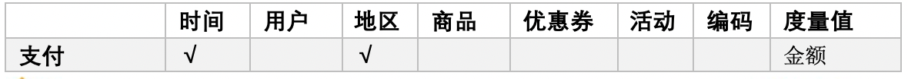
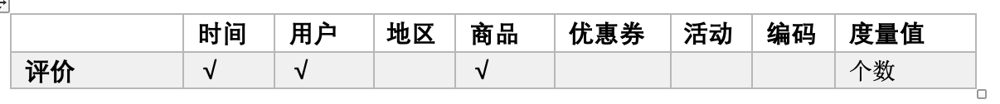

# 电商数仓系统(一)

### 一、数仓分层

##### 1. 什么是数仓

```bash
#1. 数据仓库
保留历史数据(数据量特别的大, 会有重复的数据)
占用空间比较大(GB-PB级别)
OLAP分析

#更好的管理
1).如何去建表(数仓建模)
2).如何更方便的管理
3).如何分层


#2. 数据库
传统的数据
不保留历史数据(一般存最新的状态)
OLTP分析
一般存储是GB级别


#注: 本质都是存数据
```


##### 2. 数仓为什么要分层

- 把复杂问题简单化
  - 复杂的任务可以分解成多层, 每一层只处理简单的问题, 出现问题方便定位那一层
- 减少重复开发
  - 计算结果复用, 减少重复计算.
- 隔离原始数据
  - 使真实数据与统计数据解耦

```bash
#数据仓库分层

#ODS(Operation Data Store)原始数据分层
kafka存到hdfs中(每一条数据都是json字符串), 直接load
从mysql通过sqoop到hdfs中
原始数据层, 存放原始数据,直接加载原始日志数据, 保持原貌不处理

#DWD(data warehouse detail) 明细数据层
对ODS层数据进行清洗(去除控制, 脏数据, 超过极限范围的数据), 

纬度退化
(一张表会拆分成多个表, 避免数据冗余, 在处理时会需要用到join, join非常消耗性能, 
所以在表中增加一些关联子段,但是会数据冗余, 可以接受, 可以避免join,原因:硬盘成本低), 

脱敏(保护隐私)
无任何聚合操作


#DWS(data warehouse service) 服务数据层
以DWD为基础, 按天为单位, 进行轻度汇总
一个设备, 一天运行一次就可以


#DWT(data warehouse Topic) 数据主题层
以DWS为基础, 按主题进行汇总
以某一种角度去分析 (如: 用户角度, 商品角度)


#ADS(Application Data Store) 数据应用层
为各种统计报表提供数据


#最后可以放在mysql中进行展示, 最终到ADS的数据量会大大减少
#DWD(最重要) DWS DWT
```


##### 3. 数据集市与数据仓库

- 数据集市是一种微型的数据仓库, 通常有更少的数据, 更少的主题区域, 以及更少的历史数据呀, 因此是部门级别的. 
- 数据仓库是企业 级的, 能为整个企业各个部门的运行提供巨册支持手段


##### 4. 数仓的命名规范

> 表明要有意义, 方便我们识别

表的命名

```bash
#通过命名知道表在哪一层

Ø ODS层命名为ods_表名

Ø DWD层命名为dwd_dim/fact_表名
纬度或者事实

Ø DWS层命名为dws_表名  

Ø DWT层命名为dwt_购物车

Ø ADS层命名为ads_表名

Ø 临时表命名为xxx_tmp

Ø 用户行为表，以log为后缀。
```


脚本命名

```bash
#数据源_to_目标_db/log.sh


#用户行为脚本以log为后缀；业务数据脚本以db为后缀。


```


表子段类型

```bash
	数量类型为bigint
	金额类型为decimal(16,2)
	字符串(名字，描述信息等)类型为string
	主键外键类型为string
	时间戳类型为bigint
```


### 二、数仓理论

##### 1. 范式理论

历史:

```bash
#关系型数据库建模
范式建模(理论)
三范式
OLTP(on-line transaction processing) 联机事物处理(增删改查)

#数仓建模
纬度建模
OLAP(on-line analytical processing) 联机分析处理(聚合操作)
```


定义:

范式可以理解为设计一张数据表的表结构，符合的标准级别。 规范和要求


优点:

关系型数据库设计时，遵照一定的规范要求，目的在于**降低数据的冗余性。**

为什么要降低数据**冗余性？**

（1）十几年前，磁盘很贵，为了减少磁盘存储。

（2）以前没有分布式系统，都是单机，只能增加磁盘，磁盘个数也是有限的

（3）一次修改，需要修改多个表，很难保证**数据一致性**


缺点

范式的缺点是获取数据时，需要通过Join拼接出最后的数据。

- 为了避免冗余, 需要拆分成多个表, 所以需要通过join拼接出最后的数据


分类

目前业界范式有：第一范式(1NF)、第二范式(2NF)、第三范式(3NF)、巴斯-科德范式(BCNF)、第四范式(4NF)、第五范式(5NF)。 


##### 2. 函数依赖


```bash
#完全函数依赖
通过,(学号, 课程)推出分数, 但是单独用学号推断不出分数, 那么就可以说: 分数完全依赖于(学号, 课程)
必须通过AB得出C, 单独AB得不出, 则C完全依赖于AB

#部分函数依赖
通过(学号, 课程)推出姓名, 也可以通过学号推出姓名, 所以姓名部分依赖于(学号和课程)

AB-->C  
A-->C 
C部分依赖AB


#传递函数依赖
学号推出系名, 系名推出系主任, 系主任传递依赖于学号, 但是系主任退推不出学号
通过A--->B
B--->C
C xxx A
C传递依赖于A

#因为部分函数依赖和传递函数依赖, 造成数据冗余
```


##### 3. 三范式区分

```bash
#第一范式核心: 属性不可切割

#第二范式核心: 不能出现部分函数依赖

#第三范式核心: 不能出现传递函数依赖
```


##### 4. 关系建模与纬度建模

| **对比属性** | **OLTP**                   | **OLAP**                   |
| ------------ | -------------------------- | -------------------------- |
| **读特性**   | 每次查询只返回少量记录     | 对大量记录进行汇总         |
| **写特性**   | 随机、低延时写入用户的输入 | 批量导入                   |
| **使用场景** | 用户，Java EE项目          | 内部分析师，为决策提供支持 |
| **数据表征** | 最新数据状态               | 随时间变化的历史状态       |
| **数据规模** | GB                         | TB到PB                     |


```bash
#OLTP
单条数据返回, 如: 某个员工的基本信息
要求迅速反应
数据库500G性能下降, 要进行分库分表

#OLAP
需要对大量信息进行汇总, 用来为公司进行决策
从多个纬度去分析数据, 一般是一层关系表

```


维度模型如图所示，主要应用于OLAP系统中，通常以某一个事实表为中心进行表的组织，主要面向业务，特征是可能存在数据的冗余，但是能方便的得到数据。

关系模型虽然冗余少，但是在大规模数据，跨表分析统计查询过程中，会造成多表关联，这会大大降低执行效率。所以通常我们采用维度模型建模，把相关各种表整理成两种：事实表和维度表两种。


##### 5. 纬度建模

在维度建模的基础上又分为三种模型：星型模型、雪花模型、星座模型


```bash
#1. 星型模型
一张事实表, 多个一层纬度表(常用)
性能更好

#2. 雪花模型
一张事实表, 多个多层纬度表
比较靠近第三范式
更灵活

#3. 星座模型
多个星型表连接, 其中有共同的纬度, 
主要区别是事实表的数量, 一个纬度表共同服务多个事实表


#企业中, 大部分第一种(更倾向纬度更少的表, 性能更好), 少部分雪花(更灵活), 通常并行
#在hadoop体系中, 减少join就是减少shuffle, 性能差距很大
```


##### 6. 纬度表和事实表

```bash
#纬度表
一般对事实的描述信息, 对'事实表'某一个属性信息用一个'纬度表'来展示更详细的描述信息
如: 日期(日期, 周, 年, 季度, 节假日)

#纬度表特征
纬度表的范围很宽(具有多个属性, 列比较多)
跟事实相比, 行数相对较小, 通常<10万条
内容相对固定: 又称编码表, 一旦生成基本不变


#事实表
事物表中的每行数据代表一个业务事件(下单, 支付, 退款, 评价等).
'事实'(事实表中的属性)一般是可以度量值(可统计次数, 个数, 金额等)
是否可加
隐藏度量值, 总个数

#事实表与纬度表关联
每一个事实表的行包括：具有可加性的数值型的度量值、与维表相连接的外键、
通常具有两个和两个以上的外键、外键之间表示维表之间多对多的关系。

#事实表的特征
	非常的大
	内容相对的窄：列数较少
	经常发生变化，每天会新增加很多。
```


###### 度量

```bash
1. 可加
最灵活最有用
使用任意纬度的值进行加

2. 半可加
某些可以加, 但是其他纬度就不能加了
如: 地点纬度可以, 事时间纬度没意义

3. 不可加
在任何的纬度下都不可加
如: 比率 10% 20%
100		10		10%
90		10		1/9

变成可加, 把度量拆分, 分子分母进行拆分变成可加
```


##### 7. 事实表

```bash
#1）事务型事实表
以'每个事务或事件为单位'，例如一个销售订单记录，一笔支付记录等，作为事实表里的一行数据。一旦事务被提交，事实表数据被插入，数据就不再进行更改，其更新方式为'增量更新'(追加新的内容, 新的订单, 不能对原有数据更新)。  

#2）周期型快照事实表
周期型快照事实表中'不会保留所有数据，只保留固定时间间隔的数据'，例如每天或者每月的销售额，或每月的账户余额等。
如: 表中所有数据, 一天一个快照, '全量更新'
只记录最后一次的状态

#3）累积型快照事实表
'累计快照事实表用于跟踪业务事实的变化'。例如，数据仓库中可能需要累积或者存储订单从下订单开始，到订单商品被打包、运输、和签收的各个业务阶段的时间点数据来跟踪订单声明周期的进展情况。当这个业务过程进行时，事实表的记录也要不断更新。

已有数据变化了, 会对已有数据进行更新替换
新的记录会被增加
'增量 + 更新'
```


###### 事实表的几个原则:

```bash
1. 包含所有与实时性相关的业务
		尽可能的多

2. 只选择与事实相关的业务
		
3. 不可加的(事实)度量
如: 比例, 拆分

4. 提前声明事实表的粒度

5. 一个事实表中, 粒度要一致

6. 度量的单位要一致

7. null用0来替换

8. 使用纬度冗余
```


##### 8. 数据仓库建模(建表, 层)

```bash
#ODS层
（1）保持数据原貌不做任何修改，起到备份数据的作用。
（2）数据采用压缩，减少磁盘存储空间（例如：原始数据100G，可以压缩到10G左右）
（3）创建分区表，防止后续的全表扫描


#DWD层 (主要理论使用)
DWD层需构建维度模型，一般采用'星型模型'，呈现的状态一般为星座模型。
维度建模一般按照以下四个步骤：
'选择业务过程→声明粒度→确认维度→确认事实'

1).选择业务过程(确认事实表)
确定事实表, 挑选感兴趣的业务线

2).声明力粒度
最小粒度是指数据的细化程度或综合程度

数据的详细程度, 声明粒度意味着精确定义事实表中的一行数据表示什么, 一般选择最'小的粒度', 以此来应各种各样的需求。

典型的粒度声明如下：
订单详情表中，每行数据对应一个订单中的一个商品项，
订单表中，每行数据对应一个订单。


3).确认纬度
维度的主要作用是描述业务是事实，主要表示的是'谁，何处，何时'等信息。


4).确认事实(确认哪些度量)
此处的'事实'一词，指的是业务中的度量值，例如订单金额、下单次数等。

#阿里巴巴
5). 多一步纬度冗余
详情表:
id	order_id	user_id		sku_id		amount
按照年龄聚合(年龄在用户表user_id中, 需要和用户表进行join, 影响性能和计算)


id	order_id	user_id		user_age		user_gender		sku_id		amount
增加user表一些信息冗余, 但是不需要再join, 从而提高计算性能

DWS和DWT都是建'宽表'，宽表都是按照主题去建。主题相当于观察问题的角度。对应着维度表。

#DWS层 (都是分区表)
统计'各个主题对象'的'当天行为'(按照天分区)，服务于DWT层的主题宽表(列会多些, 纬度冗余)，以及一些业务明细数据，应对特殊需求（例如，购买行为，统计商品复购率）。

#DWT层 (都不是分区表)
以分析的'主题对象'为建模驱动，基于上层的应用和产品的指标需求，构建主题对象的'全量宽表'。
通常五种主题:
每日设备行为
每日会员行为
每日商品行为
每日地区统计
每日活动统计


#ADS层
对电商系统各大主题指标进行分析
```


### 三、数仓搭建 ---ODS层

##### 1. hive的介绍

三种引擎

- mr
- tez
- spark


hive 和 spark有两种方式

1. hive on spark
   - 将引擎换成spark, 无spark环境jar包
   - set hive.execution.engine=spark;
   - 自己编译的spark不要带hive
2. spark on hive (spark-sql)
   - spark 一般自带hive, 只需要知道hive 的元数据


##### 2. hive的配置

```bash
#1）解压spark-2.4.5-bin-without-hive.tgz
[atguigu@hadoop102 software]$ tar -zxf /opt/software/spark-2.4.5-bin-without-hive.tgz -C /opt/module
[atguigu@hadoop102 software]$ mv /opt/module/spark-2.4.5-bin-without-hive /opt/module/spark


#2）配置SPARK_HOME环境变量
[atguigu@hadoop102 software]$ sudo vim /etc/profile.d/my_env.sh
添加如下内容
export SPARK_HOME=/opt/module/spark
export PATH=$PATH:$SPARK_HOME/bin
source 使其生效
[atguigu@hadoop102 software]$ source /etc/profile.d/my_env.sh


#3）配置spark运行环境
[atguigu@hadoop102 software]$ mv /opt/module/spark/conf/spark-env.sh.template /opt/module/spark/conf/spark-env.sh
[atguigu@hadoop102 software]$ vim /opt/module/spark/conf/spark-env.sh
添加如下内容
export SPARK_DIST_CLASSPATH=$(hadoop classpath)


#4）新建spark配置文件
[atguigu@hadoop102 software]$ vim /opt/module/hive/conf/spark-defaults.conf
添加如下内容
spark.master                               yarn
spark.eventLog.enabled                   	 true
spark.eventLog.dir                         hdfs://hadoop102:8020/spark-history
spark.executor.memory                      1g
spark.driver.memory					   						 1g


#5）在HDFS创建如下路径
[atguigu@hadoop102 software]$ hadoop fs -mkdir /spark-history


#6）上传Spark依赖到HDFS
[atguigu@hadoop102 software]$ hadoop fs -mkdir /spark-jars

[atguigu@hadoop102 software]$ hadoop fs -put /opt/module/spark/jars/* /spark-jars


#7）修改hive-site.xml

<!--Spark依赖位置-->
<property>
    <name>spark.yarn.jars</name>
    <value>hdfs://hadoop102:8020/spark-jars/*</value>
</property>
  
<!--Hive执行引擎-->
<property>
    <name>hive.execution.engine</name>
    <value>spark</value>
</property>

<!--Hive和spark连接超时时间-->
<property>
    <name>hive.spark.client.connect.timeout</name>
    <value>10000ms</value>
</property>


#注意：hive.spark.client.connect.timeout的默认值是1000ms，如果执行hive的insert语句时，抛如下异常，可以调大该参数到10000ms
#FAILED: SemanticException Failed to get a spark session: org.apache.hadoop.hive.ql.metadata.HiveException: Failed to create Spark client for Spark session d9e0224c-3d14-4bf4-95bc-ee3ec56df48e
```


##### 3. hive on spark测试

```bash
#1）启动hive客户端
[atguigu@hadoop102 hive]$ bin/hive


#2）创建一张测试表
hive (default)> create external table student(id int, name string) location '/student';


#3）通过insert测试效果
hive (default)> insert into table student values(1,'abc');


#4）如果插入数据过程/tmp/atguigu/hive.log文件中抛如下异常
Caused by: javax.security.sasl.SaslException: Server closed before SASL negotiation finished.


#5）修改/opt/module/hadoop-3.1.3/etc/hadoop/capacity-scheduler.xml中am启动的最大资源配置。分发、并重新启动resourcemanager
[atguigu@hadoop102 hadoop]$ vim capacity-scheduler.xml

<property>
    <name>yarn.scheduler.capacity.maximum-am-resource-percent</name>
    <value>1</value>
</property>
```


##### 4. 增加队列

```bash
#（1）修改容量调度器配置文件
默认Yarn的配置下，容量调度器只有一条Default队列。在capacity-scheduler.xml中可以配置多条队列，修改以下属性，增加hive队列。
<property>
    <name>yarn.scheduler.capacity.root.queues</name>
    <value>default,hive</value>
    <description>
      The queues at the this level (root is the root queue).
    </description>
</property>
<property>
    <name>yarn.scheduler.capacity.root.default.capacity</name>
<value>50</value>
    <description>
      default队列的容量为50%
    </description>
</property>


#同时为新加队列添加必要属性：
<property>
    <name>yarn.scheduler.capacity.root.hive.capacity</name>
<value>50</value>
    <description>
      hive队列的容量为50%
    </description>
</property>

<property>
    <name>yarn.scheduler.capacity.root.hive.user-limit-factor</name>
<value>1</value>
    <description>
      一个用户最多能够获取该队列资源容量的比例
    </description>
</property>

<property>
    <name>yarn.scheduler.capacity.root.hive.maximum-capacity</name>
<value>80</value>
    <description>
      hive队列的最大容量
    </description>
</property>

<property>
    <name>yarn.scheduler.capacity.root.hive.state</name>
    <value>RUNNING</value>
</property>

<property>
    <name>yarn.scheduler.capacity.root.hive.acl_submit_applications</name>
<value>*</value>
    <description>
      访问控制，控制谁可以将任务提交到该队列
    </description>
</property>

<property>
    <name>yarn.scheduler.capacity.root.hive.acl_administer_queue</name>
<value>*</value>
    <description>
      访问控制，控制谁可以管理(包括提交和取消)该队列的任务
    </description>
</property>

<property>
    <name>yarn.scheduler.capacity.root.hive.acl_application_max_priority</name>
<value>*</value>
<description>
      访问控制，控制用户可以提交到该队列的任务的最大优先级
    </description>
</property>

<property>
    <name>yarn.scheduler.capacity.root.hive.maximum-application-lifetime</name>
<value>-1</value>
    <description>
      hive队列中任务的最大生命时长
</description>
</property>
<property>
    <name>yarn.scheduler.capacity.root.hive.default-application-lifetime</name>
<value>-1</value>
    <description>
      hive队列中任务的默认生命时长
</description>
</property>


#（2）分发配置文件
[atguigu@hadoop102 ~]$ xsync /opt/module/hadoop-3.1.3/etc/hadoop/capacity-scheduler.xml

#（3）重启Hadoop集群
```


##### 5. 创建数据库

```bash
1）启动hive
[atguigu@hadoop102 hive]$ bin/hive
2）显示数据库
hive (default)> show databases;
3）创建数据库
hive (default)> create database gmall;
4）使用数据库
hive (default)> use gmall;
```


##### 6. ODS层(用户行为数据)

1. ###### 创建日志表

```bash
#1）创建支持lzo压缩的分区表
hive (gmall)> 
drop table if exists ods_log;
CREATE EXTERNAL TABLE ods_log (`line` string)
PARTITIONED BY (`dt` string)
STORED AS
  INPUTFORMAT 'com.hadoop.mapred.DeprecatedLzoTextInputFormat'
  OUTPUTFORMAT 'org.apache.hadoop.hive.ql.io.HiveIgnoreKeyTextOutputFormat'
LOCATION '/warehouse/gmall/ods/ods_log';


说明Hive的LZO压缩：https://cwiki.apache.org/confluence/display/Hive/LanguageManual+LZO


#2）加载数据
#是一种剪切
hive (gmall)> 
load data inpath '/origin_data/gmall/log/topic_log/2020-06-25' into table ods_log partition(dt='2020-06-25');
注意：时间格式都配置成YYYY-MM-DD格式，这是Hive默认支持的时间格式


#3）查看是否加载成功
hive (gmall)> select * from ods_log limit 2;


#4）为lzo压缩文件创建索引
[atguigu@hadoop102 bin]$ hadoop jar /opt/module/hadoop-3.1.3/share/hadoop/common/hadoop-lzo-0.4.20.jar com.hadoop.compression.lzo.DistributedLzoIndexer -Dmapreduce.job.queuename=hive /warehouse/gmall/ods/ods_log/dt=2020-06-22
```


##### 7. ODS层加载数据脚本


###### 1. 日期的使用

```bash
[atguigu@hadoop102 module]$ date
Sat Jun 27 16:36:29 CST 2020
[atguigu@hadoop102 module]$ date +%F
2020-06-27
[atguigu@hadoop102 module]$ date -d "-1 day" +%F
2020-06-26
[atguigu@hadoop102 module]$ date -d "yesterday" +%F
2020-06-26
```


###### 2. 单引号双引号

```bash
都表示字符串
最外层如果是双引号, 则内部的$abc会进行运算
"aaa $abc"
如果最外层是单引号, 则内从的$abc不会进行运算
'aaa $abc'
``里面当作一个命令来执行
[atguigu@hadoop102 module]$ a=`pwd`
[atguigu@hadoop102 module]$ $a
-bash: /opt/module: Is a directory
```


###### 3. 日志倒入数据脚本

```bash
1）在hadoop102的/home/atguigu/bin目录下创建脚本
[atguigu@hadoop102 bin]$ vim hdfs_to_ods_log.sh
	在脚本中编写如下内容


#!/bin/bash

# 定义变量方便修改
APP=gmall
hive=/opt/module/hive/bin/hive
hadoop=/opt/module/hadoop-3.1.3/bin/hadoop

# 如果是输入的日期按照取输入日期；如果没输入日期取当前时间的前一天
if [ -n "$1" ] ;then
   do_date=$1
else 
   do_date=`date -d "-1 day" +%F`
fi 

echo ================== 日志日期为 $do_date ==================
sql="
load data inpath '/origin_data/gmall/log/topic_log/$do_date' into table "$APP".ods_log partition(dt='$do_date');
"

$hive -e "$sql"

$hadoop jar /opt/module/hadoop-3.1.3/share/hadoop/common/hadoop-lzo-0.4.20.jar com.hadoop.compression.lzo.DistributedLzoIndexer -Dmapreduce.job.queuename=hive /warehouse/gmall/ods/ods_log/dt=$do_date 


#说明1：
[ -n 变量值 ] 判断变量的值，是否为空
-- 变量的值，非空，返回true
-- 变量的值，为空，返回false
[ -z 变量值 ] 判断变量的值，是否为空
-- 变量的值，非空，返回false
-- 变量的值，为空，返回true
注意：[ -n 变量值 ]不会解析数据,使用[ -n 变量值 ]时，需要对变量加上双引号(" ")

#说明2：
查看date命令的使用，[atguigu@hadoop102 ~]$ date --help
2）增加脚本执行权限
[atguigu@hadoop102 bin]$ chmod 777 hdfs_to_ods_log.sh
3）脚本使用
[atguigu@hadoop102 module]$ hdfs_to_ods_log.sh 2020-06-26
4）查看导入数据
hive (gmall)> 
select * from ods_log where dt='2020-06-15' limit 2;
5）脚本执行时间
企业开发中一般在每日凌晨30分~1点
```


###### 4. 日志数据采集和系统时间的关系

```bash
1. 日志采集
出现topic收不到, 从topic读不到数据

改系统时间, 生产环境绝对禁止
1). 清空3台集群的kafka的logs的所有文件
2). 去zookeeper中, 删除一个节点, /kafka

采集需要改两个时间
1). 系统时间, 仅仅是为了hdfs上的目录
2). application.properties的时间, 是生产的数据的时间


2. 业务数据
1). 先创建数据库
2). 使用脚本创建表
3). 周期性的生产数据
```


###### **5. 业务表**导入

```sql
-- 3.3.1 订单表（增量及更新）
-- hive (gmall)>
drop table if exists ods_order_info;
create external table ods_order_info (
    `id` string COMMENT '订单号',
    `final_total_amount` decimal(16,2) COMMENT '订单金额',
    `order_status` string COMMENT '订单状态',
    `user_id` string COMMENT '用户id',
    `out_trade_no` string COMMENT '支付流水号',
    `create_time` string COMMENT '创建时间',
    `operate_time` string COMMENT '操作时间',
    `province_id` string COMMENT '省份ID',
    `benefit_reduce_amount` decimal(16,2) COMMENT '优惠金额',
    `original_total_amount` decimal(16,2)  COMMENT '原价金额',
    `feight_fee` decimal(16,2)  COMMENT '运费'
) COMMENT '订单表'
PARTITIONED BY (`dt` string)
row format delimited fields terminated by '\t'
STORED AS
  INPUTFORMAT 'com.hadoop.mapred.DeprecatedLzoTextInputFormat'
  OUTPUTFORMAT 'org.apache.hadoop.hive.ql.io.HiveIgnoreKeyTextOutputFormat'
location '/warehouse/gmall/ods/ods_order_info/';

-- '\t'与生成数据脚本的一致都是'\t'
-- 压缩格式是lzop
 

-- 3.3.2 订单详情表（增量）
-- hive (gmall)>
drop table if exists ods_order_detail;
create external table ods_order_detail( 
    `id` string COMMENT '订单编号',
    `order_id` string  COMMENT '订单号', 
    `user_id` string COMMENT '用户id',
    `sku_id` string COMMENT '商品id',
    `sku_name` string COMMENT '商品名称',
    `order_price` decimal(16,2) COMMENT '商品价格',
    `sku_num` bigint COMMENT '商品数量',
`create_time` string COMMENT '创建时间',
`source_type` string COMMENT '来源类型',
`source_id` string COMMENT '来源编号'
) COMMENT '订单详情表'
PARTITIONED BY (`dt` string)
row format delimited fields terminated by '\t' 
STORED AS
  INPUTFORMAT 'com.hadoop.mapred.DeprecatedLzoTextInputFormat'
  OUTPUTFORMAT 'org.apache.hadoop.hive.ql.io.HiveIgnoreKeyTextOutputFormat'
location '/warehouse/gmall/ods/ods_order_detail/';


-- 3.3.3 SKU商品表（全量）
-- hive (gmall)>
drop table if exists ods_sku_info;
create external table ods_sku_info( 
    `id` string COMMENT 'skuId',
    `spu_id` string   COMMENT 'spuid', 
    `price` decimal(16,2) COMMENT '价格',
    `sku_name` string COMMENT '商品名称',
    `sku_desc` string COMMENT '商品描述',
    `weight` string COMMENT '重量',
    `tm_id` string COMMENT '品牌id',
    `category3_id` string COMMENT '品类id',
    `create_time` string COMMENT '创建时间'
) COMMENT 'SKU商品表'
PARTITIONED BY (`dt` string)
row format delimited fields terminated by '\t'
STORED AS
  INPUTFORMAT 'com.hadoop.mapred.DeprecatedLzoTextInputFormat'
  OUTPUTFORMAT 'org.apache.hadoop.hive.ql.io.HiveIgnoreKeyTextOutputFormat'
location '/warehouse/gmall/ods/ods_sku_info/';


-- 3.3.4 用户表（增量及更新）
-- hive (gmall)>
drop table if exists ods_user_info;
create external table ods_user_info( 
    `id` string COMMENT '用户id',
    `name`  string COMMENT '姓名',
    `birthday` string COMMENT '生日',
    `gender` string COMMENT '性别',
    `email` string COMMENT '邮箱',
    `user_level` string COMMENT '用户等级',
    `create_time` string COMMENT '创建时间',
    `operate_time` string COMMENT '操作时间'
) COMMENT '用户表'
PARTITIONED BY (`dt` string)
row format delimited fields terminated by '\t'
STORED AS
  INPUTFORMAT 'com.hadoop.mapred.DeprecatedLzoTextInputFormat'
  OUTPUTFORMAT 'org.apache.hadoop.hive.ql.io.HiveIgnoreKeyTextOutputFormat'
location '/warehouse/gmall/ods/ods_user_info/';


-- 3.3.5 商品一级分类表（全量）
-- hive (gmall)>
drop table if exists ods_base_category1;
create external table ods_base_category1( 
    `id` string COMMENT 'id',
    `name`  string COMMENT '名称'
) COMMENT '商品一级分类表'
PARTITIONED BY (`dt` string)
row format delimited fields terminated by '\t'
STORED AS
  INPUTFORMAT 'com.hadoop.mapred.DeprecatedLzoTextInputFormat'
  OUTPUTFORMAT 'org.apache.hadoop.hive.ql.io.HiveIgnoreKeyTextOutputFormat'
location '/warehouse/gmall/ods/ods_base_category1/';


-- 3.3.6 商品二级分类表（全量）
-- hive (gmall)>
drop table if exists ods_base_category2;
create external table ods_base_category2( 
    `id` string COMMENT ' id',
    `name` string COMMENT '名称',
    category1_id string COMMENT '一级品类id'
) COMMENT '商品二级分类表'
PARTITIONED BY (`dt` string)
row format delimited fields terminated by '\t'
STORED AS
  INPUTFORMAT 'com.hadoop.mapred.DeprecatedLzoTextInputFormat'
  OUTPUTFORMAT 'org.apache.hadoop.hive.ql.io.HiveIgnoreKeyTextOutputFormat'
location '/warehouse/gmall/ods/ods_base_category2/';


-- 3.3.7 商品三级分类表（全量）
-- hive (gmall)>
drop table if exists ods_base_category3;
create external table ods_base_category3(
    `id` string COMMENT ' id',
    `name`  string COMMENT '名称',
    category2_id string COMMENT '二级品类id'
) COMMENT '商品三级分类表'
PARTITIONED BY (`dt` string)
row format delimited fields terminated by '\t'
STORED AS
  INPUTFORMAT 'com.hadoop.mapred.DeprecatedLzoTextInputFormat'
  OUTPUTFORMAT 'org.apache.hadoop.hive.ql.io.HiveIgnoreKeyTextOutputFormat'
location '/warehouse/gmall/ods/ods_base_category3/';


-- 3.3.8 支付流水表（增量）
-- hive (gmall)>
drop table if exists ods_payment_info;
create external table ods_payment_info(
    `id`   bigint COMMENT '编号',
    `out_trade_no`    string COMMENT '对外业务编号',
    `order_id`        string COMMENT '订单编号',
    `user_id`         string COMMENT '用户编号',
    `alipay_trade_no` string COMMENT '支付宝交易流水编号',
    `total_amount`    decimal(16,2) COMMENT '支付金额',
    `subject`         string COMMENT '交易内容',
    `payment_type`    string COMMENT '支付类型',
    `payment_time`    string COMMENT '支付时间'
)  COMMENT '支付流水表'
PARTITIONED BY (`dt` string)
row format delimited fields terminated by '\t'
STORED AS
  INPUTFORMAT 'com.hadoop.mapred.DeprecatedLzoTextInputFormat'
  OUTPUTFORMAT 'org.apache.hadoop.hive.ql.io.HiveIgnoreKeyTextOutputFormat'
location '/warehouse/gmall/ods/ods_payment_info/';


-- 3.3.9 省份表（特殊）
-- hive (gmall)>
drop table if exists ods_base_province;
create external table ods_base_province (
    `id`   bigint COMMENT '编号',
    `name`        string COMMENT '省份名称',
    `region_id`    string COMMENT '地区ID',
    `area_code`    string COMMENT '地区编码',
    `iso_code` string COMMENT 'iso编码,superset可视化使用'
   )  COMMENT '省份表'
row format delimited fields terminated by '\t'
STORED AS
  INPUTFORMAT 'com.hadoop.mapred.DeprecatedLzoTextInputFormat'
  OUTPUTFORMAT 'org.apache.hadoop.hive.ql.io.HiveIgnoreKeyTextOutputFormat'
location '/warehouse/gmall/ods/ods_base_province/';


-- 3.3.10 地区表（特殊）
-- hive (gmall)>
drop table if exists ods_base_region;
create external table ods_base_region (
    `id` string COMMENT '编号',
    `region_name` string COMMENT '地区名称'
   )  COMMENT '地区表'
row format delimited fields terminated by '\t'
STORED AS
  INPUTFORMAT 'com.hadoop.mapred.DeprecatedLzoTextInputFormat'
  OUTPUTFORMAT 'org.apache.hadoop.hive.ql.io.HiveIgnoreKeyTextOutputFormat'
location '/warehouse/gmall/ods/ods_base_region/';


-- 3.3.11 品牌表（全量）
-- hive (gmall)>
drop table if exists ods_base_trademark;
create external table ods_base_trademark (
    `tm_id`   string COMMENT '编号',
    `tm_name` string COMMENT '品牌名称'
)  COMMENT '品牌表'
PARTITIONED BY (`dt` string)
row format delimited fields terminated by '\t'
STORED AS
  INPUTFORMAT 'com.hadoop.mapred.DeprecatedLzoTextInputFormat'
  OUTPUTFORMAT 'org.apache.hadoop.hive.ql.io.HiveIgnoreKeyTextOutputFormat'
location '/warehouse/gmall/ods/ods_base_trademark/';


-- 3.3.12 订单状态表（增量）
-- hive (gmall)>
drop table if exists ods_order_status_log;
create external table ods_order_status_log (
    `id`   string COMMENT '编号',
    `order_id` string COMMENT '订单ID',
    `order_status` string COMMENT '订单状态',
    `operate_time` string COMMENT '修改时间'
)  COMMENT '订单状态表'
PARTITIONED BY (`dt` string)
row format delimited fields terminated by '\t'
STORED AS
  INPUTFORMAT 'com.hadoop.mapred.DeprecatedLzoTextInputFormat'
  OUTPUTFORMAT 'org.apache.hadoop.hive.ql.io.HiveIgnoreKeyTextOutputFormat'
location '/warehouse/gmall/ods/ods_order_status_log/';


-- 3.3.13 SPU商品表（全量）
-- hive (gmall)>
drop table if exists ods_spu_info;
create external table ods_spu_info(
    `id` string COMMENT 'spuid',
    `spu_name` string COMMENT 'spu名称',
    `category3_id` string COMMENT '品类id',
    `tm_id` string COMMENT '品牌id'
) COMMENT 'SPU商品表'
PARTITIONED BY (`dt` string)
row format delimited fields terminated by '\t'
STORED AS
  INPUTFORMAT 'com.hadoop.mapred.DeprecatedLzoTextInputFormat'
  OUTPUTFORMAT 'org.apache.hadoop.hive.ql.io.HiveIgnoreKeyTextOutputFormat'
location '/warehouse/gmall/ods/ods_spu_info/';


-- 3.3.14 商品评论表（增量）
-- hive (gmall)>
drop table if exists ods_comment_info;
create external table ods_comment_info(
    `id` string COMMENT '编号',
    `user_id` string COMMENT '用户ID',
    `sku_id` string COMMENT '商品sku',
    `spu_id` string COMMENT '商品spu',
    `order_id` string COMMENT '订单ID',
    `appraise` string COMMENT '评价',
    `create_time` string COMMENT '评价时间'
) COMMENT '商品评论表'
PARTITIONED BY (`dt` string)
row format delimited fields terminated by '\t'
STORED AS
  INPUTFORMAT 'com.hadoop.mapred.DeprecatedLzoTextInputFormat'
  OUTPUTFORMAT 'org.apache.hadoop.hive.ql.io.HiveIgnoreKeyTextOutputFormat'
location '/warehouse/gmall/ods/ods_comment_info/';


-- 3.3.15 退单表（增量）
-- hive (gmall)>
drop table if exists ods_order_refund_info;
create external table ods_order_refund_info(
    `id` string COMMENT '编号',
    `user_id` string COMMENT '用户ID',
    `order_id` string COMMENT '订单ID',
    `sku_id` string COMMENT '商品ID',
    `refund_type` string COMMENT '退款类型',
    `refund_num` bigint COMMENT '退款件数',
    `refund_amount` decimal(16,2) COMMENT '退款金额',
    `refund_reason_type` string COMMENT '退款原因类型',
    `create_time` string COMMENT '退款时间'
) COMMENT '退单表'
PARTITIONED BY (`dt` string)
row format delimited fields terminated by '\t'
STORED AS
  INPUTFORMAT 'com.hadoop.mapred.DeprecatedLzoTextInputFormat'
  OUTPUTFORMAT 'org.apache.hadoop.hive.ql.io.HiveIgnoreKeyTextOutputFormat'
location '/warehouse/gmall/ods/ods_order_refund_info/';


-- 3.3.16 加购表（全量）
-- hive (gmall)>
drop table if exists ods_cart_info;
create external table ods_cart_info(
    `id` string COMMENT '编号',
    `user_id` string  COMMENT '用户id',
    `sku_id` string  COMMENT 'skuid',
    `cart_price` decimal(16,2)  COMMENT '放入购物车时价格',
    `sku_num` bigint  COMMENT '数量',
    `sku_name` string  COMMENT 'sku名称 (冗余)',
    `create_time` string  COMMENT '创建时间',
    `operate_time` string COMMENT '修改时间',
    `is_ordered` string COMMENT '是否已经下单',
`order_time` string  COMMENT '下单时间',
`source_type` string COMMENT '来源类型',
`source_id` string COMMENT '来源编号'
) COMMENT '加购表'
PARTITIONED BY (`dt` string)
row format delimited fields terminated by '\t'
STORED AS
  INPUTFORMAT 'com.hadoop.mapred.DeprecatedLzoTextInputFormat'
  OUTPUTFORMAT 'org.apache.hadoop.hive.ql.io.HiveIgnoreKeyTextOutputFormat'
location '/warehouse/gmall/ods/ods_cart_info/';


-- 3.3.17 商品收藏表（全量）
-- hive (gmall)>
drop table if exists ods_favor_info;
create external table ods_favor_info(
    `id` string COMMENT '编号',
    `user_id` string  COMMENT '用户id',
    `sku_id` string  COMMENT 'skuid',
    `spu_id` string  COMMENT 'spuid',
    `is_cancel` string  COMMENT '是否取消',
    `create_time` string  COMMENT '收藏时间',
    `cancel_time` string  COMMENT '取消时间'
) COMMENT '商品收藏表'
PARTITIONED BY (`dt` string)
row format delimited fields terminated by '\t'
STORED AS
  INPUTFORMAT 'com.hadoop.mapred.DeprecatedLzoTextInputFormat'
  OUTPUTFORMAT 'org.apache.hadoop.hive.ql.io.HiveIgnoreKeyTextOutputFormat'
location '/warehouse/gmall/ods/ods_favor_info/';


-- 3.3.18 优惠券领用表（新增及变化）
-- hive (gmall)>
drop table if exists ods_coupon_use;
create external table ods_coupon_use(
    `id` string COMMENT '编号',
    `coupon_id` string  COMMENT '优惠券ID',
    `user_id` string  COMMENT 'skuid',
    `order_id` string  COMMENT 'spuid',
    `coupon_status` string  COMMENT '优惠券状态',
    `get_time` string  COMMENT '领取时间',
    `using_time` string  COMMENT '使用时间(下单)',
    `used_time` string  COMMENT '使用时间(支付)'
) COMMENT '优惠券领用表'
PARTITIONED BY (`dt` string)
row format delimited fields terminated by '\t'
STORED AS
  INPUTFORMAT 'com.hadoop.mapred.DeprecatedLzoTextInputFormat'
  OUTPUTFORMAT 'org.apache.hadoop.hive.ql.io.HiveIgnoreKeyTextOutputFormat'
location '/warehouse/gmall/ods/ods_coupon_use/';


-- 3.3.19 优惠券表（全量）
-- hive (gmall)>
drop table if exists ods_coupon_info;
create external table ods_coupon_info(
  `id` string COMMENT '购物券编号',
  `coupon_name` string COMMENT '购物券名称',
  `coupon_type` string COMMENT '购物券类型 1 现金券 2 折扣券 3 满减券 4 满件打折券',
  `condition_amount` decimal(16,2) COMMENT '满额数',
  `condition_num` bigint COMMENT '满件数',
  `activity_id` string COMMENT '活动编号',
  `benefit_amount` decimal(16,2) COMMENT '减金额',
  `benefit_discount` decimal(16,2) COMMENT '折扣',
  `create_time` string COMMENT '创建时间',
  `range_type` string COMMENT '范围类型 1、商品 2、品类 3、品牌',
  `spu_id` string COMMENT '商品id',
  `tm_id` string COMMENT '品牌id',
  `category3_id` string COMMENT '品类id',
  `limit_num` bigint COMMENT '最多领用次数',
  `operate_time`  string COMMENT '修改时间',
  `expire_time`  string COMMENT '过期时间'
) COMMENT '优惠券表'
PARTITIONED BY (`dt` string)
row format delimited fields terminated by '\t'
STORED AS
  INPUTFORMAT 'com.hadoop.mapred.DeprecatedLzoTextInputFormat'
  OUTPUTFORMAT 'org.apache.hadoop.hive.ql.io.HiveIgnoreKeyTextOutputFormat'
location '/warehouse/gmall/ods/ods_coupon_info/';


-- 3.3.20 活动表（全量）
-- hive (gmall)>
drop table if exists ods_activity_info;
create external table ods_activity_info(
    `id` string COMMENT '编号',
    `activity_name` string  COMMENT '活动名称',
    `activity_type` string  COMMENT '活动类型',
    `start_time` string  COMMENT '开始时间',
    `end_time` string  COMMENT '结束时间',
    `create_time` string  COMMENT '创建时间'
) COMMENT '活动表'
PARTITIONED BY (`dt` string)
row format delimited fields terminated by '\t'
STORED AS
  INPUTFORMAT 'com.hadoop.mapred.DeprecatedLzoTextInputFormat'
  OUTPUTFORMAT 'org.apache.hadoop.hive.ql.io.HiveIgnoreKeyTextOutputFormat'
location '/warehouse/gmall/ods/ods_activity_info/';


-- 3.3.21 活动订单关联表（增量）
-- hive (gmall)>
drop table if exists ods_activity_order;
create external table ods_activity_order(
    `id` string COMMENT '编号',
    `activity_id` string  COMMENT '优惠券ID',
    `order_id` string  COMMENT 'skuid',
    `create_time` string  COMMENT '领取时间'
) COMMENT '活动订单关联表'
PARTITIONED BY (`dt` string)
row format delimited fields terminated by '\t'
STORED AS
  INPUTFORMAT 'com.hadoop.mapred.DeprecatedLzoTextInputFormat'
  OUTPUTFORMAT 'org.apache.hadoop.hive.ql.io.HiveIgnoreKeyTextOutputFormat'
location '/warehouse/gmall/ods/ods_activity_order/';


-- 3.3.22 优惠规则表（全量）
-- hive (gmall)>
drop table if exists ods_activity_rule;
create external table ods_activity_rule(
    `id` string COMMENT '编号',
    `activity_id` string  COMMENT '活动ID',
    `condition_amount` decimal(16,2) COMMENT '满减金额',
    `condition_num` bigint COMMENT '满减件数',
    `benefit_amount` decimal(16,2) COMMENT '优惠金额',
    `benefit_discount` decimal(16,2) COMMENT '优惠折扣',
    `benefit_level` string  COMMENT '优惠级别'
) COMMENT '优惠规则表'
PARTITIONED BY (`dt` string)
row format delimited fields terminated by '\t'
STORED AS
  INPUTFORMAT 'com.hadoop.mapred.DeprecatedLzoTextInputFormat'
  OUTPUTFORMAT 'org.apache.hadoop.hive.ql.io.HiveIgnoreKeyTextOutputFormat'
location '/warehouse/gmall/ods/ods_activity_rule/';


-- 3.3.23 编码字典表（全量）
-- hive (gmall)>
drop table if exists ods_base_dic;
create external table ods_base_dic(
    `dic_code` string COMMENT '编号',
    `dic_name` string  COMMENT '编码名称',
    `parent_code` string  COMMENT '父编码',
    `create_time` string  COMMENT '创建日期',
    `operate_time` string  COMMENT '操作日期'
) COMMENT '编码字典表'
PARTITIONED BY (`dt` string)
row format delimited fields terminated by '\t'
STORED AS
  INPUTFORMAT 'com.hadoop.mapred.DeprecatedLzoTextInputFormat'
  OUTPUTFORMAT 'org.apache.hadoop.hive.ql.io.HiveIgnoreKeyTextOutputFormat'
location '/warehouse/gmall/ods/ods_base_dic/';
```


为什么日志需要键索引, 业务数据不需要索引?

```bash
1. 日志flume直接采集过来的, 没有索引, 所以导入到ods的时候需要手动建索引
2. 业务在从mysql-hdfs的时候, 已经索引了, 所以就不需要再间
```


###### 6. 加载数业务据脚本

```bash
1）在/home/atguigu/bin目录下创建脚本hdfs_to_ods_db.sh
[atguigu@hadoop102 bin]$ vim hdfs_to_ods_db.sh
在脚本中填写如下内容

#!/bin/bash

APP=gmall
hive=/opt/module/hive/bin/hive

# 如果是输入的日期按照取输入日期；如果没输入日期取当前时间的前一天
if [ -n "$2" ] ;then
    do_date=$2
else 
    do_date=`date -d "-1 day" +%F`
fi

sql1=" 
load data inpath '/origin_data/$APP/db/order_info/$do_date' OVERWRITE into table ${APP}.ods_order_info partition(dt='$do_date');

load data inpath '/origin_data/$APP/db/order_detail/$do_date' OVERWRITE into table ${APP}.ods_order_detail partition(dt='$do_date');

load data inpath '/origin_data/$APP/db/sku_info/$do_date' OVERWRITE into table ${APP}.ods_sku_info partition(dt='$do_date');

load data inpath '/origin_data/$APP/db/user_info/$do_date' OVERWRITE into table ${APP}.ods_user_info partition(dt='$do_date');

load data inpath '/origin_data/$APP/db/payment_info/$do_date' OVERWRITE into table ${APP}.ods_payment_info partition(dt='$do_date');

load data inpath '/origin_data/$APP/db/base_category1/$do_date' OVERWRITE into table ${APP}.ods_base_category1 partition(dt='$do_date');

load data inpath '/origin_data/$APP/db/base_category2/$do_date' OVERWRITE into table ${APP}.ods_base_category2 partition(dt='$do_date');

load data inpath '/origin_data/$APP/db/base_category3/$do_date' OVERWRITE into table ${APP}.ods_base_category3 partition(dt='$do_date'); 

load data inpath '/origin_data/$APP/db/base_trademark/$do_date' OVERWRITE into table ${APP}.ods_base_trademark partition(dt='$do_date'); 

load data inpath '/origin_data/$APP/db/activity_info/$do_date' OVERWRITE into table ${APP}.ods_activity_info partition(dt='$do_date'); 

load data inpath '/origin_data/$APP/db/activity_order/$do_date' OVERWRITE into table ${APP}.ods_activity_order partition(dt='$do_date'); 

load data inpath '/origin_data/$APP/db/cart_info/$do_date' OVERWRITE into table ${APP}.ods_cart_info partition(dt='$do_date'); 

load data inpath '/origin_data/$APP/db/comment_info/$do_date' OVERWRITE into table ${APP}.ods_comment_info partition(dt='$do_date'); 

load data inpath '/origin_data/$APP/db/coupon_info/$do_date' OVERWRITE into table ${APP}.ods_coupon_info partition(dt='$do_date'); 

load data inpath '/origin_data/$APP/db/coupon_use/$do_date' OVERWRITE into table ${APP}.ods_coupon_use partition(dt='$do_date'); 

load data inpath '/origin_data/$APP/db/favor_info/$do_date' OVERWRITE into table ${APP}.ods_favor_info partition(dt='$do_date'); 

load data inpath '/origin_data/$APP/db/order_refund_info/$do_date' OVERWRITE into table ${APP}.ods_order_refund_info partition(dt='$do_date'); 

load data inpath '/origin_data/$APP/db/order_status_log/$do_date' OVERWRITE into table ${APP}.ods_order_status_log partition(dt='$do_date'); 

load data inpath '/origin_data/$APP/db/spu_info/$do_date' OVERWRITE into table ${APP}.ods_spu_info partition(dt='$do_date'); 

load data inpath '/origin_data/$APP/db/activity_rule/$do_date' OVERWRITE into table ${APP}.ods_activity_rule partition(dt='$do_date'); 

load data inpath '/origin_data/$APP/db/base_dic/$do_date' OVERWRITE into table ${APP}.ods_base_dic partition(dt='$do_date'); 
"

sql2=" 
load data inpath '/origin_data/$APP/db/base_province/$do_date' OVERWRITE into table ${APP}.ods_base_province;

load data inpath '/origin_data/$APP/db/base_region/$do_date' OVERWRITE into table ${APP}.ods_base_region;
"
case $1 in
"first"){
    $hive -e "$sql1$sql2"
};;
"all"){
    $hive -e "$sql1"
};;
esac


2）修改权限
[atguigu@hadoop102 bin]$ chmod 777 hdfs_to_ods_db.sh

3）初次导入
[atguigu@hadoop102 bin]$ hdfs_to_ods_db.sh first 2020-06-22

4）每日导入
[atguigu@hadoop102 bin]$ hdfs_to_ods_db.sh all 2020-06-15

5）测试数据是否导入成功
hive (gmall)> select * from ods_order_detail where dt='2020-06-15';
```


###### 7.  四种表

1). 全量

```bash
1. 分区表
通过时间分区

#周期型快照事实表
'不会保留所有数据，只保留固定时间间隔的数据'
一天更新表中所有数据


2. load data ... into ...
```


2). 增量

```bash
1. 分区表
通过时间分区

#事务型事实表
'增量更新'(追加新的内容, 新的订单, 不能对原有数据更新)。  
```


3). 增量及更新

```bash
1. 分区表
通过时间分区 

#累积型快照事实表
'累计快照事实表用于跟踪业务事实的变化'
```


4). 特殊

```bash
非分区表

省份表
地区表

\t要保持一致
从sqoop导入数据的格式和在创建业务表的格式

lzo			不可切分
lzop		可切分

mysql导入hdfs处理
mysql 的空字符串变成 '\\N'

这两个表只需要导入一次所以是特殊表, 因为地区基本不需要更新
```


### 四、DWD层

##### 1. 日志数据

所有的数据都在一个json字符串中


数据的分组:


**为方便后续的数据分析，我们需要对日志解析到启动、页面、动作、曝光、错误五张表中。**

**1**）启动日志解析

启动日志表中每行数据对应一个启动记录，一个启动记录应该包含日志中的公共信息和启动信息。先将所有包含start字段的日志过滤出来，然后使用get_json_object函数解析每个字段。

**2**）页面日志解析

页面日志表中每行数据对应一个页面访问记录，一个页面访问记录应该包含日志中的公共信息和页面信息。先将所有包含page字段的日志过滤出来，然后使用get_json_object函数解析每个字段。

**3**）动作日志解析

动作日志表中每行数据对应用户的一个动作记录，一个动作记录应当包含部分（或全部）公共信息、部分（或全部）页面信息以及动作信息。先将包含action字段的日志过滤出来，然后通过UDTF函数，将action数组“炸开”（类似于explode函数的效果），然后使用get_json_object函数解析每个字段。

**4**）曝光日志解析

曝光日志表中每行数据对应一个曝光记录，一个曝光记录应当包含部分（或全部）公共信息、部分（或全部）页面信息以及曝光信息。先将包含display字段的日志过滤出来，然后通过UDTF函数，将display数组“炸开”（类似于explode函数的效果），然后使用get_json_object函数解析每个字段。

**5**）错误日志解析

错误日志表中每行数据对应一个错误记录，一个错误记录应当包含部分（或全部公共信息）、部分（或全部）页面信息、曝光信息、动作信息、启动信息以及错误信息。先将包含err字段的日志过滤出来，然后通过UDF函数，将曝光信息和动作信息转换为struct数组的形式，最后使用get_json_object函数解析其余字段。


##### 2. 启动日志表 & 数据导入

###### 1). 启动日志表

```sql
drop table if exists dwd_start_log;
CREATE EXTERNAL TABLE dwd_start_log(
    `area_code` string,
    `brand` string, 
    `channel` string, 
    `model` string, 
    `mid_id` string, 
    `os` string, 
    `user_id` string, 
    `version_code` string, 
    `entry` string,
    `loading_time` bigint,
    `open_ad_id` string,
    `open_ad_ms` bigint, 
    `open_ad_skip_ms` bigint, 
    `ts` bigint
)
PARTITIONED BY (dt string)
stored as parquet
LOCATION '/warehouse/gmall/dwd/dwd_start_log'
TBLPROPERTIES('parquet.compression'='lzo'); 

-- 说明：数据采用parquet存储方式，是可以支持切片的，不需要再对数据创建索引。
列式存储, 读取速度快

-- 如何在hive中解析json

```


如何在sql中解析json

```sql
get_json_object('json字符串','$.common.ar')


{"name":"kaki","age":10,"girls":["pp","oo"]}
get_json_object('{"name":"kaki","age":10,"girls":["pp","oo"]}','$.name');
get_json_object('{"name":"kaki","age":10,"girls":["pp","oo"]}','$.girls[0]');

```


数据插入

```sql
-- ods层有lzo和index文件
-- 默认HiveInputFormat
-- 会把索引文件当作输入文件
-- 一般情况下, 会把索引文件转换成null的文件, 但是由于包的原因, 会识别成索引文件
-- 如果index文件被当作输入文件, 怎index文件失效, lzo不能在分片
hive.input.format=org.apache.hadoop.hive.ql.io.CombineHiveInputFormat


SET hive.input.format=org.apache.hadoop.hive.ql.io.HiveInputFormat;


insert overwrite table dwd_start_log partition(dt='2020-06-25')
select 
    get_json_object(line,'$.common.ar'),
    get_json_object(line,'$.common.ba'),
    get_json_object(line,'$.common.ch'),
    get_json_object(line,'$.common.md'),
    get_json_object(line,'$.common.mid'),
    get_json_object(line,'$.common.os'),
    get_json_object(line,'$.common.uid'),
    get_json_object(line,'$.common.vc'),
    get_json_object(line,'$.start.entry'),
    get_json_object(line,'$.start.loading_time'),
    get_json_object(line,'$.start.open_ad_id'),
    get_json_object(line,'$.start.open_ad_ms'),
    get_json_object(line,'$.start.open_ad_skip_ms'),
    get_json_object(line,'$.ts')
from ods_log
where dt='2020-06-25'
and get_json_object(line,'$.start') is not null;
```


###### 2). 页面日志表

```sql
drop table if exists dwd_page_log;
CREATE EXTERNAL TABLE dwd_page_log(
    `area_code` string,
    `brand` string, 
    `channel` string, 
    `model` string, 
    `mid_id` string, 
    `os` string, 
    `user_id` string, 
    `version_code` string, 
    `during_time` bigint,
    `page_item` string, 
    `page_item_type` string, 
    `last_page_id` string, 
    `page_id` string,
    `source_type` string, 
    `ts` bigint
)
PARTITIONED BY (dt string)
stored as parquet
LOCATION '/warehouse/gmall/dwd/dwd_page_log'
TBLPROPERTIES('parquet.compression'='lzo');
```

数据导入

```sql
SET hive.input.format=org.apache.hadoop.hive.ql.io.HiveInputFormat;
insert overwrite table dwd_page_log partition(dt='2020-06-25')
select
    get_json_object(line,'$.common.ar'),
    get_json_object(line,'$.common.ba'),
    get_json_object(line,'$.common.ch'),
    get_json_object(line,'$.common.md'),
    get_json_object(line,'$.common.mid'),
    get_json_object(line,'$.common.os'),
    get_json_object(line,'$.common.uid'),
    get_json_object(line,'$.common.vc'),
    get_json_object(line,'$.page.during_time'),
    get_json_object(line,'$.page.item'),
    get_json_object(line,'$.page.item_type'),
    get_json_object(line,'$.page.last_page_id'),
    get_json_object(line,'$.page.page_id'),
    get_json_object(line,'$.page.sourceType'),
    get_json_object(line,'$.ts')
from ods_log
where dt='2020-06-125'
and get_json_object(line,'$.page') is not null;
```


###### 3). 动作日志表

```sal
drop table if exists dwd_action_log;
CREATE EXTERNAL TABLE dwd_action_log(
    `area_code` string,
    `brand` string, 
    `channel` string, 
    `model` string, 
    `mid_id` string, 
    `os` string, 
    `user_id` string, 
    `version_code` string, 
    `during_time` bigint, 
    `page_item` string, 
    `page_item_type` string, 
    `last_page_id` string, 
    `page_id` string,
    `source_type` string, 
    `action_id` string,
    `item` string,
    `item_type` string, 
    `ts` bigint
)
PARTITIONED BY (dt string)
stored as parquet
LOCATION '/warehouse/gmall/dwd/dwd_action_log'
TBLPROPERTIES('parquet.compression'='lzo');
```


UDTF

```java
//1. 因为一条数据有两个动作, 所以我们需要炸裂函数去把一条数据变成两条
// 所以我们需要自定义UDTF函数


//2. 导入依赖
<dependencies>
    <!--添加hive依赖-->
    <dependency>
        <groupId>org.apache.hive</groupId>
        <artifactId>hive-exec</artifactId>
        <version>3.1.2</version>
    </dependency>
</dependencies>

  
  
  
//3. 代码
  
/**
如何定义一个udtf	
1. 继承一个类GenericUDTF
2. 覆写一些方法

使用
1. 打包成jar
2. copy到hive的lib目录下
3. 创建永久的hive函数
*/
package com.atguigu.hive.udtf;

import org.apache.hadoop.hive.ql.exec.Description;
import org.apache.hadoop.hive.ql.exec.UDFArgumentException;
import org.apache.hadoop.hive.ql.metadata.HiveException;
import org.apache.hadoop.hive.ql.udf.generic.GenericUDTF;
import org.apache.hadoop.hive.serde2.objectinspector.ObjectInspector;
import org.apache.hadoop.hive.serde2.objectinspector.ObjectInspectorFactory;
import org.apache.hadoop.hive.serde2.objectinspector.StructField;
import org.apache.hadoop.hive.serde2.objectinspector.StructObjectInspector;
import org.apache.hadoop.hive.serde2.objectinspector.primitive.PrimitiveObjectInspectorFactory;
import org.json.JSONArray;

import java.util.ArrayList;
import java.util.List;

/**
 * @Description
 * @Author kaki
 * @create 2020-06-29-2:38 PM
 */
@Description(name = "explode_json_array", value = "explode json array ....")
public class ExplodeJSONArray extends GenericUDTF {


    /*
    作用：
    1. 检测输入
    2. 返回期望的数据类型的检测器
     */
    @Override
    public StructObjectInspector initialize(StructObjectInspector argOIs) throws UDFArgumentException {
        //1. 检测输入
        //1.1 获取传入参数
        List<? extends StructField> inputFields = argOIs.getAllStructFieldRefs();
        if (inputFields.size() != 1){
            throw new UDFArgumentException("explode_json_array只需要1个参数");
        }

        ObjectInspector inspector = inputFields.get(0).getFieldObjectInspector();
        if (inspector.getCategory() != ObjectInspector.Category.PRIMITIVE || !inspector.getTypeName().equals("string")){
            throw new UDFArgumentException("函数explode_json_array 参数类型不匹配， 必须是字符串");
        }
        //2. 返回期望数据类型的检测器
        List<String> names = new ArrayList<String>();
        names.add("actions");
        List<ObjectInspector> inspectors = new ArrayList<ObjectInspector>();
        inspectors.add(PrimitiveObjectInspectorFactory.javaStringObjectInspector);


        return ObjectInspectorFactory.getStandardStructObjectInspector(names,inspectors);
    }


    /*
    处理数据 [{},{},{}...]

     */
    @Override
    public void process(Object[] objects) throws HiveException {
        String jsonArrayString = objects[0].toString();
        JSONArray jsonArray = new JSONArray(jsonArrayString);

        for (int i = 0 ; i < jsonArray.length(); i ++){
            String col = jsonArray.getString(i);

            String[] cols = new String[1];
            cols[0] = col;
            forward(cols); //为什么传递数组， 因为最后炸裂出来多列， 所以才需要传递数字。
        }
    }


    /*
    关闭资源， 不用操作
     */
    @Override
    public void close() throws HiveException {

    }
}


//3. 创建函数
（1）打包
  
（2）将hivefunction-1.0-SNAPSHOT.jar上传到hadoop102的/opt/module，然后再将该jar包上传到HDFS的/user/hive/jars路径下
[atguigu@hadoop102 module]$ hadoop fs -mkdir -p /user/hive/jars
[atguigu@hadoop102 module]$ hadoop fs -put hivefunction-1.0-SNAPSHOT.jar /user/hive/jars

（3）创建永久函数与开发好的java class关联
hive (gmall)>
create function explode_json_array as 'com.atguigu.hive.udtf.ExplodeJSONArray' using jar 'hdfs://hadoop102:8020/user/hive/jars/hivefunction-1.0-SNAPSHOT.jar';

（4）注意：如果修改了自定义函数重新生成jar包怎么处理？只需要替换HDFS路径上的旧jar包，然后重启Hive客户端即可。
  
//测试
select explode_json_array('["name","age"]');
select explode_json_array('["name","age","10","aaa"]');
```


插入数据

```sql
SET hive.input.format=org.apache.hadoop.hive.ql.io.HiveInputFormat;

insert overwrite table dwd_action_log partition(dt='2020-06-25')
select
    get_json_object(line,'$.common.ar'),
    get_json_object(line,'$.common.ba'),
    get_json_object(line,'$.common.ch'),
    get_json_object(line,'$.common.md'),
    get_json_object(line,'$.common.mid'),
    get_json_object(line,'$.common.os'),
    get_json_object(line,'$.common.uid'),
    get_json_object(line,'$.common.vc'),
    get_json_object(line,'$.page.during_time'),
    get_json_object(line,'$.page.item'),
    get_json_object(line,'$.page.item_type'),
    get_json_object(line,'$.page.last_page_id'),
    get_json_object(line,'$.page.page_id'),
    get_json_object(line,'$.page.sourceType'),
    get_json_object(action,'$.action_id'),
    get_json_object(action,'$.item'),
    get_json_object(action,'$.item_type'),
    get_json_object(action,'$.ts')
from ods_log lateral view explode_json_array(get_json_object(line,'$.actions')) tmp as action
where dt='2020-06-25'
and get_json_object(line,'$.actions') is not null;
```


###### 4). 曝光日志表

```sql
drop table if exists dwd_display_log;
CREATE EXTERNAL TABLE dwd_display_log(
    `area_code` string,
    `brand` string, 
    `channel` string, 
    `model` string, 
    `mid_id` string, 
    `os` string, 
    `user_id` string, 
    `version_code` string, 
    `during_time` bigint,
    `page_item` string, 
    `page_item_type` string, 
    `last_page_id` string, 
    `page_id` string,
    `source_type` string, 
    `ts` bigint,
    `display_type` string,
    `item` string,
    `item_type` string, 
    `order` bigint
)
PARTITIONED BY (dt string)
stored as parquet
LOCATION '/warehouse/gmall/dwd/dwd_display_log'
TBLPROPERTIES('parquet.compression'='lzo');
```

插入数据

```sql
SET hive.input.format=org.apache.hadoop.hive.ql.io.HiveInputFormat;


insert overwrite table dwd_display_log partition(dt='2020-06-14')
select
    get_json_object(line,'$.common.ar'),
    get_json_object(line,'$.common.ba'),
    get_json_object(line,'$.common.ch'),
    get_json_object(line,'$.common.md'),
    get_json_object(line,'$.common.mid'),
    get_json_object(line,'$.common.os'),
    get_json_object(line,'$.common.uid'),
    get_json_object(line,'$.common.vc'),
    get_json_object(line,'$.page.during_time'),
    get_json_object(line,'$.page.item'),
    get_json_object(line,'$.page.item_type'),
    get_json_object(line,'$.page.last_page_id'),
    get_json_object(line,'$.page.page_id'),
    get_json_object(line,'$.page.sourceType'),
    get_json_object(line,'$.ts'),
    get_json_object(displays,'$.displayType'),
    get_json_object(displays,'$.item'),
    get_json_object(displays,'$.item_type'),
    get_json_object(displays,'$.order')
from ods_log lateral view explode_json_array(get_json_object(line,'$.displays')) tmp as displays
where dt='2020-06-14'
and get_json_object(line,'$.displays') is not null;
```


###### 5). 错误日志表


分析:

```bash
#有错误信息存在于页面埋点日志和启动日志中
图上所圈画的字段要存放在一条错误信息中

#一行数据代表一条报错记录
但是曝光日志和动作日志, 数据是数组会有多条.

#用hive中的复杂数组来存储数组(json字符串, json数组)
用hive中的真正数组来存储, 复杂的数据类型()

#一行错误信息(一条)都包含哪些字段
公共信息(一条) 启动信息(一条) 页面信息(一条) 错误信息(一条) 动作信息(数组) 曝光信息(数组)

#json数组和hive复杂类型
josn [{},{},{}]
中括号代表数组
大括号代表对象

hive中的array数组
每一个元素对应相应的json对象
这样数组元素应该是struct类型
所以最终应该是一个struct类型的数组 

#action, display
动作有四个字段
曝光有四个字段
```


建表:

```sql
drop table if exists dwd_error_log;
CREATE EXTERNAL TABLE dwd_error_log(
    `area_code` string,
    `brand` string, 
    `channel` string, 
    `model` string, 
    `mid_id` string, 
    `os` string, 
    `user_id` string, 
    `version_code` string, 
    `page_item` string, 
    `page_item_type` string, 
    `last_page_id` string, 
    `page_id` string,
    `source_type` string, 
    `entry` string,
    `loading_time` string,
    `open_ad_id` string,
    `open_ad_ms` string, 
    `open_ad_skip_ms` string,
    `actions` array<struct<action_id:string,item:string,item_type:string,ts:bigint>>,
    `displays` array<struct<display_type:string,item:string,item_type:string,`order`:int>>,
    `ts` string,
    `error_code` string,
    `msg` string
)
PARTITIONED BY (dt string)
stored as parquet
LOCATION '/warehouse/gmall/dwd/dwd_error_log'
TBLPROPERTIES('parquet.compression'='lzo');


-- 解释
hive的结构体数组声明
`actions` array<struct<action_id:string,item:string,item_type:string,ts:bigint>>,
`displays` array<struct<display_type:string,item:string,item_type:string,`order`:int>>,

array<bigint>
map<string,bigint>
struct<id:id, name:string, age:int>
```


创建UDF函数

```java
//函数定义
package com.atguigu.hive.udf;

import org.apache.hadoop.hive.ql.exec.Description;
import org.apache.hadoop.hive.ql.exec.UDFArgumentException;
import org.apache.hadoop.hive.ql.metadata.HiveException;
import org.apache.hadoop.hive.ql.udf.generic.GenericUDF;
import org.apache.hadoop.hive.serde2.objectinspector.ConstantObjectInspector;
import org.apache.hadoop.hive.serde2.objectinspector.ObjectInspector;
import org.apache.hadoop.hive.serde2.objectinspector.ObjectInspectorFactory;
import org.apache.hadoop.hive.serde2.objectinspector.primitive.PrimitiveObjectInspectorFactory;
import org.json.JSONArray;
import org.json.JSONObject;

import java.util.ArrayList;

/**
 * @Description
 * @Author kaki
 * @create 2020-06-30-9:19 AM
 */
@Description(name = "json_array_to_struct_array", value = "-- convert json_array to struct_array")
public class JsonArrayToStructArray extends GenericUDF {

    /*
    一进一出
    对输入检测，
    对返回输出的值的对象检测器
     */

    /*json_array_to_struct_array(
    get_json_object(line,'$.actions'),
    'action_id',
    'item',
    'item_type',
    'ts',
    'action_id:string',
    'item:string',
    'item_type:string','
    ts:bigint')
    在总共的字段中选择需要的字段, 此时前面的字段(参数)用来指定, 后面对应的字段(参数)用来数据处理*/
    @Override
    public ObjectInspector initialize(ObjectInspector[] arguments) throws UDFArgumentException {

        // 1. 对输入检测
        if (arguments.length < 3 ){
            throw new UDFArgumentException("参数个数必须执行3个");
        }

        for (int i = 0; i < arguments.length; i++) {
            if (!"string".equals(arguments[i].getTypeName())) {
                throw new UDFArgumentException("json_array_to_struct_array的第" + (i+1)+"个参数应为String");
            }

        }

        ArrayList<String> fieldNames = new ArrayList<>();
        ArrayList<ObjectInspector> fieldOIs = new ArrayList<>();

        for (int i = (arguments.length + 1) / 2; i < arguments.length; i++) {
            if (!(arguments[i] instanceof ConstantObjectInspector)) {
                throw new UDFArgumentException("json_array_to_struct_array的第" + (i+1)+"个参数应为String");
            }

            String field = ((ConstantObjectInspector)arguments[i]).getWritableConstantValue().toString();
            String[] split = field.split(":");
            fieldNames.add(split[0]);

            switch (split[1]) {
                case "string" :
                    fieldOIs.add(PrimitiveObjectInspectorFactory.javaStringObjectInspector);
                    break;
                case "bigint":
                    fieldOIs.add(PrimitiveObjectInspectorFactory.javaLongObjectInspector);
                    break;
                case "boolean" :
                    fieldOIs.add(PrimitiveObjectInspectorFactory.javaBooleanObjectInspector);
                    break;
                case "tinyint" :
                    fieldOIs.add(PrimitiveObjectInspectorFactory.javaByteArrayObjectInspector);
                    break;
                case "smallint" :
                    fieldOIs.add(PrimitiveObjectInspectorFactory.javaShortObjectInspector);
                    break;
                case "int":
                    fieldOIs.add(PrimitiveObjectInspectorFactory.javaIntObjectInspector);
                    break;
                case "float" :
                    fieldOIs.add(PrimitiveObjectInspectorFactory.javaFloatObjectInspector);
                    break;
                case "double" :
                    fieldOIs.add(PrimitiveObjectInspectorFactory.javaDoubleObjectInspector);
                default:
                    throw new UDFArgumentException("json_array_to_struct_array 不支持" + split[1] + "type");
            }


        }


        return ObjectInspectorFactory.getStandardListObjectInspector(ObjectInspectorFactory.
                getStandardStructObjectInspector(fieldNames,fieldOIs));
    }

    /*
    对传入的数据做计算，返回函最终的值
     */
    @Override
    public Object evaluate(DeferredObject[] arguments) throws HiveException {
        Object o = arguments[0].get();

        if (arguments[0].get() == null) {
            return null;
        }

        String strArray = arguments[0].get().toString();
        JSONArray jsonArray = new JSONArray(strArray);

        ArrayList<Object> array = new ArrayList<>();

        for (int i = 0; i < jsonArray.length(); i++) {

            ArrayList<Object> struct = new ArrayList<>();

            JSONObject jsonObject = jsonArray.getJSONObject(i);

            for (int j = 1; j < (arguments.length+1) / 2; j++) {
                String key = arguments[j].get().toString();
                if (jsonObject.has(key)) {
                    struct.add(jsonObject.get(key));
                }
                else {
                    struct.add(null);
                }
            }

            array.add(struct);
        }

        return array;
    }

    /*
    select a(...)
    返回要展示的字符串
     */
    @Override
    public String getDisplayString(String[] strings) {
        return getStandardDisplayString("json_array_to_struct_array",strings);
    }
}
```


建函数

```bash
创建函数
（1）重新打包

（2）删除上文上传到hdfs的jar包

（3）将hivefunction-1.0-SNAPSHOT.jar上传到hadoop102的/opt/module，然后再将该jar包重新上传到HDFS的/user/hive/jars路径下
[atguigu@hadoop102 module]$ hadoop fs -put hivefunction-1.0-SNAPSHOT.jar /user/hive/jars

（3）创建永久函数与开发好的java class关联
hive (gmall)>
create function json_array_to_struct_array as 'com.atguigu.hive.udf.JsonArrayToStructArray' using jar 'hdfs://hadoop102:8020/user/hive/jars/hivefunction-1.0-SNAPSHOT.jar';
```


插入数据

```sql
SET hive.input.format=org.apache.hadoop.hive.ql.io.HiveInputFormat;
insert overwrite table dwd_error_log partition(dt='2020-05-15')
select
    get_json_object(line,'$.common.ar'),
    get_json_object(line,'$.common.ba'),
    get_json_object(line,'$.common.ch'),
    get_json_object(line,'$.common.md'),
    get_json_object(line,'$.common.mid'),
    get_json_object(line,'$.common.os'),
    get_json_object(line,'$.common.uid'),
    get_json_object(line,'$.common.vc'),
    get_json_object(line,'$.page.item'),
    get_json_object(line,'$.page.item_type'),
    get_json_object(line,'$.page.last_page_id'),
    get_json_object(line,'$.page.page_id'),
    get_json_object(line,'$.page.sourceType'),
    get_json_object(line,'$.start.entry'),
    get_json_object(line,'$.start.loading_time'),
    get_json_object(line,'$.start.open_ad_id'),
    get_json_object(line,'$.start.open_ad_ms'),
    get_json_object(line,'$.start.open_ad_skip_ms'),
    json_array_to_struct_array(get_json_object(line,'$.actions'),'action_id','item','item_type','ts','action_id:string','item:string','item_type:string','ts:bigint'),
    json_array_to_struct_array(get_json_object(line,'$.displays'),'displayType','item','item_type','order','display_type:string','item:string','item_type:string','order:int'),
    get_json_object(line,'$.ts'),
    get_json_object(line,'$.err.error_code'),
    get_json_object(line,'$.err.msg')
from ods_log 
where dt='2020-06-25'
and get_json_object(line,'$.err') is not null;


-- 解释
json_array_to_struct_array(get_json_object(line,'$.actions'),'action_id','item','item_type','ts','action_id:string','item:string','item_type:string','ts:bigint')
在总共的字段中选择需要的字段, 此时前面的字段(参数)用来指定, 后面对应的字段(参数)用来数据处理
```


##### 3. DWD层用户行为数据加载脚本

```bash
1）在hadoop102的/home/atguigu/bin目录下创建脚本
[atguigu@hadoop102 bin]$ vim ods_to_dwd_log.sh
	在脚本中编写如下内容
	
	
	
	

#!/bin/bash

hive=/opt/module/hive/bin/hive
APP=gmall
# 如果是输入的日期按照取输入日期；如果没输入日期取当前时间的前一天
if [ -n "$1" ] ;then
    do_date=$1
else 
    do_date=`date -d "-1 day" +%F`
fi

sql="
SET mapreduce.job.queuename=hive;
SET hive.input.format=org.apache.hadoop.hive.ql.io.HiveInputFormat;
insert overwrite table ${APP}.dwd_start_log partition(dt='$do_date')
select 
    get_json_object(line,'$.common.ar'),
    get_json_object(line,'$.common.ba'),
    get_json_object(line,'$.common.ch'),
    get_json_object(line,'$.common.md'),
    get_json_object(line,'$.common.mid'),
    get_json_object(line,'$.common.os'),
    get_json_object(line,'$.common.uid'),
    get_json_object(line,'$.common.vc'),
    get_json_object(line,'$.start.entry'),
    get_json_object(line,'$.start.loading_time'),
    get_json_object(line,'$.start.open_ad_id'),
    get_json_object(line,'$.start.open_ad_ms'),
    get_json_object(line,'$.start.open_ad_skip_ms'),
    get_json_object(line,'$.ts')
from ${APP}.ods_log
where dt='$do_date'
and get_json_object(line,'$.start') is not null;


insert overwrite table ${APP}.dwd_action_log partition(dt='$do_date')
select
    get_json_object(line,'$.common.ar'),
    get_json_object(line,'$.common.ba'),
    get_json_object(line,'$.common.ch'),
    get_json_object(line,'$.common.md'),
    get_json_object(line,'$.common.mid'),
    get_json_object(line,'$.common.os'),
    get_json_object(line,'$.common.uid'),
    get_json_object(line,'$.common.vc'),
    get_json_object(line,'$.page.during_time'),
    get_json_object(line,'$.page.item'),
    get_json_object(line,'$.page.item_type'),
    get_json_object(line,'$.page.last_page_id'),
    get_json_object(line,'$.page.page_id'),
    get_json_object(line,'$.page.sourceType'),
    get_json_object(action,'$.action_id'),
    get_json_object(action,'$.item'),
    get_json_object(action,'$.item_type'),
    get_json_object(action,'$.ts')
from ${APP}.ods_log lateral view ${APP}.explode_json_array(get_json_object(line,'$.actions')) tmp as action
where dt='$do_date'
and get_json_object(line,'$.actions') is not null;


insert overwrite table ${APP}.dwd_display_log partition(dt='$do_date')
select
    get_json_object(line,'$.common.ar'),
    get_json_object(line,'$.common.ba'),
    get_json_object(line,'$.common.ch'),
    get_json_object(line,'$.common.md'),
    get_json_object(line,'$.common.mid'),
    get_json_object(line,'$.common.os'),
    get_json_object(line,'$.common.uid'),
    get_json_object(line,'$.common.vc'),
    get_json_object(line,'$.page.during_time'),
    get_json_object(line,'$.page.item'),
    get_json_object(line,'$.page.item_type'),
    get_json_object(line,'$.page.last_page_id'),
    get_json_object(line,'$.page.page_id'),
    get_json_object(line,'$.page.sourceType'),
    get_json_object(line,'$.ts'),
    get_json_object(displays,'$.displayType'),
    get_json_object(displays,'$.item'),
    get_json_object(displays,'$.item_type'),
    get_json_object(displays,'$.order')
from ${APP}.ods_log lateral view ${APP}.explode_json_array(get_json_object(line,'$.displays')) tmp as displays
where dt='$do_date'
and get_json_object(line,'$.displays') is not null;

insert overwrite table ${APP}.dwd_page_log partition(dt='$do_date')
select
    get_json_object(line,'$.common.ar'),
    get_json_object(line,'$.common.ba'),
    get_json_object(line,'$.common.ch'),
    get_json_object(line,'$.common.md'),
    get_json_object(line,'$.common.mid'),
    get_json_object(line,'$.common.os'),
    get_json_object(line,'$.common.uid'),
    get_json_object(line,'$.common.vc'),
    get_json_object(line,'$.page.during_time'),
    get_json_object(line,'$.page.item'),
    get_json_object(line,'$.page.item_type'),
    get_json_object(line,'$.page.last_page_id'),
    get_json_object(line,'$.page.page_id'),
    get_json_object(line,'$.page.sourceType'),
    get_json_object(line,'$.ts')
from ${APP}.ods_log
where dt='$do_date'
and get_json_object(line,'$.page') is not null;


insert overwrite table ${APP}.dwd_error_log partition(dt='$do_date')
select
    get_json_object(line,'$.common.ar'),
    get_json_object(line,'$.common.ba'),
    get_json_object(line,'$.common.ch'),
    get_json_object(line,'$.common.md'),
    get_json_object(line,'$.common.mid'),
    get_json_object(line,'$.common.os'),
    get_json_object(line,'$.common.uid'),
    get_json_object(line,'$.common.vc'),
    get_json_object(line,'$.page.item'),
    get_json_object(line,'$.page.item_type'),
    get_json_object(line,'$.page.last_page_id'),
    get_json_object(line,'$.page.page_id'),
    get_json_object(line,'$.page.sourceType'),
    get_json_object(line,'$.start.entry'),
    get_json_object(line,'$.start.loading_time'),
    get_json_object(line,'$.start.open_ad_id'),
    get_json_object(line,'$.start.open_ad_ms'),
    get_json_object(line,'$.start.open_ad_skip_ms'),
    ${APP}.json_array_to_struct_array(get_json_object(line,'$.actions'), 'action_id','item','item_type','ts','action_id:string','item:string','item_type:string','ts:bigint'),
    ${APP}.json_array_to_struct_array(get_json_object(line,'$.displays'), 'displayType','item','item_type','order','display_type:string','item:string','item_type:string','order:int'),
    get_json_object(line,'$.ts'),
    get_json_object(line,'$.err.error_code'),
    get_json_object(line,'$.err.msg')
from ${APP}.ods_log 
where dt='$do_date'
and get_json_object(line,'$.err') is not null;
"


$hive -e "$sql"
2）增加脚本执行权限
[atguigu@hadoop102 bin]$ chmod 777 ods_to_dwd_log.sh
3）脚本使用
[atguigu@hadoop102 module]$ ods_to_dwd_log.sh 2020-06-15
4）查询导入结果
hive (gmall)> 
select * from dwd_start_log where dt='2020-06-15' limit 2;
5）脚本执行时间
企业开发中一般在每日凌晨30分~1点
```


##### 4. 业务数据

###### 1).  回顾

业务 ---> 粒度 ---> 纬度 ---> 事实(度量)


关系模型


纬度模型


###### 2). 分析


```bash
#纬度表的创建
从ods来的关系型表 --->DWD纬度表
把某个纬度相关的所有表进行join, 使其变成纬度宽表

#所有的纬度为: 时间, 用户, 地区, 商品, 优惠券, 活动, 编码, 度量值
时间(特殊), 地区(特殊), 这两个纬度表是基本不变的.

#商品纬度表(全量表)
首先确定哪些字段
找到所有相关表, 找出一共有哪些字段
用join变成纬度宽表
```


###### 3). 商品表纬度(全量)


分析:

```bash
#sku纬度表, 由其他相关关系表共同组成一张纬度宽表
商品三级分类表
商品二级分类表
商品一级分类表
SPU商品表
品牌表

#商品表的同步策略
所有相关的商品表都是全量表
所以采用全量表
是join之后的采用全量同步

#一般情况下纬度表的同步策略
都是全量同步
```


建表

```sql
DROP TABLE IF EXISTS `dwd_dim_sku_info`;
CREATE EXTERNAL TABLE `dwd_dim_sku_info` (
    `id` string COMMENT '商品id',
    `spu_id` string COMMENT 'spuid',
    `price` decimal(16,2) COMMENT '商品价格',
    `sku_name` string COMMENT '商品名称',
    `sku_desc` string COMMENT '商品描述',
    `weight` decimal(16,2) COMMENT '重量',
    `tm_id` string COMMENT '品牌id',
    `tm_name` string COMMENT '品牌名称',
    `category3_id` string COMMENT '三级分类id',
    `category2_id` string COMMENT '二级分类id',
    `category1_id` string COMMENT '一级分类id',
    `category3_name` string COMMENT '三级分类名称',
    `category2_name` string COMMENT '二级分类名称',
    `category1_name` string COMMENT '一级分类名称',
    `spu_name` string COMMENT 'spu名称',
    `create_time` string COMMENT '创建时间'
) 
COMMENT '商品维度表'
PARTITIONED BY (`dt` string)
stored as parquet
location '/warehouse/gmall/dwd/dwd_dim_sku_info/'
tblproperties ("parquet.compression"="lzo");
```

插入数据

```sql
SET hive.input.format=org.apache.hadoop.hive.ql.io.HiveInputFormat;
insert overwrite table dwd_dim_sku_info partition(dt='2020-06-25')
select  
    sku.id,
    sku.spu_id,
    sku.price,
    sku.sku_name,
    sku.sku_desc,
    sku.weight,
    sku.tm_id,
    ob.tm_name,
    sku.category3_id,
    c2.id category2_id,
    c1.id category1_id,
    c3.name category3_name,
    c2.name category2_name,
    c1.name category1_name,
    spu.spu_name,
    sku.create_time
from
(
    select * from ods_sku_info where dt='2020-06-25'
)sku
join
(
    select * from ods_base_trademark where dt='2020-06-25'
)ob on sku.tm_id=ob.tm_id
join
(
    select * from ods_spu_info where dt='2020-06-25'
)spu on spu.id = sku.spu_id
join 
(
    select * from ods_base_category3 where dt='2020-06-25'
)c3 on sku.category3_id=c3.id
join 
(
    select * from ods_base_category2 where dt='2020-06-25'
)c2 on c3.category2_id=c2.id 
join 
(
    select * from ods_base_category1 where dt='2020-06-25'
)c1 on c2.category1_id=c1.id;
```

查询

```bash
select * from dwd_dim_sku_info where dt='2020-06-25' limit 2;
```


###### 4). 优惠券纬度表(全量)

```bash
#只有一张表, 关于优惠券的关系表只有一张
```

 建表 

```sql
drop table if exists dwd_dim_coupon_info;
create external table dwd_dim_coupon_info(
    `id` string COMMENT '购物券编号',
    `coupon_name` string COMMENT '购物券名称',
    `coupon_type` string COMMENT '购物券类型 1 现金券 2 折扣券 3 满减券 4 满件打折券',
    `condition_amount` decimal(16,2) COMMENT '满额数',
    `condition_num` bigint COMMENT '满件数',
    `activity_id` string COMMENT '活动编号',
    `benefit_amount` decimal(16,2) COMMENT '减金额',
    `benefit_discount` decimal(16,2) COMMENT '折扣',
    `create_time` string COMMENT '创建时间',
    `range_type` string COMMENT '范围类型 1、商品 2、品类 3、品牌',
    `spu_id` string COMMENT '商品id',
    `tm_id` string COMMENT '品牌id',
    `category3_id` string COMMENT '品类id',
    `limit_num` bigint COMMENT '最多领用次数',
    `operate_time`  string COMMENT '修改时间',
    `expire_time`  string COMMENT '过期时间'
) COMMENT '优惠券信息表'
PARTITIONED BY (`dt` string)
row format delimited fields terminated by '\t'
stored as parquet
location '/warehouse/gmall/dwd/dwd_dim_coupon_info/'
tblproperties ("parquet.compression"="lzo");
```

插入数据

```sql
SET hive.input.format=org.apache.hadoop.hive.ql.io.HiveInputFormat;
insert overwrite table dwd_dim_coupon_info partition(dt='2020-06-25')
select
    id,
    coupon_name,
    coupon_type,
    condition_amount,
    condition_num,
    activity_id,
    benefit_amount,
    benefit_discount,
    create_time,
    range_type,
    spu_id,
    tm_id,
    category3_id,
    limit_num,
    operate_time,
    expire_time
from ods_coupon_info
where dt='2020-06-25';
```

查询

```sql
select * from dwd_dim_coupon_info where dt='2020-06-25' limit 2;
```


###### 4). 活动纬度表(全量)

分析

```bash
#left join
左表为基本信息表, 右表为活动关联表.
此时左表为全部信息, 右表空值为null补足
```


建表

```sql
drop table if exists dwd_dim_activity_info;
create external table dwd_dim_activity_info(
    `id` string COMMENT '编号',
    `activity_name` string  COMMENT '活动名称',
    `activity_type` string  COMMENT '活动类型',
    `condition_amount` decimal(16,2)  COMMENT '满减金额',
    `condition_num` bigint  COMMENT '满减件数',
    `benefit_amount` decimal(16,2)  COMMENT '优惠金额',
    `benefit_discount` decimal(16,2)  COMMENT '优惠折扣',
    `benefit_level` string  COMMENT '优惠级别',
    `start_time` string  COMMENT '开始时间',
    `end_time` string  COMMENT '结束时间',
    `create_time` string  COMMENT '创建时间'
) COMMENT '活动信息表'
PARTITIONED BY (`dt` string)
row format delimited fields terminated by '\t'
stored as parquet
location '/warehouse/gmall/dwd/dwd_dim_activity_info/'
tblproperties ("parquet.compression"="lzo");
```

插入数据

```sql
SET hive.input.format=org.apache.hadoop.hive.ql.io.HiveInputFormat;
insert overwrite table dwd_dim_activity_info partition(dt='2020-06-25')
select
    info.id,
    info.activity_name,
    info.activity_type,
    rule.condition_amount,
    rule.condition_num,
    rule.benefit_amount,
    rule.benefit_discount,
    rule.benefit_level,
    info.start_time,
    info.end_time,
    info.create_time
from 
(
    select * from ods_activity_info where dt='2020-06-25'
)info
left join
(
    select * from ods_activity_rule where dt='2020-06-25'
)rule on info.id = rule.activity_id;
```

查看

```bash
select * from dwd_dim_activity_info where dt='2020-06-25' limit 2;
```


###### 5).  地区纬度表(特殊)

分析

```bash
表固定不变, 所以数据量小, 不用列式存储和建立压缩
```


建表

```sql
DROP TABLE IF EXISTS `dwd_dim_base_province`;
CREATE EXTERNAL TABLE `dwd_dim_base_province` (
    `id` string COMMENT 'id',
    `province_name` string COMMENT '省市名称',
    `area_code` string COMMENT '地区编码',
    `iso_code` string COMMENT 'ISO编码',
    `region_id` string COMMENT '地区id',
    `region_name` string COMMENT '地区名称'
) 
COMMENT '地区省市表'
stored as parquet
location '/warehouse/gmall/dwd/dwd_dim_base_province/'
tblproperties ("parquet.compression"="lzo");
```


插入数据

```sql
SET hive.input.format=org.apache.hadoop.hive.ql.io.HiveInputFormat;
insert overwrite table dwd_dim_base_province
select 
    bp.id,
    bp.name,
    bp.area_code,
    bp.iso_code,
    bp.region_id,
    br.region_name
from ods_base_province bp
join ods_base_region br
on bp.region_id=br.id;
```


查询

```bash
select * from dwd_dim_base_province limit 2;
```


###### 6). 时间纬度表(特殊)

建表

```sql
DROP TABLE IF EXISTS `dwd_dim_date_info`;
CREATE EXTERNAL TABLE `dwd_dim_date_info`(
    `date_id` string COMMENT '日',
    `week_id` string COMMENT '周',
    `week_day` string COMMENT '周的第几天',
    `day` string COMMENT '每月的第几天',
    `month` string COMMENT '第几月',
    `quarter` string COMMENT '第几季度',
    `year` string COMMENT '年',
    `is_workday` string COMMENT '是否是周末',
    `holiday_id` string COMMENT '是否是节假日'
)
row format delimited fields terminated by '\t'
stored as parquet
location '/warehouse/gmall/dwd/dwd_dim_date_info/'
tblproperties ("parquet.compression"="lzo");


-- 把date_info.txt文件上传到hadoop102的/opt/module/db_log/路径
```


分析

```bash
创建的表用列式存储和建立压缩
所以, 要建一张临时表进行非列式存储和建立压缩的存储
然后在load到之前创建的表中
```


插入数据

```sql
--（1）创建临时表，非列式存储
DROP TABLE IF EXISTS `dwd_dim_date_info_tmp`;
CREATE EXTERNAL TABLE `dwd_dim_date_info_tmp`(
    `date_id` string COMMENT '日',
    `week_id` string COMMENT '周',
    `week_day` string COMMENT '周的第几天',
    `day` string COMMENT '每月的第几天',
    `month` string COMMENT '第几月',
    `quarter` string COMMENT '第几季度',
    `year` string COMMENT '年',
    `is_workday` string COMMENT '是否是周末',
    `holiday_id` string COMMENT '是否是节假日'
)
row format delimited fields terminated by '\t'
location '/warehouse/gmall/dwd/dwd_dim_date_info_tmp/';


-- （2）将数据导入临时表
load data local inpath '/opt/module/db_log/date_info.txt' into table dwd_dim_date_info_tmp;


-- （3）将数据导入正式表
insert overwrite table dwd_dim_date_info select * from dwd_dim_date_info_tmp;


-- 4）查询加载结果
select * from dwd_dim_date_info;
```


###### 7). 订单明细事实表(事物型)

分析

```bash
#一般情况下
事物型事实表是增量表
这个增量表其实就是在数据从mysql到hdfs的过程中, 就决定了它是增量表

我们是通过sqoop来实现的增量同步策略
截取order_info : 
 where (DATE_FORMAT(create_time,'%Y-%m-%d')='$do_date' 
                          or DATE_FORMAT(operate_time,'%Y-%m-%d')='$do_date')"

#周期型快照事实表
是全量表

#累积型变化表
一般是新增及变化

#字段分析
ods_oder_detail, 已有字段
id, order_id, user_id, sku_id, sku_name, order_price, sku_name, create_time
source_type, source_id

无省份id, 所以需要join一张表(orderInfo)

度量值:
original_amount_d
final_amount_d
feight_fee_d
benefit_reduce_amount_d
```


无省份id, 所以需要join一张表(orderInfo)


度量值

```sql
-- 原始价格分摊
某个商品的总价 = 商品价格 * 商品数量
round(od.order_price*od.sku_num,2) original_amount_d,

-- 购买价格分摊
需要从order_info获取计算

-- 分摊优惠
需要从order_info获取计算


-- 分摊运费
需要从order_info获取计算
运费所需分摊 = 运费总价 * (某个商品的总价 / 所有商品总价)
round(od.order_price*od.sku_num/oi.original_total_amount*oi.feight_fee,2) feight_fee_d,

-- 出现精度损失, 3.33 + 3.33 + 3.33 != 10
-- 1. 所有分摊运费求和
sum(round(od.order_price*od.sku_num/oi.original_total_amount*oi.feight_fee,2)) over(partition by od.order_id) sum_div_feight_fee,

-- 2. 总运费 - 所有分摊运费求和(有精度损失) = 损失的精度
-- 3. 将这个损失的精度可以加到任意一个分摊运费中
row_number() over(partition by od.order_id order by od.id desc) rn,
if(rn=1,feight_fee-(sum_div_feight_fee-feight_fee_d),feight_fee_d),
```


建表

```sql
drop table if exists dwd_fact_order_detail;
create external table dwd_fact_order_detail (
    `id` string COMMENT '订单编号',
    `order_id` string COMMENT '订单号',
    `user_id` string COMMENT '用户id',
    `sku_id` string COMMENT 'sku商品id',
    `sku_name` string COMMENT '商品名称',
    `order_price` decimal(16,2) COMMENT '商品价格',
    `sku_num` bigint COMMENT '商品数量',
    `create_time` string COMMENT '创建时间',
`province_id` string COMMENT '省份ID',
`source_type` string COMMENT '来源类型',
`source_id` string COMMENT '来源编号',
    `original_amount_d` decimal(20,2) COMMENT '原始价格分摊',
    `final_amount_d` decimal(20,2) COMMENT '购买价格分摊',
    `feight_fee_d` decimal(20,2) COMMENT '分摊运费',
    `benefit_reduce_amount_d` decimal(20,2) COMMENT '分摊优惠'
) 
PARTITIONED BY (`dt` string)
stored as parquet
location '/warehouse/gmall/dwd/dwd_fact_order_detail/'
tblproperties ("parquet.compression"="lzo");
```


 

 

插入数据

```sql
SET hive.input.format=org.apache.hadoop.hive.ql.io.HiveInputFormat;
insert overwrite table dwd_fact_order_detail partition(dt='2020-06-25')
select
    id,
    order_id,
    user_id,
    sku_id,
    sku_name,
    order_price,
    sku_num,
    create_time,
    province_id,
    source_type,
    source_id,
    original_amount_d,
    if(rn=1,final_total_amount-(sum_div_final_amount-final_amount_d),final_amount_d),
    if(rn=1,feight_fee-(sum_div_feight_fee-feight_fee_d),feight_fee_d),
    if(rn=1,benefit_reduce_amount-(sum_div_benefit_reduce_amount-benefit_reduce_amount_d),benefit_reduce_amount_d)
from
(
    select
        od.id,
        od.order_id,
        od.user_id,
        od.sku_id,
        od.sku_name,
        od.order_price,
        od.sku_num,
        od.create_time,
        oi.province_id,
        od.source_type,
        od.source_id,
        round(od.order_price*od.sku_num,2) original_amount_d,
        round(od.order_price*od.sku_num/oi.original_total_amount*oi.final_total_amount,2) final_amount_d,
round(od.order_price*od.sku_num/oi.original_total_amount*oi.feight_fee,2) feight_fee_d,
round(od.order_price*od.sku_num/oi.original_total_amount*oi.benefit_reduce_amount,2) benefit_reduce_amount_d,
row_number() over(partition by od.order_id order by od.id desc) rn,
        oi.final_total_amount,
        oi.feight_fee,
        oi.benefit_reduce_amount,      sum(round(od.order_price*od.sku_num/oi.original_total_amount*oi.final_total_amount,2)) over(partition by od.order_id) sum_div_final_amount,
sum(round(od.order_price*od.sku_num/oi.original_total_amount*oi.feight_fee,2)) over(partition by od.order_id) sum_div_feight_fee,      sum(round(od.order_price*od.sku_num/oi.original_total_amount*oi.benefit_reduce_amount,2)) over(partition by od.order_id) sum_div_benefit_reduce_amount
from 
    (
        select * from ods_order_detail where dt='2020-06-25'
    ) od
    join 
    (
        select * from ods_order_info where dt='2020-06-25'
    ) oi
    on od.order_id=oi.id
)t1;
```


查询结果

```bash
select * from dwd_fact_order_detail where dt='2020-06-25' limit 2;
```


###### 8).  支付事实表(事物型)



分析

```bash
业务层和ods层表结构是一样的
增量表
```


比ods多了一个省份字段


支付表可以从订单表中得到省份, 所以两张表要join


建表

```sql
drop table if exists dwd_fact_payment_info;
create external table dwd_fact_payment_info (
    `id` string COMMENT '',
    `out_trade_no` string COMMENT '对外业务编号',
    `order_id` string COMMENT '订单编号',
    `user_id` string COMMENT '用户编号',
    `alipay_trade_no` string COMMENT '支付宝交易流水编号',
    `payment_amount`    decimal(16,2) COMMENT '支付金额',
    `subject`         string COMMENT '交易内容',
    `payment_type` string COMMENT '支付类型',
    `payment_time` string COMMENT '支付时间',
    `province_id` string COMMENT '省份ID'
) 
PARTITIONED BY (`dt` string)
stored as parquet
location '/warehouse/gmall/dwd/dwd_fact_payment_info/'
tblproperties ("parquet.compression"="lzo");
```


插入数据

```sql
SET hive.input.format=org.apache.hadoop.hive.ql.io.HiveInputFormat;
insert overwrite table dwd_fact_payment_info partition(dt='2020-06-25')
select
    pi.id,
    pi.out_trade_no,
    pi.order_id,
    pi.user_id,
    pi.alipay_trade_no,
    pi.total_amount,
    pi.subject,
    pi.payment_type,
    pi.payment_time,          
    oi.province_id
from
(
    select * from ods_payment_info where dt='2020-06-25'
)pi
join
(
    select id, province_id from ods_order_info where dt='2020-06-25'
)oi
on pi.order_id = oi.id;
```


查询

```bash
select * from dwd_fact_payment_info where dt='2020-06-25' limit 2;
```


###### 9). 退款事实表(事物型)


建表

```sql
create external table dwd_fact_order_refund_info(
    `id` string COMMENT '编号',
    `user_id` string COMMENT '用户ID',
    `order_id` string COMMENT '订单ID',
    `sku_id` string COMMENT '商品ID',
    `refund_type` string COMMENT '退款类型',
    `refund_num` bigint COMMENT '退款件数',
    `refund_amount` decimal(16,2) COMMENT '退款金额',
    `refund_reason_type` string COMMENT '退款原因类型',
    `create_time` string COMMENT '退款时间'
) COMMENT '退款事实表'
PARTITIONED BY (`dt` string)
row format delimited fields terminated by '\t'
location '/warehouse/gmall/dwd/dwd_fact_order_refund_info/';
```


插入数据

```sal
SET hive.input.format=org.apache.hadoop.hive.ql.io.HiveInputFormat;
insert overwrite table dwd_fact_order_refund_info partition(dt='2020-06-25')
select
    id,
    user_id,
    order_id,
    sku_id,
    refund_type,
    refund_num,
    refund_amount,
    refund_reason_type,
    create_time
from ods_order_refund_info
where dt='2020-06-25';
```


查询

```bash
select * from dwd_fact_order_refund_info where dt='2020-06-25' limit 2;
```


###### 10). 评价事实表(事物型)



 建表

```sql
drop table if exists dwd_fact_comment_info;
create external table dwd_fact_comment_info(
    `id` string COMMENT '编号',
    `user_id` string COMMENT '用户ID',
    `sku_id` string COMMENT '商品sku',
    `spu_id` string COMMENT '商品spu',
    `order_id` string COMMENT '订单ID',
    `appraise` string COMMENT '评价',
    `create_time` string COMMENT '评价时间'
) COMMENT '评价事实表'
PARTITIONED BY (`dt` string)
row format delimited fields terminated by '\t'
location '/warehouse/gmall/dwd/dwd_fact_comment_info/';
```


插入数据

```sql
SET hive.input.format=org.apache.hadoop.hive.ql.io.HiveInputFormat;
insert overwrite table dwd_fact_comment_info partition(dt='2020-06-25')
select
    id,
    user_id,
    sku_id,
    spu_id,
    order_id,
    appraise,
    create_time
from ods_comment_info
where dt='2020-06-25';
```


查询

```bash
select * from dwd_fact_comment_info where dt='2020-06-25' limit 2;
```


###### 11). 加购事实表(周期型, 每日快照)

分析

```bash
#每日快照
全量表, 全量更新
不关心更新的过程, 只关心更新的最后结果. 那么我们用周期型每日快照

#购物车变化
不关心, +-商品的具体操作
只关心, 购物车最后有哪些商品

#以天为周期
只对某天状态进行分析

#外键加度量值
```


建表

```sql
drop table if exists dwd_fact_cart_info;
create external table dwd_fact_cart_info(
    `id` string COMMENT '编号',
    `user_id` string  COMMENT '用户id',
    `sku_id` string  COMMENT 'skuid',
    `cart_price` string  COMMENT '放入购物车时价格',
    `sku_num` string  COMMENT '数量',
    `sku_name` string  COMMENT 'sku名称 (冗余)',
    `create_time` string  COMMENT '创建时间',
    `operate_time` string COMMENT '修改时间',
    `is_ordered` string COMMENT '是否已经下单。1为已下单;0为未下单',
`order_time` string  COMMENT '下单时间',
`source_type` string COMMENT '来源类型',
`srouce_id` string COMMENT '来源编号'
) COMMENT '加购事实表'
PARTITIONED BY (`dt` string)
row format delimited fields terminated by '\t'
location '/warehouse/gmall/dwd/dwd_fact_cart_info/';
```


插入数据

```sql
SET hive.input.format=org.apache.hadoop.hive.ql.io.HiveInputFormat;
insert overwrite table dwd_fact_cart_info partition(dt='2020-06-25')
select
    id,
    user_id,
    sku_id,
    cart_price,
    sku_num,
    sku_name,
    create_time,
    operate_time,
    is_ordered,
order_time,
source_type,
source_id
from ods_cart_info
where dt='2020-06-25';
```


查询

```bash
select * from dwd_fact_cart_info where dt='2020-06-25' limit 2;
```


###### 12). 收藏事实表(周期型, 每日快照)

分析

```bash
#全量表, 做分区
为了保留历史数据
```


建表

```sql
drop table if exists dwd_fact_favor_info;
create external table dwd_fact_favor_info(
    `id` string COMMENT '编号',
    `user_id` string  COMMENT '用户id',
    `sku_id` string  COMMENT 'skuid',
    `spu_id` string  COMMENT 'spuid',
    `is_cancel` string  COMMENT '是否取消',
    `create_time` string  COMMENT '收藏时间',
    `cancel_time` string  COMMENT '取消时间'
) COMMENT '收藏事实表'
PARTITIONED BY (`dt` string)
row format delimited fields terminated by '\t'
location '/warehouse/gmall/dwd/dwd_fact_favor_info/';
```


插入数据

```sql
SET hive.input.format=org.apache.hadoop.hive.ql.io.HiveInputFormat;
insert overwrite table dwd_fact_favor_info partition(dt='2020-06-25')
select
    id,
    user_id,
    sku_id,
    spu_id,
    is_cancel,
    create_time,
    cancel_time
from ods_favor_info
where dt='2020-06-25';
```


查询

```bash
select * from dwd_fact_favor_info where dt='2020-06-25' limit 2;
```


###### 13). 优惠券事实表(累计型, 快照)

分析

```bash
#累积型事实表采用什么同步策略(sqoop阶段如何实现)
import_data coupon_use "select
                          id,
                          coupon_id,
                          user_id,
                          order_id,
                          coupon_status,
                          get_time,
                          using_time,
                          used_time
                        from coupon_use
                        where (date_format(get_time,'%Y-%m-%d')='$do_date'
                        or date_format(using_time,'%Y-%m-%d')='$do_date'
                        or date_format(used_time,'%Y-%m-%d')='$do_date')"
                        
什么数据会倒进来
1. 领取时间是今天
2. 使用时间是今天
其余时间的数据不会倒进来

#领取时间: get_time
新增

#使用时间(下单): using_time
变化

#使用时间(支付): used_time
变化

#分区
领取时间
用using_time, used_time的时间去更新get_time表里的之前对应的数据

#更新, 如何修改hive数据
hive更新, 先把需要修改的分区的所有数据拿到, 然后在修改, 修改后在写入(覆盖)
先select原表中数据, 然后使用if选择修改的数据, 再使用insert overwrite覆盖

#hive支持update操作吗
一般是分桶表使用update性能比较高
但是一般生产环境不使用


#累积型事实表必须是一个分区表
修改数据不需要查出来整张表
事实表一般数据量比较大
```


建表

```sql
drop table if exists dwd_fact_coupon_use;
create external table dwd_fact_coupon_use(
    `id` string COMMENT '编号',
    `coupon_id` string  COMMENT '优惠券ID',
    `user_id` string  COMMENT 'userid',
    `order_id` string  COMMENT '订单id',
    `coupon_status` string  COMMENT '优惠券状态',
    `get_time` string  COMMENT '领取时间',
    `using_time` string  COMMENT '使用时间(下单)',
    `used_time` string  COMMENT '使用时间(支付)'
) COMMENT '优惠券领用事实表'
PARTITIONED BY (`dt` string)
row format delimited fields terminated by '\t'
location '/warehouse/gmall/dwd/dwd_fact_coupon_use/';
```


```sql
-- 不需要修改的数据
join不上的就是不需要修改的

-- 需要更新的数据
能join上的是可以修改的

-- 需要增加的数据
join不上也有需要增加的数据

-- 三种数据都需要保留, 最后使用 insert overwrite
采用full join

-- 修改时间的更新语句
dt分区(如: 今天的数据, 可能存在其他天的领用时间及更新)


-- 要被修改的老的数据, 找到对应的分区, 其分区内包含了未被修改的gettime和已被修改的
-- 将当前表(dwd_fact_coupon_use)中所有与今天变化(ods_coipon_use)的时间进行匹配
select *
from dwd_fact_coupon_use
where dt in
-- 今天的所有优惠券的使用时间, 和以前的领取时间
(
select
date_format(get_time,'yyyy-MM-dd')
from ods_coupon_use
where dt='2020-06-25'
)old

-- 如何重新插入数据
-- 查出的数据, 有多个分区
-- 使用动态分区
set hive.exec.dynamic.partition.mode=nonstrict;
insert overwrite table dwd_fact_coupon_use partition(dt)
date_format(if(new.get_time is null,old.get_time,new.get_time),'yyyy-MM-dd')
```


插入数据

```sql
set hive.exec.dynamic.partition.mode=nonstrict;
SET hive.input.format=org.apache.hadoop.hive.ql.io.HiveInputFormat;
insert overwrite table dwd_fact_coupon_use partition(dt)
select
    if(new.id is null,old.id,new.id),
    if(new.coupon_id is null,old.coupon_id,new.coupon_id),
    if(new.user_id is null,old.user_id,new.user_id),
    if(new.order_id is null,old.order_id,new.order_id),
    if(new.coupon_status is null,old.coupon_status,new.coupon_status),
    if(new.get_time is null,old.get_time,new.get_time),
    if(new.using_time is null,old.using_time,new.using_time),
    if(new.used_time is null,old.used_time,new.used_time),
    date_format(if(new.get_time is null,old.get_time,new.get_time),'yyyy-MM-dd')
from
(
    select
        id,
        coupon_id,
        user_id,
        order_id,
        coupon_status,
        get_time,
        using_time,
        used_time
    from dwd_fact_coupon_use
    where dt in
    (
        select
            date_format(get_time,'yyyy-MM-dd')
        from ods_coupon_use
        where dt='2020-06-25'
    )
)old
full outer join
(
    select
        id,
        coupon_id,
        user_id,
        order_id,
        coupon_status,
        get_time,
        using_time,
        used_time
    from ods_coupon_use
    where dt='2020-06-25'
)new
on old.id=new.id;
```


###### 13).  系统函数


```sql
1）concat函数
concat函数在连接字符串的时候，只要其中一个是NULL，那么将返回NULL
hive> select concat('a','b');
ab

hive> select concat('a','b',null);
NULL


2）concat_ws函数
concat_ws函数在连接字符串的时候，只要有一个字符串不是NULL，就不会返回NULL。concat_ws函数需要指定分隔符。
hive> select concat_ws('-','a','b');
a-b

hive> select concat_ws('-','a','b',null);
a-b

hive> select concat_ws('','a','b',null);
ab


3）STR_TO_MAP函数
（1）语法描述
STR_TO_MAP(VARCHAR text, VARCHAR listDelimiter, VARCHAR keyValueDelimiter)
（2）功能描述
使用listDelimiter将text分隔成K-V对，然后使用keyValueDelimiter分隔每个K-V对，组装成MAP返回。默认listDelimiter为（ ，），keyValueDelimiter为（=）。
（3）案例
str_to_map('1001=2020-06-14,1002=2020-06-14',  ','  ,  '=')
输出
{"1001":"2020-06-14","1002":"2020-06-14"}
```


###### 14). 订单事物表(累计型, 快照)

分析

```bash
import_data order_info "select
                            id, 
                            final_total_amount, 
                            order_status, 
                            user_id, 
                            out_trade_no, 
                            create_time, 
                            operate_time,
                            province_id,
                            benefit_reduce_amount,
                            original_total_amount,
                            feight_fee      
                        from order_info
                        where (date_format(create_time,'%Y-%m-%d')='$do_date' 
                        or date_format(operate_time,'%Y-%m-%d')='$do_date')"
                          
#order_info
这个表是新增及变化

#create_time
新增

#order_status
变化

#operate_time
变化

#ods与dwd表之间的对比
`payment_time` string COMMENT '支付时间(已支付状态)',
`cancel_time` string COMMENT '取消时间(已取消状态)',
`finish_time` string COMMENT '完成时间(已完成状态)',
`refund_time` string COMMENT '退款时间(退款中状态)',

#ods里没有这些时间, 需要从order_status_log里拿到

#dwd中的表与ods表中的字段不对应
我们需要将order_status_log的字段列转行
collect_set是数组, 状态和时间不能对用上

#使用map(<k,v>, <k,v> ...)
key = order_status
value = operate_time
函数: str_to_map(String text, String listDelimiter, String keyValueDelimiter)
使用UDFA函数进行聚合, 再使用UDA进行一对一结构转换

#还需要join活动订单关联表
`activity_id` string COMMENT '活动ID',
```


建表

```sql
drop table if exists dwd_fact_order_info;
create external table dwd_fact_order_info (
    `id` string COMMENT '订单编号',
    `order_status` string COMMENT '订单状态',
    `user_id` string COMMENT '用户id',
    `out_trade_no` string COMMENT '支付流水号',
    `create_time` string COMMENT '创建时间(未支付状态)',
    `payment_time` string COMMENT '支付时间(已支付状态)',
    `cancel_time` string COMMENT '取消时间(已取消状态)',
    `finish_time` string COMMENT '完成时间(已完成状态)',
    `refund_time` string COMMENT '退款时间(退款中状态)',
    `refund_finish_time` string COMMENT '退款完成时间(退款完成状态)',
    `province_id` string COMMENT '省份ID',
    `activity_id` string COMMENT '活动ID',
    `original_total_amount` decimal(16,2) COMMENT '原价金额',
    `benefit_reduce_amount` decimal(16,2) COMMENT '优惠金额',
    `feight_fee` decimal(16,2) COMMENT '运费',
    `final_total_amount` decimal(16,2) COMMENT '订单金额'
) 
PARTITIONED BY (`dt` string)
stored as parquet
location '/warehouse/gmall/dwd/dwd_fact_order_info/'
tblproperties ("parquet.compression"="lzo");
```


使用用函数

```sql
-- 传多个字符, 多字符拼接在一起, 如果里面有null, 则最终结果为null
select order_id, concat(order_status,'=', operate_time) from ods_order_status_log where dt='2020-06-25'; 


-- 数组
select order_id, collect_set(concat(order_status,'=',operate_time)) from ods_order_status_log where dt='2020-06-25' group by order_id;


-- 传一个分隔符, 和一个字符. 则会使用拼接起来
select order_id, concat_ws(',', collect_set(concat(order_status,'=',operate_time))) from ods_order_status_log where dt='2020-06-25' group by order_id;


-- map
select order_id, str_to_map(concat_ws(',',collect_set(concat(order_status,'=',operate_time))), ','  ,  '=') from ods_order_status_log where dt='2020-06-25' group by order_id;
```


插入数据

```sql
set hive.exec.dynamic.partition.mode=nonstrict;
SET hive.input.format=org.apache.hadoop.hive.ql.io.HiveInputFormat;
insert overwrite table dwd_fact_order_info partition(dt)
select
    if(new.id is null,old.id,new.id),
    if(new.order_status is null,old.order_status,new.order_status),
    if(new.user_id is null,old.user_id,new.user_id),
    if(new.out_trade_no is null,old.out_trade_no,new.out_trade_no),
    if(new.tms['1001'] is null,old.create_time,new.tms['1001']),--1001对应未支付状态
    if(new.tms['1002'] is null,old.payment_time,new.tms['1002']),
    if(new.tms['1003'] is null,old.cancel_time,new.tms['1003']),
    if(new.tms['1004'] is null,old.finish_time,new.tms['1004']),
    if(new.tms['1005'] is null,old.refund_time,new.tms['1005']),
    if(new.tms['1006'] is null,old.refund_finish_time,new.tms['1006']),
    if(new.province_id is null,old.province_id,new.province_id),
    if(new.activity_id is null,old.activity_id,new.activity_id),
    if(new.original_total_amount is null,old.original_total_amount,new.original_total_amount),
    if(new.benefit_reduce_amount is null,old.benefit_reduce_amount,new.benefit_reduce_amount),
    if(new.feight_fee is null,old.feight_fee,new.feight_fee),
    if(new.final_total_amount is null,old.final_total_amount,new.final_total_amount),
    date_format(if(new.tms['1001'] is null,old.create_time,new.tms['1001']),'yyyy-MM-dd')
from
(
    select
        id,
        order_status,
        user_id,
        out_trade_no,
        create_time,
        payment_time,
        cancel_time,
        finish_time,
        refund_time,
        refund_finish_time,
        province_id,
        activity_id,
        original_total_amount,
        benefit_reduce_amount,
        feight_fee,
        final_total_amount
    from dwd_fact_order_info
    where dt
    in
    (
        select
          date_format(create_time,'yyyy-MM-dd')
        from ods_order_info
        where dt='2020-06-25'
    )
)old
full outer join
(
    select
        info.id,
        info.order_status,
        info.user_id,
        info.out_trade_no,
        info.province_id,
        act.activity_id,
        log.tms,
        info.original_total_amount,
        info.benefit_reduce_amount,
        info.feight_fee,
        info.final_total_amount
    from
    (
        select
            order_id,
            str_to_map(concat_ws(',',collect_set(concat(order_status,'=',operate_time))),',','=') tms
        from ods_order_status_log
        where dt='2020-06-25'
        group by order_id
    )log
    join
    (
        select * from ods_order_info where dt='2020-06-25'
    )info
    on log.order_id=info.id
    left join
    (
        select * from ods_activity_order where dt='2020-06-25'
    )act
    on log.order_id=act.order_id
)new
on old.id=new.id;
```


查询

```sql
select * from dwd_fact_order_info where dt='2020-06-25' limit 2;
```


###### 15). 用户纬度表(拉链表)

分析

```bash
#有新增, 有变化, 但修改的频率不高, 属于缓慢变化纬度. 数据量比较大
新增及变化可以做成拉链表
能够存储每个用户的历史状态
只'增加''变化'的数据

#拉链表
ods的同步策略是新增及变化
dwd是和ods表合并, ods上的所有数据进行追加到dwd上


#关于分割符的问题
如果是用load方式则必须指定
如果是select + insert的方式不需要, 有默认分割

#
```


拉链表的一些问题

```bash
#为什么不用分区
分区可以避免全表扫描, 并且修改时只需要对分区内的数据进行操作
可以使用create_time来作为分区, 但是纬度表数据量和更新程度不大, 所以相对于事实表不需要分区, 可以全表扫描

#累计型事实表 vs 拉链纬度表
同步策略都是, '新增'和'更新'

累计型事实表是事实表, 它是追踪一个周期型变化的业务
拉链表是用在纬度表上, 一般为缓慢变化

保留历史数据的方式上:
累计型是都在一行上, 数据只留最新的状态
拉链表一个用户可以有多行数据, 保留多行历史数据
```


建立拉链表

```sql
drop table if exists dwd_dim_user_info_his;
create external table dwd_dim_user_info_his(
    `id` string COMMENT '用户id',
    `name` string COMMENT '姓名', 
    `birthday` string COMMENT '生日',
    `gender` string COMMENT '性别',
    `email` string COMMENT '邮箱',
    `user_level` string COMMENT '用户等级',
    `create_time` string COMMENT '创建时间',
    `operate_time` string COMMENT '操作时间',
    `start_date`  string COMMENT '有效开始日期',
    `end_date`  string COMMENT '有效结束日期'
) COMMENT '订单拉链表'
stored as parquet
location '/warehouse/gmall/dwd/dwd_dim_user_info_his/'
tblproperties ("parquet.compression"="lzo");
```


生产环境: 单独使用sqoop将业务系统中的用户表的全部数据导入至HDFS, 可以通过一个临时表, 将数据绕如至拉链表


**生产环境:** 初始化拉链表

```sql
SET hive.input.format=org.apache.hadoop.hive.ql.io.HiveInputFormat;
insert overwrite table dwd_dim_user_info_his
select
    id,
    name,
    birthday,
    gender,
    email,
    user_level,
    create_time,
    operate_time,
    '2020-06-25',
    '9999-99-99'
from ods_user_info oi
where oi.dt='2020-06-25';
```


**步骤1:**  制作当日变动数据 (包括新增, 修改) 每日执行

ods_user_info中每个分区存储就是每日变动数据 


**步骤2:** 先合并变动信息, 在追加新增信息, 插入到临时表中

建立临时表

```sql
drop table if exists dwd_dim_user_info_his_tmp;
create external table dwd_dim_user_info_his_tmp(
    `id` string COMMENT '用户id',
    `name` string COMMENT '姓名', 
    `birthday` string COMMENT '生日',
    `gender` string COMMENT '性别',
    `email` string COMMENT '邮箱',
    `user_level` string COMMENT '用户等级',
    `create_time` string COMMENT '创建时间',
    `operate_time` string COMMENT '操作时间',
    `start_date`  string COMMENT '有效开始日期',
    `end_date`  string COMMENT '有效结束日期'
) COMMENT '订单拉链临时表'
stored as parquet
location '/warehouse/gmall/dwd/dwd_dim_user_info_his_tmp/'
tblproperties ("parquet.compression"="lzo");
```


插入数据

```sql
SET hive.input.format=org.apache.hadoop.hive.ql.io.HiveInputFormat;
insert overwrite table dwd_dim_user_info_his_tmp
select * from 
(
    select 
        id,
        name,
        birthday,
        gender,
        email,
        user_level,
        create_time,
        operate_time,
        '2020-06-26' start_date,
        '9999-99-99' end_date
    from ods_user_info where dt='2020-06-26'

    union all 
    select 
        uh.id,
        uh.name,
        uh.birthday,
        uh.gender,
        uh.email,
        uh.user_level,
        uh.create_time,
        uh.operate_time,
        uh.start_date,
        if(ui.id is not null  and uh.end_date='9999-99-99', date_add(ui.dt,-1), uh.end_date) end_date
    from dwd_dim_user_info_his uh left join 
    (
        select
            *
        from ods_user_info
        where dt='2020-06-26'
    ) ui on uh.id=ui.id
)his 
order by his.id, start_date;
```


**步骤三:** 

把临时表覆盖给拉链表

```sql
insert overwrite table dwd_dim_user_info_his 
select * from dwd_dim_user_info_his_tmp;
```


查询

```sql
select id, start_date, end_date from dwd_dim_user_info_his limit 2;
```


##### 5. DWD层业务数据导入脚本


分区出现hive_defalut_partition_

```bash
#历史数据确实问题
create会出现一下空字段, 这些字段会被放进hive的一个空分区内
出现空字段的原因就是因为, 历史数据缺失
```


```bash
1）在/home/atguigu/bin目录下创建脚本ods_to_dwd_db.sh
[atguigu@hadoop102 bin]$ vim ods_to_dwd_db.sh
在脚本中填写如下内容


#!/bin/bash

APP=gmall
hive=/opt/module/hive/bin/hive

# 如果是输入的日期按照取输入日期；如果没输入日期取当前时间的前一天
if [ -n "$2" ] ;then
    do_date=$2
else 
    do_date=`date -d "-1 day" +%F`
fi

sql1="
set mapreduce.job.queuename=hive;
set hive.exec.dynamic.partition.mode=nonstrict;
SET hive.input.format=org.apache.hadoop.hive.ql.io.HiveInputFormat;

insert overwrite table ${APP}.dwd_dim_sku_info partition(dt='$do_date')
select  
    sku.id,
    sku.spu_id,
    sku.price,
    sku.sku_name,
    sku.sku_desc,
    sku.weight,
    sku.tm_id,
    ob.tm_name,
    sku.category3_id,
    c2.id category2_id,
    c1.id category1_id,
    c3.name category3_name,
    c2.name category2_name,
    c1.name category1_name,
    spu.spu_name,
    sku.create_time
from
(
    select * from ${APP}.ods_sku_info where dt='$do_date'
)sku
join
(
    select * from ${APP}.ods_base_trademark where dt='$do_date'
)ob on sku.tm_id=ob.tm_id
join
(
    select * from ${APP}.ods_spu_info where dt='$do_date'
)spu on spu.id = sku.spu_id
join 
(
    select * from ${APP}.ods_base_category3 where dt='$do_date'
)c3 on sku.category3_id=c3.id
join 
(
    select * from ${APP}.ods_base_category2 where dt='$do_date'
)c2 on c3.category2_id=c2.id 
join 
(
    select * from ${APP}.ods_base_category1 where dt='$do_date'
)c1 on c2.category1_id=c1.id;


insert overwrite table ${APP}.dwd_dim_coupon_info partition(dt='$do_date')
select
    id,
    coupon_name,
    coupon_type,
    condition_amount,
    condition_num,
    activity_id,
    benefit_amount,
    benefit_discount,
    create_time,
    range_type,
    spu_id,
    tm_id,
    category3_id,
    limit_num,
    operate_time,
    expire_time
from ${APP}.ods_coupon_info
where dt='$do_date';


insert overwrite table ${APP}.dwd_dim_activity_info partition(dt='$do_date')
select
    info.id,
    info.activity_name,
    info.activity_type,
    rule.condition_amount,
    rule.condition_num,
    rule.benefit_amount,
    rule.benefit_discount,
    rule.benefit_level,
    info.start_time,
    info.end_time,
    info.create_time
from 
(
    select * from ${APP}.ods_activity_info where dt='$do_date'
)info
left join
(
    select * from ${APP}.ods_activity_rule where dt='$do_date'
)rule on info.id = rule.activity_id;


insert overwrite table ${APP}.dwd_fact_order_detail partition(dt='$do_date')
select
    id,
    order_id,
    user_id,
    sku_id,
    sku_num,
    order_price,
    sku_num,
    create_time,
    province_id,
    source_type,
    source_id,
    original_amount_d,
    if(rn=1,final_total_amount-(sum_div_final_amount-final_amount_d),final_amount_d),
    if(rn=1,feight_fee-(sum_div_feight_fee-feight_fee_d),feight_fee_d),
    if(rn=1,benefit_reduce_amount-(sum_div_benefit_reduce_amount-benefit_reduce_amount_d),benefit_reduce_amount_d)
from
(
    select
        od.id,
        od.order_id,
        od.user_id,
        od.sku_id,
        od.sku_name,
        od.order_price,
        od.sku_num,
        od.create_time,
        oi.province_id,
        od.source_type,
        od.source_id,
        round(od.order_price*od.sku_num,2) original_amount_d,
        round(od.order_price*od.sku_num/oi.original_total_amount*oi.final_total_amount,2) final_amount_d,
        round(od.order_price*od.sku_num/oi.original_total_amount*oi.feight_fee,2) feight_fee_d,
        round(od.order_price*od.sku_num/oi.original_total_amount*oi.benefit_reduce_amount,2) benefit_reduce_amount_d,
        row_number() over(partition by od.order_id order by od.id desc) rn,
        oi.final_total_amount,
        oi.feight_fee,
        oi.benefit_reduce_amount,
        sum(round(od.order_price*od.sku_num/oi.original_total_amount*oi.final_total_amount,2)) over(partition by od.order_id) sum_div_final_amount,
        sum(round(od.order_price*od.sku_num/oi.original_total_amount*oi.feight_fee,2)) over(partition by od.order_id) sum_div_feight_fee,
        sum(round(od.order_price*od.sku_num/oi.original_total_amount*oi.benefit_reduce_amount,2)) over(partition by od.order_id) sum_div_benefit_reduce_amount
    from 
    (
        select * from ${APP}.ods_order_detail where dt='$do_date'
    ) od
    join 
    (
        select * from ${APP}.ods_order_info where dt='$do_date'
    ) oi
    on od.order_id=oi.id
)t1;

insert overwrite table ${APP}.dwd_fact_payment_info partition(dt='$do_date')
select
    pi.id,
    pi.out_trade_no,
    pi.order_id,
    pi.user_id,
    pi.alipay_trade_no,
    pi.total_amount,
    pi.subject,
    pi.payment_type,
    pi.payment_time,          
    oi.province_id
from
(
    select * from ${APP}.ods_payment_info where dt='$do_date'
)pi
join
(
    select id, province_id from ${APP}.ods_order_info where dt='$do_date'
)oi
on pi.order_id = oi.id;


insert overwrite table ${APP}.dwd_fact_order_refund_info partition(dt='$do_date')
select
    id,
    user_id,
    order_id,
    sku_id,
    refund_type,
    refund_num,
    refund_amount,
    refund_reason_type,
    create_time
from ${APP}.ods_order_refund_info
where dt='$do_date';


insert overwrite table ${APP}.dwd_fact_comment_info partition(dt='$do_date')
select
    id,
    user_id,
    sku_id,
    spu_id,
    order_id,
    appraise,
    create_time
from ${APP}.ods_comment_info
where dt='$do_date';


insert overwrite table ${APP}.dwd_fact_cart_info partition(dt='$do_date')
select
    id,
    user_id,
    sku_id,
    cart_price,
    sku_num,
    sku_name,
    create_time,
    operate_time,
    is_ordered,
    order_time,
    source_type,
    source_id
from ${APP}.ods_cart_info
where dt='$do_date';


insert overwrite table ${APP}.dwd_fact_favor_info partition(dt='$do_date')
select
    id,
    user_id,
    sku_id,
    spu_id,
    is_cancel,
    create_time,
    cancel_time
from ${APP}.ods_favor_info
where dt='$do_date';

insert overwrite table ${APP}.dwd_fact_coupon_use partition(dt)
select
    if(new.id is null,old.id,new.id),
    if(new.coupon_id is null,old.coupon_id,new.coupon_id),
    if(new.user_id is null,old.user_id,new.user_id),
    if(new.order_id is null,old.order_id,new.order_id),
    if(new.coupon_status is null,old.coupon_status,new.coupon_status),
    if(new.get_time is null,old.get_time,new.get_time),
    if(new.using_time is null,old.using_time,new.using_time),
    if(new.used_time is null,old.used_time,new.used_time),
    date_format(if(new.get_time is null,old.get_time,new.get_time),'yyyy-MM-dd')
from
(
    select
        id,
        coupon_id,
        user_id,
        order_id,
        coupon_status,
        get_time,
        using_time,
        used_time
    from ${APP}.dwd_fact_coupon_use
    where dt in
    (
        select
            date_format(get_time,'yyyy-MM-dd')
        from ${APP}.ods_coupon_use
        where dt='$do_date'
    )
)old
full outer join
(
    select
        id,
        coupon_id,
        user_id,
        order_id,
        coupon_status,
        get_time,
        using_time,
        used_time
    from ${APP}.ods_coupon_use
    where dt='$do_date'
)new
on old.id=new.id;


insert overwrite table ${APP}.dwd_fact_order_info partition(dt)
select
    if(new.id is null,old.id,new.id),
    if(new.order_status is null,old.order_status,new.order_status),
    if(new.user_id is null,old.user_id,new.user_id),
    if(new.out_trade_no is null,old.out_trade_no,new.out_trade_no),
    if(new.tms['1001'] is null,old.create_time,new.tms['1001']),--1001对应未支付状态
    if(new.tms['1002'] is null,old.payment_time,new.tms['1002']),
    if(new.tms['1003'] is null,old.cancel_time,new.tms['1003']),
    if(new.tms['1004'] is null,old.finish_time,new.tms['1004']),
    if(new.tms['1005'] is null,old.refund_time,new.tms['1005']),
    if(new.tms['1006'] is null,old.refund_finish_time,new.tms['1006']),
    if(new.province_id is null,old.province_id,new.province_id),
    if(new.activity_id is null,old.activity_id,new.activity_id),
    if(new.original_total_amount is null,old.original_total_amount,new.original_total_amount),
    if(new.benefit_reduce_amount is null,old.benefit_reduce_amount,new.benefit_reduce_amount),
    if(new.feight_fee is null,old.feight_fee,new.feight_fee),
    if(new.final_total_amount is null,old.final_total_amount,new.final_total_amount),
    date_format(if(new.tms['1001'] is null,old.create_time,new.tms['1001']),'yyyy-MM-dd')
from
(
    select
        id,
        order_status,
        user_id,
        out_trade_no,
        create_time,
        payment_time,
        cancel_time,
        finish_time,
        refund_time,
        refund_finish_time,
        province_id,
        activity_id,
        original_total_amount,
        benefit_reduce_amount,
        feight_fee,
        final_total_amount
    from ${APP}.dwd_fact_order_info
    where dt
    in
    (
        select
          date_format(create_time,'yyyy-MM-dd')
        from ${APP}.ods_order_info
        where dt='$do_date'
    )
)old
full outer join
(
    select
        info.id,
        info.order_status,
        info.user_id,
        info.out_trade_no,
        info.province_id,
        act.activity_id,
        log.tms,
        info.original_total_amount,
        info.benefit_reduce_amount,
        info.feight_fee,
        info.final_total_amount
    from
    (
        select
            order_id,
            str_to_map(concat_ws(',',collect_set(concat(order_status,'=',operate_time))),',','=') tms
        from ${APP}.ods_order_status_log
        where dt='$do_date'
        group by order_id
    )log
    join
    (
        select * from ${APP}.ods_order_info where dt='$do_date'
    )info
    on log.order_id=info.id
    left join
    (
        select * from ${APP}.ods_activity_order where dt='$do_date'
    )act
    on log.order_id=act.order_id
)new
on old.id=new.id;
"

sql2="
insert overwrite table ${APP}.dwd_dim_base_province
select 
    bp.id,
    bp.name,
    bp.area_code,
    bp.iso_code,
    bp.region_id,
    br.region_name
from ${APP}.ods_base_province bp
join ${APP}.ods_base_region br
on bp.region_id=br.id;
"

sql3="
insert overwrite table ${APP}.dwd_dim_user_info_his_tmp
select * from 
(
    select 
        id,
        name,
        birthday,
        gender,
        email,
        user_level,
        create_time,
        operate_time,
        '$do_date' start_date,
        '9999-99-99' end_date
    from ${APP}.ods_user_info where dt='$do_date'

    union all 
    select 
        uh.id,
        uh.name,
        uh.birthday,
        uh.gender,
        uh.email,
        uh.user_level,
        uh.create_time,
        uh.operate_time,
        uh.start_date,
        if(ui.id is not null  and uh.end_date='9999-99-99', date_add(ui.dt,-1), uh.end_date) end_date
    from ${APP}.dwd_dim_user_info_his uh left join 
    (
        select
            *
        from ${APP}.ods_user_info
        where dt='$do_date'
    ) ui on uh.id=ui.id
)his 
order by his.id, start_date;

insert overwrite table ${APP}.dwd_dim_user_info_his 
select * from ${APP}.dwd_dim_user_info_his_tmp;
"

case $1 in
"first"){
    $hive -e "$sql1$sql2"
};;
"all"){
    $hive -e "$sql1$sql3"
};;
esac
```


脚本的使用

```bash
2）增加脚本执行权限
[atguigu@hadoop102 bin]$ chmod 777 ods_to_dwd_db.sh


3）初次导入
（1）时间维度表
参照4.4.5节数据装载
（2）用户维度表
参照4.4.14节拉链表初始化
（3）其余表
[atguigu@hadoop102 bin]$ ods_to_dwd_db.sh first 2020-06-25


4）每日定时导入
[atguigu@hadoop102 bin]$ ods_to_dwd_db.sh all 2020-06-26
```

